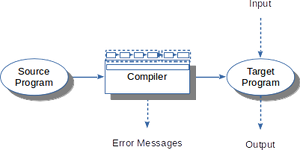
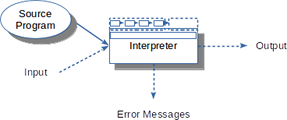
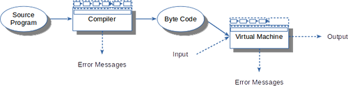
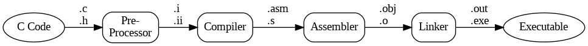
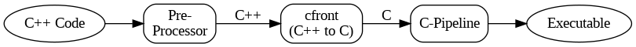
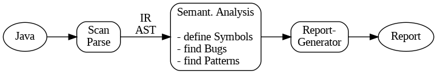

# Anwendungen

> [!IMPORTANT]
>
> <details open>
>
> <summary><strong>🎯 TL;DR</strong></summary>
>
> Es gibt verschiedene Anwendungsmöglichkeiten für Compiler. Je nach
> Bedarf wird dabei die komplette Toolchain durchlaufen oder es werden
> Stufen ausgelassen. Häufig genutzte Varianten sind dabei:
>
> - “Echte” Compiler: Übersetzen Sourcecode nach ausführbarem
>   Maschinencode
> - Interpreter: Interaktive Ausführung von Sourcecode
> - Virtuelle Maschinen als Zwischending zwischen Compiler und
>   Interpreter
> - Transpiler: Übersetzen formalen Text nach formalem Text
> - Analysetools: Parsen den Sourcecode, werten die Strukturen aus
>
> </details>

> [!TIP]
>
> <details>
>
> <summary><strong>🎦 Videos</strong></summary>
>
> - [VL Anwendungen](https://youtu.be/gt9ROh-qRIU)
>
> </details>

## Anwendung: Compiler



Wie oben diskutiert: Der Sourcecode durchläuft alle Phasen des
Compilers, am Ende fällt ein ausführbares Programm heraus. Dieses kann
man starten und ggf. mit Inputdaten versehen und erhält den
entsprechenden Output. Das erzeugte Programm läuft i.d.R. nur auf einer
bestimmten Plattform.

Beispiele: gcc, clang, …

## Anwendung: Interpreter



Beim Interpreter durchläuft der Sourcecode nur das Frontend, also die
Analyse. Es wird kein Code erzeugt, stattdessen führt der Interpreter
die Anweisungen im AST bzw. IC aus. Dazu muss der Interpreter mit den
Eingabedaten beschickt werden. Typischerweise hat man hier eine
“Read-Eval-Print-Loop” (*REPL*).

Beispiele: Python

## Anwendung: Virtuelle Maschinen



Hier liegt eine Art Mischform aus Compiler und Interpreter vor: Der
Compiler übersetzt den Quellcode in ein maschinenunabhängiges
Zwischenformat (“Byte-Code”). Dieser wird von der virtuellen Maschine
(“VM”) gelesen und ausgeführt. Die VM kann also als Interpreter für
Byte-Code betrachtet werden.

Beispiel: Java mit seiner JVM

## Anwendung: C-Toolchain



Erinnern Sie sich an die LV “Systemprogrammierung” im dritten Semester
:-)

Auch wenn es so aussieht, als würde der C-Compiler aus dem Quelltext
direkt das ausführbare Programm erzeugen, finden hier dennoch
verschiedene Stufen statt. Zuerst läuft ein Präprozessor über den
Quelltext und ersetzt alle `#include` und `#define` etc., danach
arbeitet der C-Compiler, dessen Ausgabe wiederum durch einen Assembler
zu ausführbarem Maschinencode transformiert wird.

Beispiele: gcc, clang, …

## Anwendung: C++-Compiler



C++ hat meist keinen eigenen (vollständigen) Compiler :-)

In der Regel werden die C++-Konstrukte durch `cfront` nach C übersetzt,
so dass man anschließend auf die etablierten Tools zurückgreifen kann.

Dieses Vorgehen werden Sie relativ häufig finden. Vielleicht sogar in
Ihrem Projekt …

Beispiel: g++

## Anwendung: Bugfinder



Tools wie FindBugs analysieren den (Java-) Quellcode und suchen nach
bekannten Fehlermustern. Dazu benötigen sie nur den Analyse-Teil eines
Compilers!

Auf dem AST kann dann nach vorab definierten Fehlermustern gesucht
werden (Stichwort “Graphmatching”). Dazu fällt die semantische Analyse
entsprechend umfangreicher aus als normal.

Zusätzlich wird noch eine Reporting-Komponente benötigt, da die normalen
durch die Analysekette erzeugten Fehlermeldungen nicht helfen (bzw.
sofern der Quellcode wohlgeformter Code ist, würden ja keine
Fehlermeldungen durch die Analyseeinheit generiert).

Beispiele: SpotBugs, Checkstyle, ESLint, …

## Anwendung: Pandoc

[Pandoc](https://pandoc.org/) ist ein universeller und modular
aufgebauter Textkonverter, der mit Hilfe verschiedener *Reader*
unterschiedliche Textformate einlesen und in ein Zwischenformat (hier
JSON) transformieren kann. Über verschiedene *Writer* können aus dem
Zwischenformat dann Dokumente in den gewünschten Zielformaten erzeugt
werden.

Die Reader entsprechen der Analyse-Phase und die Writer der
Synthese-Phase eines Compilers. Anstelle eines ausführbaren Programms
(Maschinencode) wird ein anderes Textformat erstellt/ausgegeben.

Beispielsweise wird aus diesem Markdown-Schnipsel …

    Dies ist ein Satz mit
    *  einem Stichpunkt, und
    *  einem zweiten Stichpunkt.

… dieses Zwischenformat erzeugt, …

``` json
{"blocks":[{"t":"Para","c":[{"t":"Str","c":"Dies"},{"t":"Space"},
           {"t":"Str","c":"ist"},{"t":"Space"},{"t":"Str","c":"ein"},
           {"t":"Space"},{"t":"Str","c":"Satz"},{"t":"Space"},
           {"t":"Str","c":"mit"}]},
           {"t":"BulletList","c":[[{"t":"Plain","c":[{"t":"Str","c":"einem"},{"t":"Space"},{"t":"Str","c":"Stichpunkt,"},{"t":"Space"},{"t":"Str","c":"und"}]}],[{"t":"Plain","c":[{"t":"Str","c":"einem"},{"t":"Space"},{"t":"Str","c":"zweiten"},{"t":"Space"},{"t":"Str","c":"Stichpunkt."}]}]]}],"pandoc-api-version":[1,17,0,4],"meta":{}}
```

… und daraus schließlich dieser TeX-Code.

``` latex
Dies ist ein Satz mit
\begin{itemize}
\tightlist
\item einem Stichpunkt, und
\item einem zweiten Stichpunkt.
\end{itemize}
```

Im Prinzip ist Pandoc damit ein Beispiel für Compiler, die aus einem
formalen Text nicht ein ausführbares Programm erzeugen (Maschinencode),
sondern einen anderen formalen Text. Dieser werden häufig auch
“Transpiler” genannt.

Weitere Beispiele:

- Lexer-/Parser-Generatoren: ANTLR, Flex, Bison, …: formale Grammatik
  nach Sourcecode
- CoffeeScript: CoffeeScript (eine Art “JavaScript light”) nach
  JavaScript
- Emscripten: C/C++ nach LLVM nach WebAssembly (tatsächlich kann LLVM-IR
  auch direkt als Input verwendet werden)
- Fitnesse: Word/Wiki nach ausführbare Unit-Tests

## Was bringt mir das?

<div align="center">

**Beschäftigung mit dem schönsten Thema in der Informatik ;-)**

</div>

### Auswahl einiger Gründe für den Besuch des Moduls “Compilerbau”

- Erstellung eigener kleiner Interpreter/Compiler
  - Einlesen von komplexen Daten
  - DSL als Brücke zwischen Stakeholdern
  - DSL zum schnelleren Programmieren (denken Sie etwa an
    [CoffeeScript](http://coffeescript.org/) …)
- Wie funktionieren FindBugs, Lint und ähnliche Tools?
  - Statische Codeanalyse: Dead code elimination
- Language-theoretic Security: [LangSec](http://langsec.org/)
- Verständnis für bestimmte Sprachkonstrukte und -konzepte (etwa
  `virtual` in C++)
- Vertiefung durch Besuch “echter” Compilerbau-Veranstaltungen an Uni
  möglich :-)
- Wie funktioniert:
  - ein Python-Interpreter?
  - das Syntaxhighlighting in einem Editor oder in Doxygen?
  - ein Hardwarecompiler (etwa VHDL)?
  - ein Text-Formatierer (TeX, LaTeX, …)?
  - CoffeeScript oder Emscripten?
- Wie kann man einen eigenen Compiler/Interpreter basteln, etwa für
  - MiniJava (mit C-Backend)
  - Brainfuck
  - Übersetzung von JSON nach XML
- Um eine profundes Kenntnis von Programmiersprachen zu erlangen, ist
  eine Beschäftigung mit ihrer Implementierung unerlässlich.
- Viele Grundtechniken der Informatik und elementare Datenstrukturen wie
  Keller, Listen, Abbildungen, Bäume, Graphen, Automaten etc. finden im
  Compilerbau Anwendung. Dadurch schließt sich in gewisser Weise der
  Kreis in der Informatikausbildung …
- Aufgrund seiner Reife gibt es hervorragende Beispiele von formaler
  Spezifikation im Compilerbau.
- Mit dem Gebiet der formalen Sprachen berührt der Compilerbau
  interessante Aspekte moderner Linguistik. Damit ergibt sich letztlich
  eine Verbindung zur KI …
- Die Unterscheidung von Syntax und Semantik ist eine grundlegende
  Technik in fast allen formalen Systeme.

### Parser-Generatoren (Auswahl)

Diese Tools könnte man beispielsweise nutzen, um seine eigene Sprache zu
basteln.

- ANTLR (ANother Tool for Language Recognition) is a powerful parser
  generator for reading, processing, executing, or translating
  structured text or binary files:
  [github.com/antlr/antlr4](https://github.com/antlr/antlr4)
- Grammars written for ANTLR v4; expectation that the grammars are free
  of actions:
  [github.com/antlr/grammars-v4](https://github.com/antlr/grammars-v4)
- An incremental parsing system for programmings tools:
  [github.com/tree-sitter/tree-sitter](https://github.com/tree-sitter/tree-sitter)
- Flex, the Fast Lexical Analyzer - scanner generator for lexing in C
  and C++: [github.com/westes/flex](https://github.com/westes/flex)
- Bison is a general-purpose parser generator that converts an annotated
  context-free grammar into a deterministic LR or generalized LR (GLR)
  parser employing LALR(1) parser tables:
  [gnu.org/software/bison](https://www.gnu.org/software/bison/)
- Parser combinators for binary formats, in C:
  [github.com/UpstandingHackers/hammer](https://github.com/UpstandingHackers/hammer)
- Eclipse Xtext is a language development framework:
  [github.com/eclipse/xtext](https://github.com/eclipse/xtext)

### Statische Analyse, Type-Checking und Linter

Als Startpunkt für eigene Ideen. Oder Verbessern/Erweitern der Projekte
…

- Pluggable type-checking for Java:
  [github.com/typetools/checker-framework](https://github.com/typetools/checker-framework)
- SpotBugs is FindBugs’ successor. A tool for static analysis to look
  for bugs in Java code:
  [github.com/spotbugs/spotbugs](https://github.com/spotbugs/spotbugs)
- An extensible cross-language static code analyzer:
  [github.com/pmd/pmd](https://github.com/pmd/pmd)
- Checkstyle is a development tool to help programmers write Java code
  that adheres to a coding standard:
  [github.com/checkstyle/checkstyle](https://github.com/checkstyle/checkstyle)
- JaCoCo - Java Code Coverage Library:
  [github.com/jacoco/jacoco](https://github.com/jacoco/jacoco)
- Sanitizers: memory error detector:
  [github.com/google/sanitizers](https://github.com/google/sanitizers)
- JSHint is a tool that helps to detect errors and potential problems in
  your JavaScript code:
  [github.com/jshint/jshint](https://github.com/jshint/jshint)
- Haskell source code suggestions:
  [github.com/ndmitchell/hlint](https://github.com/ndmitchell/hlint)
- Syntax checking hacks for vim:
  [github.com/vim-syntastic/syntastic](https://github.com/vim-syntastic/syntastic)

### DSL (Domain Specific Language)

- NVIDIA Material Definition Language SDK:
  [github.com/NVIDIA/MDL-SDK](https://github.com/NVIDIA/MDL-SDK)
- FitNesse – The Acceptance Test Wiki:
  [github.com/unclebob/fitnesse](https://github.com/unclebob/fitnesse)

Hier noch ein Framework, welches auf das Erstellen von DSL spezialisiert
ist:

- Eclipse Xtext is a language development framework:
  [github.com/eclipse/xtext](https://github.com/eclipse/xtext)

### Konverter von X nach Y

- Emscripten: An LLVM-to-JavaScript Compiler:
  [github.com/kripken/emscripten](https://github.com/kripken/emscripten)
- “Unfancy JavaScript”:
  [github.com/jashkenas/coffeescript](https://github.com/jashkenas/coffeescript)
- Universal markup converter:
  [github.com/jgm/pandoc](https://github.com/jgm/pandoc)
- Übersetzung von JSON nach XML

### Odds and Ends

- How to write your own compiler:
  [staff.polito.it/silvano.rivoira/HowToWriteYourOwnCompiler.htm](http://staff.polito.it/silvano.rivoira/HowToWriteYourOwnCompiler.htm)
- Building a modern functional compiler from first principles:
  [github.com/sdiehl/write-you-a-haskell](https://github.com/sdiehl/write-you-a-haskell)
- Language-theoretic Security: [LangSec](http://langsec.org/)
- Generierung von automatisierten Tests mit
  [Esprima](http://esprima.org/):
  [heise.de/-4129726](https://www.heise.de/developer/artikel/Generierung-von-automatisierten-Tests-mit-Esprima-4129726.html?view=print)
- Eigener kleiner Compiler/Interpreter, etwa für
  - MiniJava mit C-Backend oder sogar [LLVM](http://llvm.org/)-Backend
  - Brainfuck

### Als weitere Anregung: Themen der Mini-Projekte im W17

- Java2UMLet
- JavaDoc-to-Markdown
- Validierung und Übersetzung von Google Protocol Buffers v3 nach JSON
- svg2tikz
- SwaggerLang – Schreiben wie im Tagebuch
- Markdown zu LaTeX
- JavaDocToLaTeX
- MySQL2REDIS-Parser

## Wrap-Up

- Compiler übersetzen formalen Text in ein anderes Format

<!-- -->

- Nicht alle Stufen kommen immer vor =\> unterschiedliche Anwendungen
  - “Echte” Compiler: Sourcecode nach Maschinencode
  - Interpreter: Interaktive Ausführung
  - Virtuelle Maschinen als Zwischending zwischen Compiler und
    Interpreter
  - Transpiler: formaler Text nach formalem Text
  - Analysetools: Parsen den Sourcecode, werten die Strukturen aus

## 📖 Zum Nachlesen

- Aho u. a. ([2023](#ref-Aho2023)): Kapitel 1 Introduction
- Grune u. a. ([2012](#ref-Grune2012)): Kapitel 1 Introduction

> [!NOTE]
>
> <details>
>
> <summary><strong>✅ Lernziele</strong></summary>
>
> - k1: Ich kenne verschiedene Anwendungen für Compiler durch Einsatz
>   bestimmter Stufen der Compiler-Pipeline
>
> </details>

------------------------------------------------------------------------

> [!NOTE]
>
> <details>
>
> <summary><strong>👀 Quellen</strong></summary>
>
> <div id="refs" class="references csl-bib-body hanging-indent"
> entry-spacing="0">
>
> <div id="ref-Aho2023" class="csl-entry">
>
> Aho, A. V., M. S. Lam, R. Sethi, J. D. Ullman, und S. Bansal. 2023.
> *Compilers: Principles, Techniques, and Tools, Updated 2nd Edition by
> Pearson*. Pearson India.
> <https://learning.oreilly.com/library/view/compilers-principles-techniques/9789357054881/>.
>
> </div>
>
> <div id="ref-Grune2012" class="csl-entry">
>
> Grune, D., K. van Reeuwijk, H. E. Bal, C. J. H. Jacobs, und K.
> Langendoen. 2012. *Modern Compiler Design*. Springer.
>
> </div>
>
> </div>
>
> </details>

------------------------------------------------------------------------


Unless otherwise noted, this work is licensed under CC BY-SA 4.0.

<blockquote><p><sup><sub><strong>Last modified:</strong> d796fab (lecture: rework outcomes (Intro/Applications), 2025-08-19)<br></sub></sup></p></blockquote>
