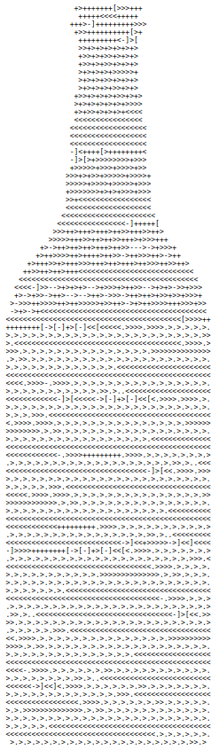

# Bandbreite der Programmiersprachen

> [!IMPORTANT]
>
> <details open>
>
> <summary><strong>🎯 TL;DR</strong></summary>
>
> Am Beispiel des Abzählreims “99 Bottles of Beer” werden (ganz kurz)
> verschiedene Programmiersprachen betrachtet. Jede der Sprachen hat ihr
> eigenes Sprachkonzept (Programmierparadigma) und auch ein eigenes
> Typ-System sowie ihre eigene Strategie zur Speicherverwaltung und
> Abarbeitung.
>
> Auch wenn die Darstellung längst nicht vollständig ist, macht sie doch
> deutlich, dass Compiler teilweise sehr unterschiedliche Konzepte
> “verstehen” müssen.
>
> </details>

> [!TIP]
>
> <details>
>
> <summary><strong>🎦 Videos</strong></summary>
>
> - [VL Programmiersprachen](https://youtu.be/prsc8cf4cJ8)
>
> </details>

## 99 Bottles of Beer

> 99 bottles of beer on the wall, 99 bottles of beer. Take one down and
> pass it around, 98 bottles of beer on the wall.
>
> 98 bottles of beer on the wall, 98 bottles of beer. Take one down and
> pass it around, 97 bottles of beer on the wall.
>
> \[…\]
>
> 2 bottles of beer on the wall, 2 bottles of beer. Take one down and
> pass it around, 1 bottle of beer on the wall.
>
> 1 bottle of beer on the wall, 1 bottle of beer. Take one down and pass
> it around, no more bottles of beer on the wall.
>
> No more bottles of beer on the wall, no more bottles of beer. Go to
> the store and buy some more, 99 bottles of beer on the wall.

Quelle: Abzählreim “99 Bottles of Beer” nach [“Lyrics of the song 99
Bottles of Beer”](https://www.99-bottles-of-beer.net/lyrics.html) on
99-bottles-of-beer.net

## Imperativ, Hardwarenah: C

``` c
 #define MAXBEER (99)
 void chug(int beers);
 main() {
    register beers;
    for(beers = MAXBEER; beers; chug(beers--))  puts("");
    puts("\nTime to buy more beer!\n");
 }
 void chug(register beers) {
    char howmany[8], *s;
    s = beers != 1 ? "s" : "";
    printf("%d bottle%s of beer on the wall,\n", beers, s);
    printf("%d bottle%s of beeeeer . . . ,\n", beers, s);
    printf("Take one down, pass it around,\n");
    if(--beers) sprintf(howmany, "%d", beers); else strcpy(howmany, "No more");
    s = beers != 1 ? "s" : "";
    printf("%s bottle%s of beer on the wall.\n", howmany, s);
 }
```

Quelle: [“Language
C”](https://www.99-bottles-of-beer.net/language-c-116.html) by Bill Wein
on 99-bottles-of-beer.net

- Imperativ

- Procedural

- Statisches Typsystem

- Resourcenschonend, aber “unsicher”: Programmierer muss wissen, was er
  tut

- Relativ hardwarenah

- Einsatz: Betriebssysteme, Systemprogrammierung

## Imperativ, Objektorientiert: Java

``` java
class bottles {
    public static void main(String args[]) {
        String s = "s";
        for (int beers=99; beers>-1;) {
            System.out.print(beers + " bottle" + s + " of beer on the wall, ");
            System.out.println(beers + " bottle" + s + " of beer, ");
            if (beers==0) {
                System.out.print("Go to the store, buy some more, ");
                System.out.println("99 bottles of beer on the wall.\n");
                System.exit(0);
            } else
                System.out.print("Take one down, pass it around, ");
            s = (--beers == 1)?"":"s";
            System.out.println(beers + " bottle" + s + " of beer on the wall.\n");
        }
    }
}
```

Quelle: [“Language
Java”](https://www.99-bottles-of-beer.net/language-java-4.html) by Sean
Russell on 99-bottles-of-beer.net

- Imperativ

- Objektorientiert

- Multi-Threading

- Basiert auf C/C++

- Statisches Typsystem

- Automatische Garbage Collection

- “Sichere” Architektur: Laufzeitumgebung fängt viele Probleme ab

- Architekturneutral: Nutzt Bytecode und eine JVM

- Einsatz: High-Level All-Purpose Language

## Logisch: Prolog

``` prolog
bottles :-
    bottles(99).

bottles(1) :-
    write('1 bottle of beer on the wall, 1 bottle of beer,'), nl,
    write('Take one down, and pass it around,'), nl,
    write('Now they are all gone.'), nl,!.
bottles(X) :-
    write(X), write(' bottles of beer on the wall,'), nl,
    write(X), write(' bottles of beer,'), nl,
    write('Take one down and pass it around,'), nl,
    NX is X - 1,
    write(NX), write(' bottles of beer on the wall.'), nl, nl,
    bottles(NX).
```

Quelle: [“Language
Prolog”](https://www.99-bottles-of-beer.net/language-prolog-965.html) by
M@ on 99-bottles-of-beer.net

- Deklarativ

- Logisch: Definition von Fakten und Regeln; eingebautes Beweissystem

- Einsatz: Theorem-Beweisen, Natural Language Programming (NLP),
  Expertensysteme, …

## Funktional: Haskell

``` haskell
bottles 0 = "no more bottles"
bottles 1 = "1 bottle"
bottles n = show n ++ " bottles"

verse 0   = "No more bottles of beer on the wall, no more bottles of beer.\n"
         ++ "Go to the store and buy some more, 99 bottles of beer on the wall."

verse n   = bottles n ++ " of beer on the wall, " ++ bottles n ++ " of beer.\n"
         ++ "Take one down and pass it around, " ++ bottles (n-1)
                                                 ++ " of beer on the wall.\n"

main      = mapM (putStrLn . verse) [99,98..0]
```

Quelle: [“Language
Haskell”](https://www.99-bottles-of-beer.net/language-haskell-1070.html)
by Iavor on 99-bottles-of-beer.net

- Deklarativ

- Funktional

- Lazy, pure

- Statisches Typsystem

- Typinferenz

- Algebraische Datentypen, Patternmatching

- Einsatz: Compiler, DSL, Forschung

## Brainfuck



Quelle: Screenshot of [“Language
Brainfuck”](https://99-bottles-of-beer.net/language-brainfuck-2542.html)
by Michal Wojciech Tarnowski on 99-bottles-of-beer.net

- Imperativ

- Feldbasiert (analog zum Band der Turingmaschine)

- 8 Befehle: Zeiger und Zellen inkrementieren/dekrementieren, Aus- und
  Eingabe, Sprungbefehle

## Programmiersprache Lox

    fun fib(x) {
        if (x == 0) {
            return 0;
        } else {
            if (x == 1) {
                return 1;
            } else {
                fib(x - 1) + fib(x - 2);
            }
        }
    }

    var wuppie = fib;
    wuppie(4);

- Die Sprache “Lox” finden Sie hier:
  [craftinginterpreters.com/the-lox-language.html](https://www.craftinginterpreters.com/the-lox-language.html)

- C-ähnliche Syntax

- Imperativ, objektorientiert, Funktionen als *First Class Citizens*,
  Closures

- Dynamisch typisiert

- Garbage Collector

- Statements und Expressions

- (Kleine) Standardbibliothek eingebaut

Die Sprache ähnelt stark anderen modernen Sprachen und ist gut geeignet,
um an ihrem Beispiel Themen wie Scanner/Parser/AST, Interpreter, Object
Code und VM zu studieren :)

## Wrap-Up

- Compiler übersetzen formalen Text in ein anderes Format

<!-- -->

- Berücksichtigung von unterschiedlichen
  - Sprachkonzepten (Programmierparadigmen)
  - Typ-Systemen
  - Speicherverwaltungsstrategien
  - Abarbeitungsstrategien

## 📖 Zum Nachlesen

- Aho u. a. ([2023](#ref-Aho2023)): Kapitel 1 Introduction
- Grune u. a. ([2012](#ref-Grune2012)): Kapitel 1 Introduction

> [!NOTE]
>
> <details>
>
> <summary><strong>✅ Lernziele</strong></summary>
>
> - k1: Ich kenne verschiedene Beispiele für verschiedene
>   Programmiersprachen und Paradigmen
>
> </details>

------------------------------------------------------------------------

> [!NOTE]
>
> <details>
>
> <summary><strong>👀 Quellen</strong></summary>
>
> <div id="refs" class="references csl-bib-body hanging-indent"
> entry-spacing="0">
>
> <div id="ref-Aho2023" class="csl-entry">
>
> Aho, A. V., M. S. Lam, R. Sethi, J. D. Ullman, und S. Bansal. 2023.
> *Compilers: Principles, Techniques, and Tools, Updated 2nd Edition by
> Pearson*. Pearson India.
> <https://learning.oreilly.com/library/view/compilers-principles-techniques/9789357054881/>.
>
> </div>
>
> <div id="ref-Grune2012" class="csl-entry">
>
> Grune, D., K. van Reeuwijk, H. E. Bal, C. J. H. Jacobs, und K.
> Langendoen. 2012. *Modern Compiler Design*. Springer.
>
> </div>
>
> </div>
>
> </details>

------------------------------------------------------------------------


Unless otherwise noted, this work is licensed under CC BY-SA 4.0.

**Exceptions:**

- [“Language C”](https://www.99-bottles-of-beer.net/language-c-116.html)
  by Bill Wein on 99-bottles-of-beer.net
- [“Language
  Haskell”](https://www.99-bottles-of-beer.net/language-haskell-1070.html)
  by Iavor on 99-bottles-of-beer.net
- [“Language
  Prolog”](https://www.99-bottles-of-beer.net/language-prolog-965.html)
  by M@ on 99-bottles-of-beer.net
- [“Language
  Java”](https://www.99-bottles-of-beer.net/language-java-4.html) by
  Sean Russell on 99-bottles-of-beer.net
- Abzählreim “99 Bottles of Beer” nach [“Lyrics of the song 99 Bottles
  of Beer”](https://www.99-bottles-of-beer.net/lyrics.html) on
  99-bottles-of-beer.net
- Screenshot of [“Language
  Brainfuck”](https://99-bottles-of-beer.net/language-brainfuck-2542.html)
  by Michal Wojciech Tarnowski on 99-bottles-of-beer.net

<blockquote><p><sup><sub><strong>Last modified:</strong> 0db2fe0 (tooling: rename 'origin' to 'credits', 2025-08-22)<br></sub></sup></p></blockquote>
