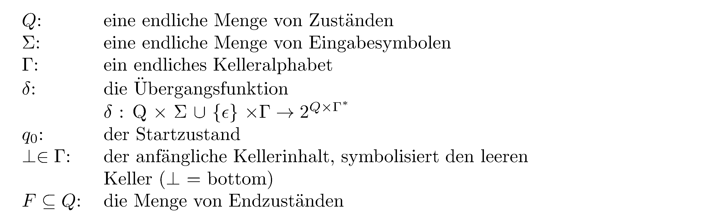
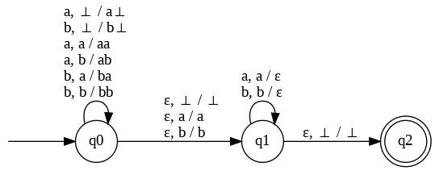

# CFG

> [!NOTE]
>
> 

>
> 
<strong>🖇 Weitere Unterlagen</strong>

>
> - [Annotierte Folien: CFG,
>   LL-Parser](https://github.com/Compiler-CampusMinden/AnnotatedSlides/blob/master/frontend_parsing_cfg.ann.ma.pdf)
>
> 

## Wiederholung

### Endliche Automaten, reguläre Ausdrücke, reguläre Grammatiken, reguläre Sprachen

- Wie sind DFAs und NFAs definiert?
- Was sind reguläre Ausdrücke?
- Was sind formale und reguläre Grammatiken?
- In welchem Zusammenhang stehen all diese Begriffe?
- Wie werden DFAs und reguläre Ausdrücke im Compilerbau eingesetzt?

## Motivation

### Wofür reichen reguläre Sprachen nicht?

Für z. B. alle Sprachen, in deren Wörtern Zeichen über eine Konstante
hinaus gezählt werden müssen. Diese Sprachen lassen sich oft mit
Variablen im Exponenten beschreiben, die unendlich viele Werte annehmen
können.

- $`a^ib^{2*i}`$ ist nicht regulär

- $`a^ib^{2*i}`$ für $`0 \leq i \leq 3`$ ist regulär

- Wo finden sich die oben genannten VAriablen bei einem DFA wieder?

- Warum ist die erste Sprache oben nicht regulär, die zweite aber?

### Themen für heute

- PDAs: mächtiger als DFAs, NFAs
- kontextfreie Grammatiken und Sprachen: mächtiger als reguläre
  Grammatiken und Sprachen
- DPDAs und deterministisch kontextfreie Grammatiken: die Grundlage der
  Syntaxanalyse im Compilerbau

## Kellerautomaten (Push-Down-Automata, PDAs)

### Kellerautomaten (Push-Down-Automata, PDAs)

Einordnung: Erweiterung der Automatenklasse DFA um einen Stack

**Def.:** Ein **Kellerautomat** (PDA)
$`P = (Q,\ \Sigma,\ \Gamma,\  \delta,\ q_0,\ \perp,\ F)`$ ist ein
Septupel aus

Definition
eines PDAs

Ein PDA ist per Definition nichtdeterministisch und kann spontane
Zustandsübergänge durchführen.

### Was kann man damit akzeptieren?

Strukturen mit paarweise zu matchenden Symbolen.

Bei jedem Zustandsübergang wird ein Zeichen (oder $`\epsilon`$) aus der
Eingabe gelesen, ein Symbol von Keller genommen. Diese und das
Eingabezeichen bestimmen den Folgezustand und eine Zeichenfolge, die auf
den Stack gepackt wird. Dabei wird ein Symbol, das später mit einem
Eingabesymbol zu matchen ist, auf den Stack gepackt.

Soll das automatisch vom Stack genommene Symbol auf dem Stack bleiben,
muss es wieder gepusht werden.

### Beispiel

Ein PDA für
$`L=\lbrace ww^{R}\mid w\in \lbrace a,b\rbrace^{\ast}\rbrace`$:

### Deterministische PDAs

**Def.** Ein PDA $`P = (Q, \Sigma, \Gamma, \delta, q_0, \perp, F)`$ ist
*deterministisch* $`: \Leftrightarrow`$

- $`\delta(q, a, X)`$ hat höchstens ein Element für jedes
  $`q \in Q, a \in\Sigma`$ oder $`(a = \epsilon`$ und $`X \in \Gamma)`$.
- Wenn $`\delta (q, a, x)`$ nicht leer ist für ein $`a \in \Sigma`$,
  dann muss $`\delta (q, \epsilon, x)`$ leer sein.

Deterministische PDAs werden auch *DPDAs* genannt.

### Der kleine Unterschied

**Satz:** Die von DPDAs akzeptierten Sprachen sind eine echte Teilmenge
der von PDAs akzeptierten Sprachen.

Reguläre Sprachen sind eine echte Teilmenge der von DPDAs akzeptierten
Sprachen.

## Kontextfreie Grammatiken und Sprachen

### Kontextfreie Grammatiken

**Def.** Eine *kontextfreie (cf-)* Grammatik ist ein 4-Tupel
$`G = (N, T, P, S)`$ mit *N, T, S* wie in (formalen) Grammatiken und *P*
ist eine endliche Menge von Produktionen der Form:

$`X \rightarrow Y`$ mit $`X \in N, Y \in {(N \cup T)}^{\ast}`$.

$`\Rightarrow, \overset{\ast}{\Rightarrow}`$ sind definiert wie bei
regulären Sprachen.

### Nicht jede kontextfreie Grammatik ist eindeutig

**Def.:** Gibt es in einer von einer kontextfreien Grammatik erzeugten
Sprache ein Wort, für das mehr als ein Ableitungsbaum existiert, so
heißt diese Grammatik *mehrdeutig*. Anderenfalls heißt sie *eindeutig*.

**Satz:** Es ist nicht entscheidbar, ob eine gegebene kontextfreie
Grammatik eindeutig ist.

**Satz:** Es gibt kontextfreie Sprachen, für die keine eindeutige
Grammatik existiert.

### Kontextfreie Grammatiken und PDAs

**Satz:** Die kontextfreien Sprachen und die Sprachen, die von PDAs
akzeptiert werden, sind dieselbe Sprachklasse.

**Satz:** Eine von einem DPDA akzeptierte Sprache hat eine eindeutige
Grammatik.

**Def.:** Die Klasse der Sprachen, die von einem DPDA akzeptiert werden,
heißt Klasse der *deterministisch kontextfreien (oder LR(k)-) Sprachen*.

Vorgehensweise im Compilerbau: Eine Grammatik für die gewünschte Sprache
definieren und schauen, ob sich daraus ein DPDA generieren lässt
(automatisch).

## Wrap-Up

### Das sollen Sie mitnehmen

- Die Struktur von gängigen Programmiersprachen lässt sich nicht mit
  regulären Ausdrücken beschreiben und damit nicht mit DFAs akzeptieren.
- Das Automatenmodell der DFAs wird um einen endlosen Stack erweitert,
  das ergibt PDAs.
- Kontextfreie Grammatiken (CFGs) erweitern die regulären Grammatiken.
- Deterministisch parsebare Sprachen haben eine eindeutige kontextfreie
  Grammatik.
- Es ist nicht entscheidbar, ob eine gegebene kontextfreie Grammatik
  eindeutig ist.
- Von DPDAs akzeptierte Sprachen haben eindeutige Grammatiken.

## 📖 Zum Nachlesen

- Aho u. a. ([2023](#ref-Aho2023))
- Hopcroft, Motwani, und Ullman ([2003](#ref-hopcroft2003))

> [!NOTE]
>
> 

>
> 
<strong>✅ Lernziele</strong>

>
> - k1: Ich kenne PDAs
> - k1: Ich kenne deterministische PDAs
> - k1: Ich kenne kontextfreie Grammatiken
> - k1: Ich kenne deterministisch kontextfreie Grammatiken
> - k2: Ich kann den Zusammenhang zwischen PDAs und kontextfreien
>   Grammatiken an einem Beispiel erklären
>
> 

------------------------------------------------------------------------

> [!NOTE]
>
> 

>
> 
<strong>👀 Quellen</strong>

>
> 
 entry-spacing="0">
>
> 

>
> Aho, A. V., M. S. Lam, R. Sethi, J. D. Ullman, und S. Bansal. 2023.
> *Compilers: Principles, Techniques, and Tools, Updated 2nd Edition by
> Pearson*. Pearson India.
> <https://learning.oreilly.com/library/view/compilers-principles-techniques/9789357054881/>.
>
> 

>
> 

>
> Hopcroft, J. E., R. Motwani, und J. D. Ullman. 2003. *Einführung in
> die Automatentheorie, formale Sprachen und Komplexitätstheorie*. I
> theoretische informatik. Pearson Education Deutschland GmbH.
>
> 

>
> 

>
> 

------------------------------------------------------------------------

Unless otherwise noted, this work is licensed under CC BY-SA 4.0.

<blockquote>
<strong>Last modified:</strong> 86736ef (lecture: rework outcomes (02/CFG), 2025-08-19) 
</blockquote>
