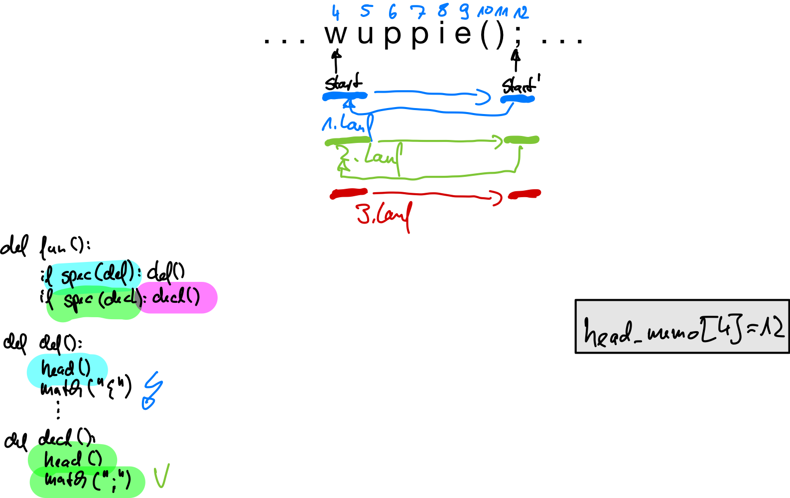

::: tldr


Man kann einen LL(k)-Parser bei Bedarf um ein "spekulatives Matching" ergänzen. Dies
ist in Situationen relevant, wo man das $k$ nicht vorhersehen kann, etwa bei der
Unterscheidung einer Vorwärtsdeklaration und einer Funktionsdefinition in C. Hier
kann man erst nach dem Parsen des Funktionsnamens entscheiden, welche Situation
vorliegt; der Funktionsname kann dabei (nahezu) beliebig lang sein.

Beim spekulativen Matching muss man sich merken, an welcher Position im Tokenstrom
man die Spekulation gestartet hat, um im Fall des Nichterfolgs dorthin wieder
zurückspringen zu können ("Backtracking").

Das Backtracking kann sehr langsam werden durch das Ausprobieren mehrerer
Alternativen und das jeweils nötige Zurückrollen. Zudem kann es passieren, dass eine
bestimmte Sequenz immer wieder erkannt werden muss. Hier hilft eine weitere Technik:
**Packrat Parsing** [@Packrat2006] (nutzt
["*memoisation*"](https://en.wikipedia.org/wiki/Memoization)). Hierbei führt man pro
Regel eine Map mit, in der zu einer Position im Tokenstrom festgehalten wird, ob
diese Regel an/ab dieser Position bereits erfolgreich oder nicht erfolgreich war.
Dies kann man dann nutzen, um bei einem erneuten Parsen der selben Regel
"vorzuspulen".

In ANTLR kann man *semantische Prädikate* benutzen, um Alternativen "abzuschalten".
Dies ist beispielsweise nützlich, wenn man nur eine Grammatik für unterschiedliche
Versionen einer Sprache implementieren will.

Eine gute Darstellung finden Sie in [@Parr2010] (Kapitel 3) und in [@Packrat2006].
:::

::: youtube
-   [VL LL-Parser: Fortgeschrittene Techniken](https://youtu.be/12GT2WxZsxY)
:::

# LL-Parser mit Backtracking

[Problem: Manchmal kennt man den nötigen Lookahead nicht vorher. Beispiel:]{.notes}

``` cpp
wuppie();         // Vorwärtsdeklaration
wuppie() { ...}   // Definition
```

[Entsprechend sähe die Grammatik aus:]{.notes}

``` antlr
func : fdef | fdecl ;
fdef : head '{' body '}' ;
fdecl: head ';' ;
head : ... ;
```

::: notes
Hier müsste man erst den gesamten Funktionskopf parsen, bevor man entscheiden kann,
ob es sich um eine Deklaration oder eine Definition handelt. Unglücklicherweise gibt
es keine Längenbeschränkung bei den Funktionsnamen ...

Mit Hilfe von Backtracking kann man zunächst spekulativ matchen und beim Auftreten
eines Fehlers die Spekulation rückgängig machen:
:::

\pause
\bigskip

``` python
def func():
    if speculate(fdef): fdef()      # Spekuliere auf "fdef"
    elif speculate(fdecl): fdecl()  # Spekuliere auf "fdecl"
    else: raise Exception()
```

::: notes
Die erste Alternative, die passt, gewinnt. Über die Reihenfolge der Spekulationen
kann man entsprechend Vorrangregeln implementieren.

## Anmerkung

Man könnte die obige Grammatik umformen ...

``` antlr
func : head ('{' body '}' | ';') ;
head : ... ;
```

...und bräuchte dann kein spekulatives Parsen mit Backtracking.

Da wir aber das Parsen mit Backtracking betrachten wollen, blenden wir diese
Möglichkeit jetzt einfach aus ;)
:::

# Details: Spekulatives Matchen

``` python
def speculate(fn):
    success = True

    mark()                  # markiere aktuelle Position

    try:   fn()             # probiere Regel fn()
    catch: success = False

    clear()                 # Rollback

    return success
```

[Eigener Code basierend auf einer Idee nach [@Parr2010, p. 60]]{.origin}

::: notes
Der Funktion `speculate` wird die zu testende Regel (Funktion) als Parameter
übergeben, im obigen Beispiel wären dies `fdef` bzw. `fdecl`.

Vor dem spekulativen Matchen muss die aktuelle Position im Tokenstrom markiert
werden. Falls der Versuch, die Deklaration zu matchen nicht funktioniert, wird der
Regel-Aufruf eine Exception werfen, entsprechend wird die Hilfsvariable gesetzt.
Anschließend muss noch mit `clear()` das aktuelle Token wieder hergestellt werden
(wir sind ja nur im Spekulationsmodus, d.h. selbst im Erfolgsfall wird ja die Regel
noch "richtig" aufgerufen).
:::

# Spekulatives Matchen: Hilfsmethoden I/II

``` python
class Parser:
    Lexer lexer
    markers = []    # Integer-Stack: speichere Tokenpositionen
    lookahead = []  # Puffer (1 Token vorbefüllt via Konstruktor)
    start = 0       # aktuelle Tokenposition im lookahead-Puffer

    def mark():
        markers.push(start)

    def clear():
        start = markers.pop()
```

[Eigener Code basierend auf einer Idee nach [@Parr2010, pp. 61/62]]{.origin}

# Spekulatives Matchen: Hilfsmethoden II/II

``` python
def consume():
    ++start
    if start == lookahead.count() and markers.isEmpty():
        start = 0; lookahead.clear()
    sync(1)

def lookahead(i):
    sync(i)
    return lookahead.get(start+i-1)

def sync(i):
    n = start + i - lookahead.count()
    while (n > 0):
        lookahead.add(lexer.nextToken()); --n
```

[Eigener Code basierend auf einer Idee nach [@Parr2010, pp. 61/62]]{.origin}

::: notes
`consume` holt wie immer das nächste Token, hier indem der Index `start` weiter
gesetzt wird und ein weiteres Token über `sync` in den Puffer geladen wird. Falls
wir nicht am Spekulieren sind und das Ende des Puffers erreicht haben, nutzen wir
die Gelegenheit und setzen den Puffer zurück. (Dies geht nicht, wenn wir spekulieren
-- hier müssen wir ja ggf. ein Rollback vornehmen und benötigen also den aktuellen
Puffer dann noch.)

Die Funktion `sync` stellt sicher, dass ab der Position `start` noch `i`
unverbrauchte Token im Puffer sind.

## Hinweis

Die Methode `count` liefert die Anzahl der aktuell gespeicherten Elemente in
`lookahead` zurück (nicht die Gesamtzahl der Plätze in der Liste -- diese kann
größer sein). Mit der Methode `add` wird ein Element hinten an die Liste angefügt,
dabei wird das Token auf den nächsten Index-Platz (`count`) geschrieben und ggf. die
Liste ggf. automatisch um weitere Speicherplätze ergänzt. Über `clear` werden die
Elemente in der Liste gelöscht, aber der Speicherplatz erhalten (d.h. `count()`
liefert den Wert 0, aber ein `add` müsste nicht erst die Liste mit weiteren Plätzen
erweitern, sondern könnte direkt an Index 0 das Token schreiben).
:::

[[Tafel: Beispiel mit dynamisch wachsendem Puffer]{.ex}]{.slides}

::: notes
## Backtracking führt zu Problemen

1.  Backtracking kann *sehr* langsam sein (Ausprobieren vieler Alternativen)
2.  Der spekulative Match muss ggf. rückgängig gemacht werden
3.  Man muss bereits gematchte Strukturen erneut matchen (=\> Abhilfe:
    Packrat-Parsing)
:::

# Verbesserung Backtracking: Packrat Parser (Memoizing)

{width="60%"}

::: notes
Bei der Eingabe `wuppie();` wird zunächst spekulativ die erste Alternative `fdef`
untersucht und ein `head` gematcht. Da die Alternative nicht komplett passt (es
kommt ein ";" statt einem "{"), muss die Spekulation rückgängig gemacht werden und
die zweite Alternative `fdecl` untersucht werden. Dabei muss man den selben Input
erneut auf `head` matchen! (Und wenn die Spekulation (irgendwann) erfolgreich war,
muss noch einmal ein `head` gematcht werden ...)

Idee: Wenn `head` sich merken würde, ob damit ein bestimmter Teil des Tokenstroms
bereits behandelt wurde (erfolgreich oder nicht), könnte man das Spekulieren
effizienter gestalten. Jede Regel muss also durch eine passende Regel mit
Speicherung ergänzt werden.

Dies wird auch als ["Memoization"](https://en.wikipedia.org/wiki/Memoization)
bezeichnet und ist eine zentrales Technik des Packrat Parsers (vgl. @Packrat2006).
:::

# Skizze: Idee des Packrat-Parsing

``` python
head_memo = {}

def head():
    if head_memo.get(start) == -1:
        raise Exception()                         # kein Match
    if head_memo.get(start) >= 0:
        start = head_memo[start]; return True     # Vorspulen
    else:
        failed = False; start_ = start
        try: ...     # rufe die ursprüngliche head()-Regel auf
        catch(e): failed = True; raise e
        finally: head_memo[start_] = (failed ? -1 : start)
```

[Eigener Code basierend auf einer Idee nach [@Parr2010, pp. 65/66]]{.origin}

::: notes
-   Wenn bereits untersucht (Eintrag vorhanden): Vorspulen bzw. Exception werfen
-   Sonst (aktuelle Position noch nicht in der Tabelle =\> Regel noch nicht an
    dieser Position getestet):
    -   Original-Regel ausführen
    -   Exception: Regel hatte keinen Erfolg =\> merken und Exception weiter reichen
-   Ergebnis für diese Startposition und diese Regel merken:
    -   Falls Regel erfolgreich, dann Start-Position und die aktuelle Position
        (Stopp-Position) in der Tabelle für diese Regel notieren
    -   Falls Regel nicht erfolgreich, zur Start-Position eine ungültige Position
        setzen

## Anmerkung *consume()*

Die Funktion `consume()` muss passend ergänzt werden: Wann immer man den
`lookahead`-Puffer zurücksetzt, werden alle `*_memo` ungültig und müssen ebenfalls
zurückgesetzt werden!
:::

[[Anmerkung Anpassung `consume()`]{.ex}]{.slides}

# Semantische Prädikate

Problem in Java: `enum` ab Java5 Schlüsselwort [(vorher als Identifier-Name
verwendbar)]{.notes}

``` antlr
prog : (enumDecl | stat)+ ;
stat : ... ;

enumDecl : ENUM id '{' id (',' id)* '}' ;
```

::: notes
Wie kann ich eine Grammatik bauen, die sowohl für Java5 und später als auch für die
Vorgänger von Java5 funktioniert?

Angenommen, man hätte eine Hilfsfunktion ("Prädikat"), mit denen man aus dem Kontext
heraus die Unterscheidung treffen kann, dann würde die Umsetzung der Regel ungefähr
so aussehen:
:::

\bigskip
\pause

``` python
def prog():
    if lookahead(1) == ENUM and java5: enumDecl()
    else: stat()
```

# Semantische Prädikate in ANTLR

::: notes
## Semantische Prädikate in Parser-Regeln
:::

``` antlr
@parser::members {public static boolean java5;}

prog : ({java5}? enumDecl | stat)+ ;
stat : ... ;

enumDecl : ENUM id '{' id (',' id)* '}' ;
```

::: notes
Prädikate in Parser-Regeln aktivieren bzw. deaktivieren alles, was nach der Abfrage
des Prädikats gematcht werden könnte.

## Semantische Prädikate in Lexer-Regeln

Alternativ für Lexer-Regeln:
:::

``` antlr
ENUM : 'enum' {java5}? ;
ID   : [a-zA-Z]+ ;
```

::: notes
Bei Token kommt das Prädikat erst am rechten Ende einer Lexer-Regel vor, da der
Lexer keine Vorhersage macht, sondern nach dem längsten Match sucht und die
Entscheidung erst trifft, wenn das ganze Token gesehen wurde. Bei Parser-Regeln
steht das Prädikat links vor der entsprechenden Alternative, da der Parser mit Hilfe
des Lookaheads Vorhersagen trifft, welche Regel/Alternative zutrifft.

*Anmerkung*: Hier wurden nur Variablen eingesetzt, es können aber auch
Methoden/Funktionen genutzt werden. In Verbindung mit einer Symboltabelle
(["Symboltabellen"](cb_symboltabellen1.html)) und/oder mit Attributen und Aktionen
in der Grammatik (["Attribute"](cb_attribute.html) und ["Interpreter:
Attribute+Aktionen"](cb_interpreter2.html)) hat man hier ein mächtiges
Hilfswerkzeug!
:::

# Wrap-Up

-   LL(1) und LL(k): Erweiterungen
    -   Dynamischer Lookahead: BT-Parser mit Packrat-Ergänzung
    -   Semantische Prädikate zum Abschalten von Alternativen

::: readings
-   @Parr2010: Kapitel 3
-   @Parr2014
-   @Mogensen2017: Kapitel 2 (insbesondere Abschnitte 2.3 bis (einschließlich) 2.19)
-   @Aho2023: Abschnitte 2.4 und 4.4
-   @Grune2012: Abschnitte 3.1 bis (einschließlich) 3.4
-   @Packrat2006
:::

::: outcomes
-   k3: Implementierung von LL(1)- und LL(k)-Parsern
-   k3: Dynamischer Lookahead mittels Backtracking; Verbesserung der
    Laufzeiteigenschaften mit Packrat
-   k3: Einsatz von semantischen Prädikaten zum (De-) Aktivieren von Regeln oder
    Token
:::
