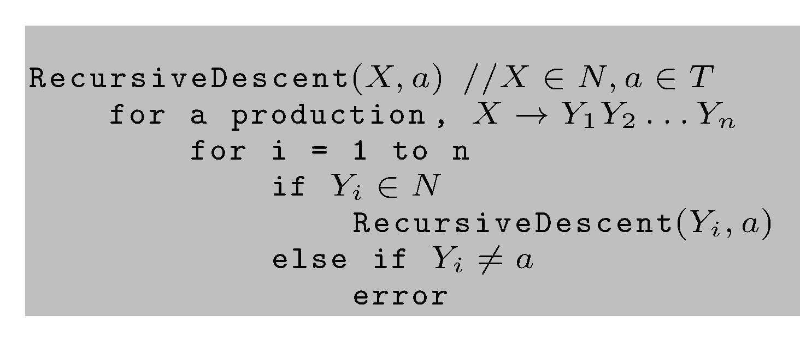

# LL-Parser

> [!NOTE]
>
> <details>
>
> <summary><strong>🖇 Weitere Unterlagen</strong></summary>
>
> - [Annotierte Folien: LL-Parser
>   (Theorie)](https://github.com/Compiler-CampusMinden/AnnotatedSlides/blob/master/ll-parser-theory.ann.ma.pdf)
>
> </details>

## Wiederholung

### PDAs und kontextfreie Grammatiken

- Warum reichen uns DFAs nicht zum Matchen von Eingabezeichen?
- Wie könnnen wir sie minimal erweitern?
- Sind PDAs deterministisch?
- Wie sind kontextfreie Grammatiken definiert?
- Sind kontextfreie Grammatiken eindeutig?

## Motivation

### Was brauchen wir für die Syntaxanalyse von Programmen?

- einen Grammatiktypen, aus dem sich manuell oder automatisiert ein
  Programm zur deterministischen Syntaxanalyse erstellen lässt
- einen Algorithmus zum sog. Parsen von Programmen mit Hilfe einer
  solchen Grammatik

### Themen für heute

- Syntaxanlyse
- Top-down-Analyse
- rekursiver Abstieg
- LL(k)-Analyse

## Syntaxanalyse

### Arten der Syntaxanalyse

Die Syntax bezieht sich auf die Struktur der zu analysierenden Eingabe,
z. B. einem Computerprogramm in einer Hochsprache. Diese Struktur wird
mit formalen Grammatiken beschrieben. Einsetzbar sind Grammatiken, die
deterministisch kontextfreie Sprachen erzeugen.

- Top-Down-Analyse: Aufbau des Parse trees von oben nach unten
  - Parsen durch rekursiven Abstieg
  - tabellengesteuertes LL-Parsing
- Bottom-Up-Analyse: LR-Parsing

### Bevor wir richtig anfangen…

**Def.:** Ein Nichtterminal *A* einer kontextfreien Grammatik *G* heißt
*unerreichbar*, falls es kein $`a,b \in {(N \cup T)}^{\ast}`$ gibt mit
$`S \overset{\ast}{\Rightarrow} aAb`$. Ein Nichtterminal *A* einer
Grammatik *G* heißt *nutzlos*, wenn es kein Wort $`w \in T^{\ast}`$ gibt
mit $`A \overset{\ast}{\Rightarrow} w`$.

**Def.:** Eine kontextfreie Grammatik $`G=(N, T, P, S)`$ heißt
*reduziert*, wenn es keine nutzlosen oder unerreichbaren Nichtterminale
in *N* gibt.

Bevor mit einer Grammatik weitergearbeitet wird, müssen erst alle
nutzlosen und dann alle unerreichbaren Symbole eliminiert werden. Wir
betrachten ab jetzt nur reduzierte Grammatiken.

## Algorithmus: Rekursiver Abstieg

Hier ist ein einfacher Algorithmus, der (indeterministisch) top-down
Ableitungen vom Nonterminal *X* aufbaut:

**Eingabe:** Ein Nichtterminal $`X`$ und das nächste zu verarbeitende
Eingabezeichen $`a`$.

<p align="center"></p><p align="center">Recursive
Descent-Algorithmus</p>

## Tabellengesteuerte Parser: LL(k)-Grammatiken

### First-Mengen

$`S \rightarrow A \ \vert \ B \ \vert \ C`$

Welche Produktion nehmen?

Wir brauchen die “terminalen k-Anfänge” von Ableitungen von
Nichtterminalen, um eindeutig die nächste zu benutzende Produktion
festzulegen. $`k`$ ist dabei die Anzahl der sog. *Vorschautoken*.

**Def.:** Wir definieren $`First`$ - Mengen einer Grammatik wie folgt:

- $`a \in T^\ast, |a| \leq k: {First}_k (a) = \lbrace a\rbrace`$

- $`a \in T^\ast, |a| > k: {First}_k (a) = \lbrace v \in T^\ast \mid a = vw, |v| = k\rbrace`$

- $`\alpha \in (N \cup T)^\ast \backslash T^\ast: {First}_k (\alpha) = \lbrace v \in T^\ast \mid  \alpha
  \overset{\ast}{\Rightarrow} w,\text{mit}\ w \in T^\ast, First_k(w) = \lbrace v \rbrace \rbrace`$

### Linksableitungen

**Def.:** Bei einer kontextfreien Grammatik $`G`$ ist die
*Linksableitung* von $`\alpha \in (N \cup T)^{\ast}`$ die Ableitung, die
man erhält, wenn in jedem Schritt das am weitesten links stehende
Nichtterminal in $`\alpha`$ abgeleitet wird.

Man schreibt $`\alpha \overset{\ast}{\Rightarrow}_l \beta.`$

### Follow-Mengen

Manchmal müssen wir wissen, welche terminalen Zeichen hinter einem
Nichtterminal stehen können.

**Def.** Wir definieren *Follow* - Mengen einer Grammatik wie folgt:

$`\forall \beta \in (N \cup T)^*:`$

``` math
Follow_k(\beta) = \lbrace w \in T^\ast \mid \exists \alpha, \gamma \in  (N \cup T)^\ast\ \text{ mit }\ S \overset{\ast}{\Rightarrow}_l \alpha \beta \gamma\ \text{ und }\ w \in First_k(\gamma) \rbrace
```

### LL(k)-Grammatiken

**Def.:** Eine kontextfreie Grammatik *G = (N, T, P, S)* ist genau dann
eine *LL(k)*-Grammatik, wenn für alle Linksableitungen der Form:

$`S \overset{\ast}{\Rightarrow}_l\ wA \gamma\ {\Rightarrow}_l\ w\alpha\gamma \overset{\ast}{\Rightarrow}_l wx`$

und

$`S \overset{\ast}{\Rightarrow}_l wA \gamma {\Rightarrow}_l w\beta\gamma \overset{\ast}{\Rightarrow}_l wy`$

mit
$`(w, x, y \in T^\ast, \alpha, \beta, \gamma \in (N \cup T)^\ast, A \in N)`$
und $`First_k(x) = First_k(y)`$ gilt:

$`\alpha = \beta`$

### LL(1)-Grammatiken

Das hilft manchmal:

Für $`k = 1`$: G ist
$`LL(1): \forall A \rightarrow \alpha, A \rightarrow \beta \in P, \alpha \neq \beta`$
gilt:

1.  $`\lnot \exists a \in T: \alpha  \overset{\ast}{\Rightarrow}_l  a\alpha_1`$
    und $`\beta \overset{\ast}{\Rightarrow}_l a\beta_1`$
2.  $`((\alpha \overset{\ast}{\Rightarrow}_l \epsilon) \Rightarrow (\lnot (\beta \overset{\ast}{\Rightarrow}_l \epsilon)))`$
    und
    $`((\beta \overset{\ast}{\Rightarrow}_l \epsilon) \Rightarrow (\lnot (\alpha\overset{\ast}{\Rightarrow}_l \epsilon)))`$
3.  $`((\beta \overset{\ast}{\Rightarrow}_l \epsilon)`$ und
    $`(\alpha \overset{\ast}{\Rightarrow}_l a\alpha_1)) \Rightarrow a \notin Follow(A)`$
4.  $`((\alpha \overset{\ast}{\Rightarrow}_l \epsilon)`$ und
    $`(\beta \overset{\ast}{\Rightarrow}_l a\beta_1)) \Rightarrow a \notin Follow(A)`$

Die ersten beiden Zeilen bedeuten:

$`\alpha`$ und $`\beta`$ können nicht beide $`\epsilon`$ ableiten,
$`First_1(\alpha) \cap First_1(\beta) = \emptyset`$

Die dritte und vierte Zeile bedeuten:

$`(\epsilon \in First_1(\beta)) \Rightarrow (First_1(\alpha) \cap Follow_1(A) = \emptyset)`$

$`(\epsilon \in First_1(\alpha)) \Rightarrow (First_1(\beta) \cap Follow_1(A) = \emptyset)`$

### LL(k)-Sprachen

Die von *LL(k)*-Grammatiken erzeugten Sprachen sind eine echte Teilmenge
der deterministisch parsbaren Sprachen.

Die von *LL(k)*-Grammatiken erzeugten Sprachen sind eine echte Teilmenge
der von *LL(k+1)*-Grammatiken erzeugten Sprachen.

Für eine kontextfreie Grammatik *G* ist nicht entscheidbar, ob es eine
*LL(1)* - Grammatik *G’* gibt mit $`L(G) = L(G')`$.

In der Praxis reichen $`LL(1)`$ - Grammatiken oft. Hier gibt es
effiziente Parsergeneratoren, deren Eingabe eine LL(k)- (meist LL(1)-)
Grammatik ist, und die als Ausgabe den Quellcode eines (effizienten)
tabellengesteuerten Parsers generieren.

### Algorithmus: Konstruktion einer LL-Parsertabelle

**Eingabe:** Eine Grammatik G = (N, T, P, S) mit $`\perp \in T`$ als
Endezeichen

**Ausgabe:** Eine Parsertabelle *P*

<p align="center"></p><p align="center">Algorithmus
zur Generierung einer LL-Parsertabelle</p>

Statt $`First_1(\alpha)`$ und $`Follow_1(\alpha)`$ wird oft nur
$`First(\alpha)`$ und $`Follow(\alpha)`$ geschrieben.

### LL-Parsertabellen

Rekursive Programmierung bedeutet, dass das Laufzeitsystem einen Stack
benutzt (bei einem Recursive-Descent-Parser, aber auch bei der
Parsertabelle). Diesen Stack kann man auch “selbst programmieren”, d. h.
einen PDA implementieren. Dabei wird ebenfalls die oben genannte Tabelle
zur Bestimmung der nächsten anzuwendenden Produktion benutzt. Der Stack
enthält die zu erwartenden Eingabezeichen, wenn immer eine
Linksableitung gebildet wird. Diese Zeichen im Stack werden mit dem
Input gematcht.

### Algorithmus: Tabellengesteuertes LL-Parsen mit einem PDA

**Eingabe:** Eine Grammatik G = (N, T, P, S), eine Parsertabelle *P* mit
$`w\perp`$ als initialem Kellerinhalt

**Ausgabe:** Wenn $`w \in L(G)`$, eine Linksableitung von $`w`$, Fehler
sonst

<p align="center"></p><p align="center">Algorithmus
zum tabellengesteuerten LL-Parsen</p>

### Wrap-Up

- Syntaxanalyse wird mit deterministisch kontextfreien Grammatiken
  durchgeführt.
- Eine Teilmenge der dazu gehörigen Sprachen lässt sich top-down parsen.
- Ein einfacher Recursive-Descent-Parser arbeitet mit Backtracking.
- Ein effizienter LL(k)-Parser realisiert einen DPDA und kann
  automatisch aus einer LL(k)-Grammatik generiert werden.
- Der Parser liefert in der Regel einen abstrakten Syntaxbaum (AST).

## 📖 Zum Nachlesen

- Aho u. a. ([2023](#ref-Aho2023))
- Hopcroft, Motwani, und Ullman ([2003](#ref-hopcroft2003))

> [!NOTE]
>
> <details>
>
> <summary><strong>✅ Lernziele</strong></summary>
>
> - k1: Ich kenne die Top-Down-Analyse
> - k1: Ich kenne Recursive-Descent-Parser
> - k1: Ich kenne First- und Follow-Mengen
> - k1: Ich kenne LL-Parser
> - k2: Ich kann den Zusammenhang zwischen PDAs und kontextfreien
>   Grammatiken an einem Beispiel erklären
> - k2: Ich kann den algorithmischen Ablauf von LL-Parsern an einem
>   Beispiel erklären
>
> </details>

------------------------------------------------------------------------

> [!NOTE]
>
> <details>
>
> <summary><strong>👀 Quellen</strong></summary>
>
> <div id="refs" class="references csl-bib-body hanging-indent"
> entry-spacing="0">
>
> <div id="ref-Aho2023" class="csl-entry">
>
> Aho, A. V., M. S. Lam, R. Sethi, J. D. Ullman, und S. Bansal. 2023.
> *Compilers: Principles, Techniques, and Tools, Updated 2nd Edition by
> Pearson*. Pearson India.
> <https://learning.oreilly.com/library/view/compilers-principles-techniques/9789357054881/>.
>
> </div>
>
> <div id="ref-hopcroft2003" class="csl-entry">
>
> Hopcroft, J. E., R. Motwani, und J. D. Ullman. 2003. *Einführung in
> die Automatentheorie, formale Sprachen und Komplexitätstheorie*. I
> theoretische informatik. Pearson Education Deutschland GmbH.
>
> </div>
>
> </div>
>
> </details>

------------------------------------------------------------------------


Unless otherwise noted, this work is licensed under CC BY-SA 4.0.

<blockquote><p><sup><sub><strong>Last modified:</strong> 87c95b9 (lecture: rework outcomes (02/LL-Theory), 2025-08-19)<br></sub></sup></p></blockquote>
