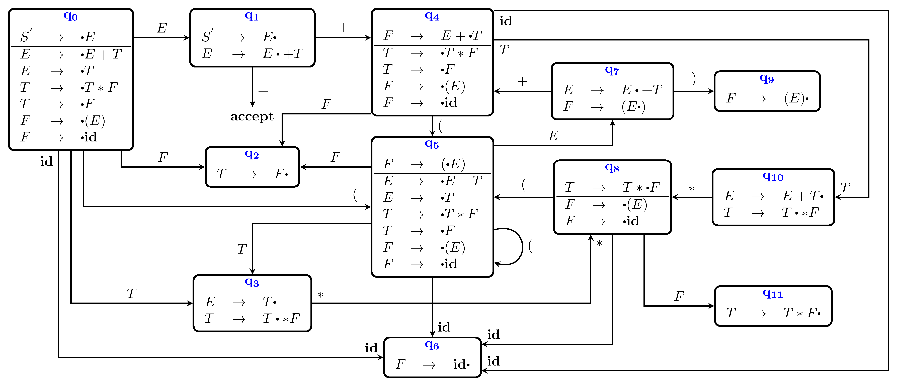
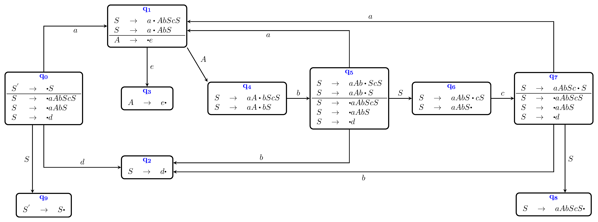
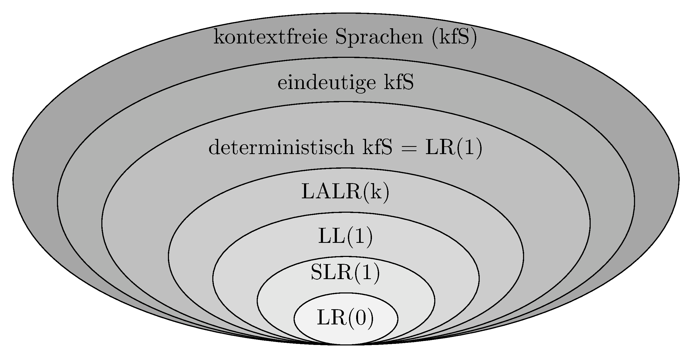

# Wiederholung

## Top-Down-Analyse

*   Baumaufbau von oben nach unten

*   eine Möglichkeit: recursive-descent parser

*   alternativ: tabellengesteuerter Parser

*   *First-* und *Follow*-Mengen bestimmen Wahl der Ableitungen

*   nicht mehr rekursiv, sondern mit PDA

# Motivation
<!-- 5 Minuten -->

## *LL* ist nicht alles

Die Menge der *LL*-Sprachen ist eine echte Teilmenge der deterministisch kontextfreien Sprachen.

Bei $LL$-Sprachen muss man nach den ersten $k$ Eingabezeichen entscheiden, welche Ableitung ganz oben im Baum als erste durchgeführt wird, also eine, die im Baum ganz weit weg ist von den Terminalen, die die Entscheidung bestimmen. Das ist nicht bei allen deterministisch parsebaren Grammatiken möglich und erschwert die Fehlerbehandlung.

# Von unten nach oben

Bei der Bottom-Up-Analyse wird der Parse Tree wird von unten nach oben aufgebaut, von links nach rechts. Dabei entsteht eine *Rechtsableitung*.

**Def.:** Bei einer kontextfreien Grammatik $G$ ist die *Rechtsableitung* von $\alpha \in (N \cup T)^{\ast}$ die Ableitung, die man erhält, wenn das am weitesten rechts stehende Nichtterminal in $\alpha$ abgeleitet wird. Man schreibt $\alpha \overset{\ast}{\Rightarrow}_r \beta$.

Mit Hilfe der Produktionen und der Vorschautoken werden die Ableitungen "rückwärts" angewandt und "Reduktionen" genannt.

## Versuchen wir es einmal

:::notes
Hier entsteht ein Tafelbild.
:::

## Kann ein Stack helfen?

:::notes
Hier entsteht ein Tafelbild.
:::

## So geht es  vielleicht

:::notes
Hier entsteht ein Tafelbild.
:::

## Da wollen wir hin

{width="80%"}

# Theorie: LR(0)

## Arbeitsweise

Im Stack stehen nur Zustandsnummern, am Anfang die Nummer des Startzustandes (+ Bottomzeichen, oft auch $\$$).

*   Lesen des obersten Stackelements ergibt Zustand $q$

*   Lesen des nächsten Eingabezeichens ergibt Zeichen $a$

*   Nachschlagen der Reaktion auf $(q, a)$ in der Parse Table

*   Durchführung der Reaktion

## Mögliche "Actions" ohne Berücksichtigung von Vorschautoken

*   Shift: Schiebe logisch das nächste Eingabesymbol auf den Stack (in Wirklichkeit Zustandsnummern)

*   Reduce: (Identifiziere ein Handle oben auf dem Stack und ersetze es durch das Nichtterminal der dazugehörigen Produktion.) Das ist gleichbedeutend mit: Entferne so viele Zustände vom Stack wie die rechte Seite der zu reduzierenden Regel Elemente hat, und schreibe den Zustand, der im Goto-Teil für $(q, a)$ steht, auf den Stack.

*   Accept: Beende das Parsen erfolgreich

*   Reagiere auf einen Syntaxfehler

## Berechnung derustände: Items

**Def.:** Ein *(dotted) Item* einer Grammatik $G$ ist eine Produktion von $G$ mit einem Punkt auf der rechten Seite der Regel vor, zwischen oder nach den Elementen.

Bsp.:

Zu der Produktion $A \rightarrow BC$ gehören die Items:

$[A\rightarrow \cdot B C]$

$[A\rightarrow B \cdot C$]

$[A\rightarrow B C \cdot]$

Das zu $A \rightarrow \epsilon$ gehörende Item ist $[A \rightarrow \cdot]$

## Berechnung der *Closure_0* von einer Menge *I* von Items

1. füge $I$ zu $CLOSURE_0 (I)$ hinzu

2. gibt es ein Item $[A \rightarrow \alpha \cdot B\beta]$ aus $CLOSURE_0 (I)$ und eine Produktion $(B \rightarrow \gamma)$, füge $[B \rightarrow \cdot \gamma]$ zu $CLOSURE_0 (I)$ hinzu

## Berechnung der *GOTO_0*-Sprungmarken

$GOTO_0(I, X) = CLOSURE_0(\lbrace[A \rightarrow \alpha X \cdot \beta] \mid [A \rightarrow \alpha \cdot X \beta] \in I\rbrace)$

für eine Itemmenge *I* und $X \in N \cup T, A \in N, \alpha, \beta \in (N \cup T)^{\ast}$.

## Konstruktion des $LR(0)$ - Automaten

1. Bilde die Hülle von $S' \rightarrow S$ und mache sie zum ersten Zustand.

2. Für jedes noch nicht betrachtete $\cdot X, X \in (N \cup T)$ in einem Zustand $q$ des Automaten berechne $GOTO_0(q, X)$ und mache $GOTO_0(q, X)$ zu einem neuen Zustand $r$. Verbinde $q$ mit einem Pfeil mit $r$ und schreibe $X$ an den Pfeil. Ist ein zu $r$ identischer Zustand schon vorhanden, wird $p$ mit diesem verbunden und kein neuer erzeugt.

## Konstruktion der Parse Table

1. Erstelle eine leere Tabelle mit den Zuständen als Zeilenüberschriften. Für den Aktionstabellenteil überschreibe die Spalten mit den Terminalen, für den Sprungtabellenteil mit den Nonterminals.

2. Shift: Für jeden mit einem Terminal beschrifteten Pfeil aus einem Zustand erstelle in der Aktionstabelle die Aktion shift mit der Nummer des Zustands, auf den der Pfeil zeigt. Für Pfeile mit Nonterminals schreibe in die Sprungtabelle nur die Nummer des Folgezustands.

3. Schreibe beim Zustand $[S' \rightarrow S \cdot]$ ein $accept$ bei dem Symbol $\bot$.

4. Für jedes Item mit $[A \rightarrow \beta \cdot]$ aus allen Zuständen schreibe für alle Terminals $reduce$ und die Nummer der entsprechenden Grammatikregel in die Tabelle.

## Ein Beispiel zum Nachvollziehen

(0) $S^{'} \rightarrow S$

(1) $S     \rightarrow a A b S c S$

(2) $S     \rightarrow a A b S$

(3) $S     \rightarrow d$

(4) $A     \rightarrow e$

## Der LR(0)-Automat zu G1

## Die LR(0)-Parsertabelle zu G1

{width="60%"}

# Und was gibt es noch?

## Wenn LR(0) nicht reicht

Zunächst: Zu jeder LR(k)-Sprache gibt es eine LR(1)-Grammatik.

Ist eine Grammatik nicht LR(0), müssen nichtdeterminsistische Tabelleneinträge verhindert werden:

*   SLR(1)-Parsing ($A \rightarrow \beta$ wird nur reduziert, wenn das Vorschautoken in der $FOLLOW$-Menge von $A$ ist.)

*   (kanonisches) LR(1)-Parsing (wie LR(0) mit einem Vorschautoken)

*   LALR(1)-Parsing (Zusammenfassung aller LR(1)-Zustände, die sich nur in den LOOKAHEAD-Mengen unterscheiden)

# Mehrdeutige Grammatiken

## Es gibt auch Auswege

Mehrdeutige Grammatiken sind oft leichter zu lesen und kleiner als die Grammatiken, die man erhält, wenn man die Mehrdeutigkeit auflöst, sofern möglich.

Folgendes kann bei Mehrdeutigkeiten helfen:

*   Angabe von Vorrangregeln

*   Angabe von Assoziativität

*   Voreinstellung des Parsergenearators: z. B. Shiften bei Shift-Reduce-Konflikten

*   Voreinstellung des Parsergenearators: z. B. Reduzieren nach der Regel, die in der Grammatik zuerst kommt bei Reduce-Reduce-Konflikten

# Hierarchie der kontextfreien Sprachen

{width="80%"}

# Wrap-Up

## Wrap-Up

*   LR-Analyse baut den Ableitungbaum von unten nach oben auf

*   es wird ein DFA benutzt zusammen mit einem Stack, der Zustände speichert

*   eine Parse-Tabelle steuert über Aktions- und Sprungbefehle das Verhalten des Parsers

*   die Tabelle wird mit (dotted) Items und Closures konstruiert

*   mit Bottom-Up-Parsing LR(1) kann man alle deterministisch kontextfreien Sprachen parsen

*   LR(0)-, SLR- und LALR- Parsing sind vereinfachte  Verfahren für Teilmengen der LR-Sprachen

<!-- DO NOT REMOVE - THIS IS A LAST SLIDE TO INDICATE THE LICENSE AND POSSIBLE EXCEPTIONS (IMAGES, ...). -->
::: slides
## LICENSE

Unless otherwise noted, this work is licensed under CC BY-SA 4.0.
:::
