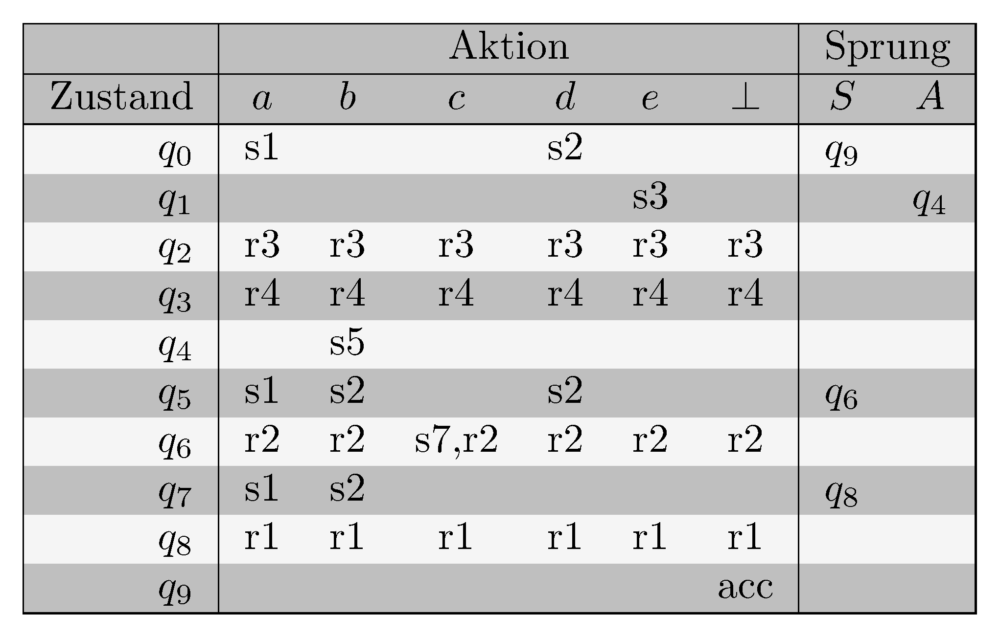

# Syntaxanalyse: LR-Parser (LR(0), LALR)

> [!NOTE]
>
> 

>
> 
<strong>🖇 Weitere Unterlagen</strong>

>
> - [Annotierte Folien:
>   LR-Parser](https://github.com/Compiler-CampusMinden/AnnotatedSlides/blob/master/lr-parser.ann.ma.pdf)
>
> 

## Wiederholung

### Top-Down-Analyse

- Baumaufbau von oben nach unten

- eine Möglichkeit: recursive-descent parser

- alternativ: tabellengesteuerter Parser

- *First-* und *Follow*-Mengen bestimmen Wahl der Ableitungen

- nicht mehr rekursiv, sondern mit PDA

## Motivation

### *LL* ist nicht alles

Die Menge der *LL*-Sprachen ist eine echte Teilmenge der deterministisch
kontextfreien Sprachen.

Bei $`LL`$-Sprachen muss man nach den ersten $`k`$ Eingabezeichen
entscheiden, welche Ableitung ganz oben im Baum als erste durchgeführt
wird, also eine, die im Baum ganz weit weg ist von den Terminalen, die
die Entscheidung bestimmen. Das ist nicht bei allen deterministisch
parsebaren Grammatiken möglich und erschwert die Fehlerbehandlung.

## Von unten nach oben

Bei der Bottom-Up-Analyse wird der Parse Tree wird von unten nach oben
aufgebaut, von links nach rechts. Dabei entsteht eine *Rechtsableitung*.

**Def.:** Bei einer kontextfreien Grammatik $`G`$ ist die
*Rechtsableitung* von $`\alpha \in (N \cup T)^{\ast}`$ die Ableitung,
die man erhält, wenn das am weitesten rechts stehende Nichtterminal in
$`\alpha`$ abgeleitet wird. Man schreibt
$`\alpha \overset{\ast}{\Rightarrow}_r \beta`$.

Mit Hilfe der Produktionen und der Vorschautoken werden die Ableitungen
“rückwärts” angewandt und “Reduktionen” genannt.

### Versuchen wir es einmal

Hier entsteht ein Tafelbild.

### Kann ein Stack helfen?

Hier entsteht ein Tafelbild.

### So geht es vielleicht

Hier entsteht ein Tafelbild.

### Da wollen wir hin

Parser-Automat

## Theorie: LR(0)

### Arbeitsweise

Im Stack stehen nur Zustandsnummern, am Anfang die Nummer des
Startzustandes (+ Bottomzeichen, oft auch $`\$`$).

- Lesen des obersten Stackelements ergibt Zustand $`q`$

- Lesen des nächsten Eingabezeichens ergibt Zeichen $`a`$

- Nachschlagen der Reaktion auf $`(q, a)`$ in der Parse Table

- Durchführung der Reaktion

### Mögliche “Actions” ohne Berücksichtigung von Vorschautoken

- Shift: Schiebe logisch das nächste Eingabesymbol auf den Stack (in
  Wirklichkeit Zustandsnummern)

- Reduce: (Identifiziere ein Handle oben auf dem Stack und ersetze es
  durch das Nichtterminal der dazugehörigen Produktion.) Das ist
  gleichbedeutend mit: Entferne so viele Zustände vom Stack wie die
  rechte Seite der zu reduzierenden Regel Elemente hat, und schreibe den
  Zustand, der im Goto-Teil für $`(q, a)`$ steht, auf den Stack.

- Accept: Beende das Parsen erfolgreich

- Reagiere auf einen Syntaxfehler

### Berechnung der Zustände: Items

**Def.:** Ein *(dotted) Item* einer Grammatik $`G`$ ist eine Produktion
von $`G`$ mit einem Punkt auf der rechten Seite der Regel vor, zwischen
oder nach den Elementen.

Bsp.:

Zu der Produktion $`A \rightarrow BC`$ gehören die Items:

$`[A\rightarrow \cdot B C]`$

$`[A\rightarrow B \cdot C`$\]

$`[A\rightarrow B C \cdot]`$

Das zu $`A \rightarrow \epsilon`$ gehörende Item ist
$`[A \rightarrow \cdot]`$

### Berechnung der *Closure_0* von einer Menge *I* von Items

1.  füge $`I`$ zu $`CLOSURE_0 (I)`$ hinzu

2.  gibt es ein Item $`[A \rightarrow \alpha \cdot B\beta]`$ aus
    $`CLOSURE_0 (I)`$ und eine Produktion $`(B \rightarrow \gamma)`$,
    füge $`[B \rightarrow \cdot \gamma]`$ zu $`CLOSURE_0 (I)`$ hinzu

### Berechnung der *GOTO_0*-Sprungmarken

$`GOTO_0(I, X) = CLOSURE_0(\lbrace[A \rightarrow \alpha X \cdot \beta] \mid [A \rightarrow \alpha \cdot X \beta] \in I\rbrace)`$

für eine Itemmenge $`I`$ und
$`X \in N \cup T, A \in N, \alpha, \beta \in (N \cup T)^{\ast}`$.

### Konstruktion des $`LR(0)`$ - Automaten

1.  Bilde die Hülle von $`S' \rightarrow S`$ und mache sie zum ersten
    Zustand.

2.  Für jedes noch nicht betrachtete $`\cdot X, X \in (N \cup T)`$ in
    einem Zustand $`q`$ des Automaten berechne $`GOTO_0(q, X)`$ und
    mache $`GOTO_0(q, X)`$ zu einem neuen Zustand $`r`$. Verbinde $`q`$
    mit einem Pfeil mit $`r`$ und schreibe $`X`$ an den Pfeil. Ist ein
    zu $`r`$ identischer Zustand schon vorhanden, wird $`p`$ mit diesem
    verbunden und kein neuer erzeugt.

### Konstruktion der Parse Table

1.  Erstelle eine leere Tabelle mit den Zuständen als
    Zeilenüberschriften. Für den Aktionstabellenteil überschreibe die
    Spalten mit den Terminalen, für den Sprungtabellenteil mit den
    Nonterminals.

2.  Shift: Für jeden mit einem Terminal beschrifteten Pfeil aus einem
    Zustand erstelle in der Aktionstabelle die Aktion shift mit der
    Nummer des Zustands, auf den der Pfeil zeigt. Für Pfeile mit
    Nonterminals schreibe in die Sprungtabelle nur die Nummer des
    Folgezustands.

3.  Schreibe beim Zustand $`[S' \rightarrow S \cdot]`$ ein $`accept`$
    bei dem Symbol $`\bot`$.

4.  Für jedes Item mit $`[A \rightarrow \beta \cdot]`$ aus allen
    Zuständen schreibe für alle Terminals $`reduce`$ und die Nummer der
    entsprechenden Grammatikregel in die Tabelle.

### Ein Beispiel zum Nachvollziehen

1.  $`S^{'} \rightarrow S`$

2.  $`S     \rightarrow a A b S c S`$

3.  $`S     \rightarrow a A b S`$

4.  $`S     \rightarrow d`$

5.  $`A     \rightarrow e`$

### Der LR(0)-Automat zu G1

LR(0)-Automat

### Die LR(0)-Parsertabelle zu G1

LR(0)-Parsertabelle

## Und was gibt es noch?

### Wenn LR(0) nicht reicht

Zunächst: Zu jeder LR(k)-Sprache gibt es eine LR(1)-Grammatik.

Ist eine Grammatik nicht LR(0), müssen nichtdeterminsistische
Tabelleneinträge verhindert werden:

- SLR(1)-Parsing ($`A \rightarrow \beta`$ wird nur reduziert, wenn das
  Vorschautoken in der $`FOLLOW`$-Menge von $`A`$ ist.)

- (kanonisches) LR(1)-Parsing (wie LR(0) mit einem Vorschautoken)

- LALR(1)-Parsing (Zusammenfassung aller LR(1)-Zustände, die sich nur in
  den LOOKAHEAD-Mengen unterscheiden)

## Mehrdeutige Grammatiken

### Es gibt auch Auswege

Mehrdeutige Grammatiken sind oft leichter zu lesen und kleiner als die
Grammatiken, die man erhält, wenn man die Mehrdeutigkeit auflöst, sofern
möglich.

Folgendes kann bei Mehrdeutigkeiten helfen:

- Angabe von Vorrangregeln

- Angabe von Assoziativität

- Voreinstellung des Parsergenearators: z. B. Shiften bei
  Shift-Reduce-Konflikten

- Voreinstellung des Parsergenearators: z. B. Reduzieren nach der Regel,
  die in der Grammatik zuerst kommt bei Reduce-Reduce-Konflikten

## Hierarchie der kontextfreien Sprachen

Sprachenhierarchie

## Wrap-Up

### Wrap-Up

- LR-Analyse baut den Ableitungbaum von unten nach oben auf

- es wird ein DFA benutzt zusammen mit einem Stack, der Zustände
  speichert

- eine Parse-Tabelle steuert über Aktions- und Sprungbefehle das
  Verhalten des Parsers

- die Tabelle wird mit (dotted) Items und Closures konstruiert

- mit Bottom-Up-Parsing LR(1) kann man alle deterministisch
  kontextfreien Sprachen parsen

- LR(0)-, SLR- und LALR- Parsing sind vereinfachte Verfahren für
  Teilmengen der LR-Sprachen

## 📖 Zum Nachlesen

- Aho u. a. ([2023](#ref-Aho2023)): Kapitel 4.5 bis 4.8
- Aho u. a. ([2023](#ref-Aho2023))
- Hopcroft, Motwani, und Ullman ([2003](#ref-hopcroft2003))
- Kunert ([2018](#ref-Kunert2018))
- Wagenknecht und Hielscher ([2014](#ref-Wagenknecht2014))

> [!NOTE]
>
> 

>
> 
<strong>✅ Lernziele</strong>

>
> - k1: Ich kenne die Prinzipien der Bottom-Up-Analyse
> - k1: Ich kenne die Begriffe Item, Closure und Parse Table
> - k2: Ich kann LR(0)-Parsing an einem Beispiel erklären
> - k3: Ich kann die Konstruktion der Parse Tables durchführen
> - k3: Ich kann das Parsen mit einem LR(0)-Parser durchführen
>
> 

------------------------------------------------------------------------

> [!NOTE]
>
> 

>
> 
<strong>👀 Quellen</strong>

>
> 
 entry-spacing="0">
>
> 

>
> Aho, A. V., M. S. Lam, R. Sethi, J. D. Ullman, und S. Bansal. 2023.
> *Compilers: Principles, Techniques, and Tools, Updated 2nd Edition by
> Pearson*. Pearson India.
> <https://learning.oreilly.com/library/view/compilers-principles-techniques/9789357054881/>.
>
> 

>
> 

>
> Hopcroft, J. E., R. Motwani, und J. D. Ullman. 2003. *Einführung in
> die Automatentheorie, formale Sprachen und Komplexitätstheorie*. I
> theoretische informatik. Pearson Education Deutschland GmbH.
>
> 

>
> 

>
> Kunert, A. 2018. „LR(k)-Analyse für Pragmatiker“. 2018.
> <http://amor.cms.hu-berlin.de/~kunert/papers/lr-analyse/lr.pdf>.
>
> 

>
> 

>
> Wagenknecht, C., und M. Hielscher. 2014. *Formale Sprachen, abstrakte
> Automaten und Compiler*. Springer Fachmedien Wiesbaden.
> <https://doi.org/10.1007/978-3-658-02692-9>.
>
> 

>
> 

>
> 

------------------------------------------------------------------------

Unless otherwise noted, this work is licensed under CC BY-SA 4.0.

<blockquote>
<strong>Last modified:</strong> e7bbe05 (cleanup: remove 02/lr-parser{1,2}.md - #210, 2025-08-21) 
</blockquote>
