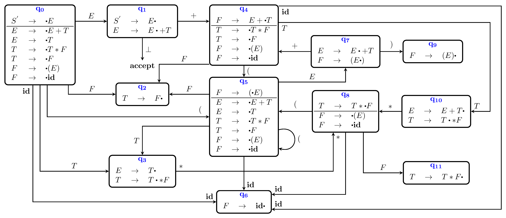
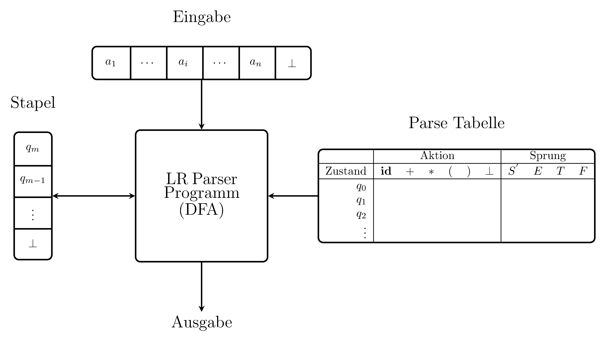

# Syntaxanalyse: LR-Parser (Teil 1)

> [!NOTE]
>
> 

>
> 
<strong>🖇 Unterlagen</strong>

>
> - [Annotierte Folien:
>   LR-Parser1](https://github.com/Compiler-CampusMinden/AnnotatedSlides/blob/master/lr-parser1.ann.ma.pdf)
>
> 

## Wiederholung

### Top-Down-Analyse

- Baumaufbau von oben nach unten
- die Grammatik muss reduziert sein
- recursive-descent parser
- *First-* und *Follow*-Mengen bestimmen Wahl der Ableitungen
- tabellengesteuert
- nicht mehr rekursiv, sondern mit PDA

## Motivation

### *LL* ist nicht alles

Die Menge der *LL*-Sprachen ist eine echte Teilmenge der deterministisch
kontextfreien Sprachen. Wir brauchen ein Verfahren, mit dem man alle
deterministisch kontextfreien Sprachen parsen kann.

## Bottom-Up-Analyse

### Von unten nach oben

Bei $`LL`$-Sprachen muss man nach den ersten $`k`$ Eingabezeichen
entscheiden, welche Ableitung ganz oben im Baum als erste durchgeführt
wird, also eine, die im Syntaxbaum ganz weit weg ist von den Terminalen,
die die Entschiedung bestimmen.Es gibt deterministisch kontextfreie
Sprachen, die nicht $`LL(k)`$ sind für irgendein *k*.

Bei der Bottom-Up-Analyse geht man den umgekehrten Weg. Der Parse Tree
wird von unten nach oben aufgebaut, die Entscheidung, welche Produktion
angewandt wird, erfolgt “näher” am Terminal. Mit Hilfe der Produktionen
und der Vorschautoken werden die Ableitungen “rückwärts” angewandt und
“Reduktionen” genannt.

Fehlermeldungen können näher am Programmtext erfolgen.

### Baumaufbau von unten

Hier entsteht ein Tafelbild.

### Kann ein Stack helfen?

Hier entsteht ein Tafelbild.

### Probleme damit?

Hier entsteht ein Tafelbild.

## Konfliktfälle

### Mehrdeutigkeiten = Konflikte beim Parsen

Es gibt Grammatiken, bei denen nicht aus dem Inhalt des Stacks und dem
Eingabezeichen entschieden werden kann, wie fortgefahren wird, auch
nicht, wenn man, wie auch schon im Fall $`LL`$, eine feste Zahl $`k`$
von Vorschautoken berücksichtigt. Diese Grammatiken können mehrdeutig
sein.

Folgen von falschen Entscheidungen:

- falscher Baum, falsche Bäume
- kein Baum

### Mögliche Konflikte

- Reduce-Reduce-Konflikt: Es sind zwei oder mehr verschiedene
  Reduktionen möglich
- Shift-Reduce-Konflikt: Es kann nicht entschieden werden, ob eine
  Reduktion oder ein Shift durchgeführt werden soll.

Shiften bedeutet, das nächste Eingabesymbol miteinbeziehen.

## LR-Parsing

### Da wollen wir hin

Parser-Automat

### So geht es

Der Stack enthält Zustände, keine Terminals oder Nonterminals.

Der Top-of-Stack ist immer der aktuelle Zustand, am Anfang $`I_0`$. Im
Stack steht $`I_0\ \bot`$.

Vorgehen: Im aktuellen Zustand nachschauen, ob das Eingabezeichen auf
einem Pfeil steht.

- ja: Shiften, d. h. dem Pfeil folgen und den Zustand am Ende des Pfeils
  pushen. Dort weiter.

- nein: Reduzieren nach der Regel aus dem aktuellen Zustand mit dem
  Punkt hinten, d. h. so viele Zustände poppen, wie die Regel Elemente
  auf der rechten Seite hat. Der Zustand darunter wird aktuell, dem
  Pfeil mit dem zu reduzierenden Nonterminal der linken Seite der Regel
  folgen und pushen.

Am Schluss kann nur noch mit $`\bot`$ akzeptiert werden.

### Beispiel

Hier entsteht ein Tafelbild.

### Definitionen

**Def.:** Bei einer kontextfreien Grammatik *G* ist die
*Rechtsableitung* von $`\alpha \in (N \cup T)^{\ast}`$ die Ableitung,
die man erhält, wenn das am weitesten rechts stehende Nichtterminal in
$`\alpha`$ abgeleitet wird. Man schreibt
$`\alpha \overset{\ast}{\Rightarrow}_r \beta`$.

**Def.:** Eine *Rechtssatzform* $`\alpha`$ einer Grammatik *G* ist ein
Element aus $`(N \cup T)^{\ast}`$ mit
$`S \overset{\ast}{\Rightarrow}_r \alpha`$.

**Def.:** In dem Syntaxbaum von
$`S \overset{\ast}{\Rightarrow}_r \alpha\ A\ w  \Rightarrow_r \alpha\ \beta\ w`$
einer kontextfreien Grammatik ist $`\beta`$ ein *Handle* von der
Produktion $`A \rightarrow \beta`$.

### LR-Parsing

Bei der *LR*-Analyse eines Wortes *w* wird *w* von links nach rechts
gelesen, dabei wird die Rechtsableitung von *w* in *G* von unten nach
oben aufgebaut. Man spricht nicht nicht mehr von Ableitungen, sondern
von Reduktionen.

Mehrdeutige Grammatiken können nicht *LR* sein.

- Vor der Konstruktion des Automaten wird die Grammatik um eine neues
  Nonterminal $`S'`$ und die neue Produktion $`S' \rightarrow S`$
  erweitert. $`S'`$ ist dann Startsymbol.
- Es wird ein Automat erstellt (s.o.)
- Es wird eine Parse Table aus dem Automaten erstellt, die den
  Parse-Vorgang steuert, mit Aktionsteil und Sprungteil.

### Steuerung des Parsens mittels der Parse Table

Parser
Schema

### Arbeitsweise

Im Stack stehen nur Zustandsnummern, am Anfang die Nummer des
Startzustandes (+ Bottomzeichen, oft auch $`\$`$). Es ist nicht nötig,
Symbole zu stacken.

- Lesen des obersten Stackelements ergibt Zustand *q*
- Lesen des nächsten Eingabezeichens ergibt Zeichen *a*
- Nachschlagen der Reaktion auf $`(q, a)`$ in der Parse Table
- Durchführung der Reaktion

### Mögliche “Actions” ohne Berücksichtigung von Vorschautoken

- Shift: Schiebe logisch das nächste Eingabesymbol auf den Stack (in
  Wirklichkeit Zustandsnummern)
- Reduce: (Identifiziere ein Handle oben auf dem Stack und ersetze es
  durch das Nichtterminal der dazugehörigen Produktion.) Das ist
  gleichbedeutend mit: Entferne so viele Zustände vom Stack wie die
  rechte Seite der zu reduzierenden Regel Elemente hat, und schreibe den
  Zustand, der im Goto-Teil für $`(q, a)`$ steht, auf den Stack.
- Accept: Beende das Parsen erfolgreich
- Reagiere auf einen Syntaxfehler

## 0 Vorschautoken = LR(0)-Parsing

### LR-Parsing ohne Vorschautoken

Wichtig: Das Handle, d. h. die rechte Seite einer zu reduzierenden
Regel, erscheint oben auf dem Stack, nie weiter unten.

Je nach Anwendungsfall müssen beim Reduzieren von Handles weitere
Aktionen ausgeführt werden: z. B. Syntaxbäume aufgebaut, Werte in
Tabellen geschrieben werden, usw. Nicht alle rechten Seiten von
Produktionen, die oben auf dem Stack stehen, sind auch Handles, manchmal
muss nur geshiftet werden.

Bsp: Steht bei der Beispielgrammatik von Folie 8 oben auf dem Stack ein
$`T`$ mit dem nächsten Eingabezeichen $`\ast`$, darf $`T`$ nicht zu
$`E`$ reduziert werden.

Lösung: Der Parser merkt sich, wo er steht in noch nicht komplett
reduzierten Regeln. Dazu benutzt er sogenannte *Items* oder
*LR(0)-Items*, auch *dotted Items* oder *(kanonische) LR(0)-Elemente*
genannt.

### Items

**Def.:** Ein *Item* einer Grammatik *G* ist eine Produktion von *G* mit
einem Punkt auf der rechten Seite der Regel vor, zwischen oder nach den
Elementen.

Bsp.:

Zu der Produktion $`A \rightarrow BC`$ gehören die Items:

$`[A\rightarrow \cdot B C]`$

$`[A\rightarrow B \cdot C`$\]

$`[A\rightarrow B C \cdot]`$

Das zu $`A \rightarrow \epsilon`$ gehörende Item ist
$`[A \rightarrow \cdot]`$

### Was bedeuten die Items?

Hier entsteht ein Tafelbild.

### Berechnung der *Closure_0* von einer Menge *I* von Items

1.  füge $`I`$ zu $`CLOSURE_0 (I)`$ hinzu

2.  gibt es ein Item $`[A \rightarrow \alpha \cdot B\beta]`$ aus
    $`CLOSURE_0 (I)`$ und eine Produktion $`(B \rightarrow \gamma)`$,
    füge $`[B \rightarrow \cdot \gamma]`$ zu $`CLOSURE_0 (I)`$ hinzu

### Berechnung der *GOTO_0*-Sprungmarken

$`GOTO_0(I, X) = CLOSURE_0(\lbrace[A \rightarrow \alpha X \cdot \beta] \mid [A \rightarrow \alpha \cdot X \beta] \in I\rbrace)`$

für eine Itemmenge *I* und
$`X \in N \cup T, A \in N, \alpha, \beta \in (N \cup T)^{\ast}`$.

### Konstruktion des $`LR(0)`$ - Automaten

1.  Bilde die Hülle von $`S' \rightarrow S`$ und mache sie zum ersten
    Zustand.

2.  Für jedes noch nicht betrachtete $`\cdot X, X \in (N \cup T)`$ in
    einem Zustand $`q`$ des Automaten berechne $`GOTO_0(q, X)`$ und
    mache $`GOTO_0(q, X)`$ zu einem neuen Zustand $`r`$. Verbinde $`q`$
    mit einem Pfeil mit $`r`$ und schreibe $`X`$ an den Pfeil. Ist ein
    zu $`r`$ identischer Zustand schon vorhanden, wird $`p`$ mit diesem
    verbunden und kein neuer erzeugt.

### Konstruktion der Parse Table

1.  Erstelle eine leere Tabelle mit den Zuständen als
    Zeilenüberschriften. Für den Aktionstabellenteil überschreibe die
    Spalten mit den Terminalen, für den Sprungtabellenteil mit den
    Nonterminals.

2.  Shift: Für jeden mit einem Terminal beschrifteten Pfeil aus einem
    Zustand erstelle in der Aktionstabelle die Aktion shift mit der
    Nummer des Zustands, auf den der Pfeil zeigt. Für Pfeile mit
    Nonterminals schreibe in die Sprungtabelle nur die Nummer des
    Folgezustands.

3.  Schreibe beim Zustand $`[S' \rightarrow S \cdot]`$ ein $`accept`$
    bei dem Symbol $`\bot`$.

4.  Für jedes Item mit $`[A \rightarrow \beta \cdot]`$ aus allen
    Zuständen schreibe für alle Terminals $`reduce`$ und die Nummer der
    entsprechenden Grammatikregel in die Tabelle.

### Und wenn in einer Zelle schon ein Eintrag ist?

Hier entsteht ein Tafelbild.

### Die Beispielgrammatik G1

1.  $`S^{'} \rightarrow S`$

2.  $`S     \rightarrow a A b S c S`$

3.  $`S     \rightarrow a A b S`$

4.  $`S     \rightarrow d`$

5.  $`A     \rightarrow e`$

### Der LR(0)-Automat zu G1

LR(0)-Automat

### Die LR(0)-Parsertabelle zu G1

LR(0)-Parsertabelle

## Wrap-Up

### Wrap-Up

- LR-Analyse baut den Ableitungbaum von unten nach oben auf.

- Es wird ein DFA benutzt zusammen mit einem Stack, der Zustände
  speichert.

- Eine Parse-Tabelle steuert über Aktions- und Sprungbefehle das
  Verhalten des Parsers.

- Die Tabelle wird mit Items und Closures konstruiert.

## 📖 Zum Nachlesen

- Aho u. a. ([2023](#ref-Aho2023)): Kapitel 4.5 bis 4.8
- Aho u. a. ([2023](#ref-Aho2023))
- Hopcroft, Motwani, und Ullman ([2003](#ref-hopcroft2003))
- Kunert ([2018](#ref-Kunert2018))
- Wagenknecht und Hielscher ([2014](#ref-Wagenknecht2014))

------------------------------------------------------------------------

> [!TIP]
>
> 

>
> 
<strong>✅ Lernziele</strong>

>
> - k1: Prinzipien der Bottom-Up-Analyse
> - k1: Items
> - k1: Closure
> - k1: Parse Table
> - k2: LR(0)-Parsing
> - k3: Konstruktion der Parse Tables
> - k3: Durchführen des Parsens
>
> 

------------------------------------------------------------------------

> [!NOTE]
>
> 

>
> 
<strong>👀 Quellen</strong>

>
> 
 entry-spacing="0">
>
> 

>
> Aho, A. V., M. S. Lam, R. Sethi, J. D. Ullman, und S. Bansal. 2023.
> *Compilers: Principles, Techniques, and Tools, Updated 2nd Edition by
> Pearson*. Pearson India.
> <https://learning.oreilly.com/library/view/compilers-principles-techniques/9789357054881/>.
>
> 

>
> 

>
> Hopcroft, J. E., R. Motwani, und J. D. Ullman. 2003. *Einführung in
> die Automatentheorie, formale Sprachen und Komplexitätstheorie*. I
> theoretische informatik. Pearson Education Deutschland GmbH.
>
> 

>
> 

>
> Kunert, A. 2018. „LR(k)-Analyse für Pragmatiker“. 2018.
> <http://amor.cms.hu-berlin.de/~kunert/papers/lr-analyse/lr.pdf>.
>
> 

>
> 

>
> Wagenknecht, C., und M. Hielscher. 2014. *Formale Sprachen, abstrakte
> Automaten und Compiler*. Springer Fachmedien Wiesbaden.
> <https://doi.org/10.1007/978-3-658-02692-9>.
>
> 

>
> 

>
> 

------------------------------------------------------------------------

Unless otherwise noted, this work is licensed under CC BY-SA 4.0.

<blockquote>
<strong>Last modified:</strong> 1c01cef (markdown: switch to leaner yaml header (#253), 2025-08-09) 
</blockquote>
