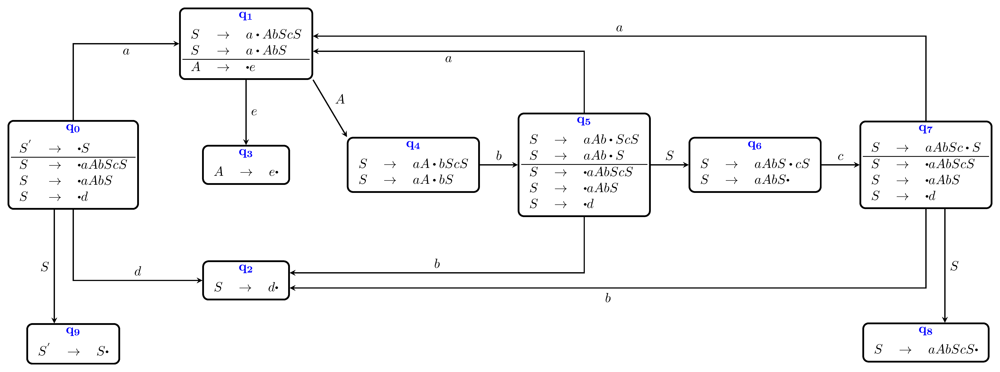
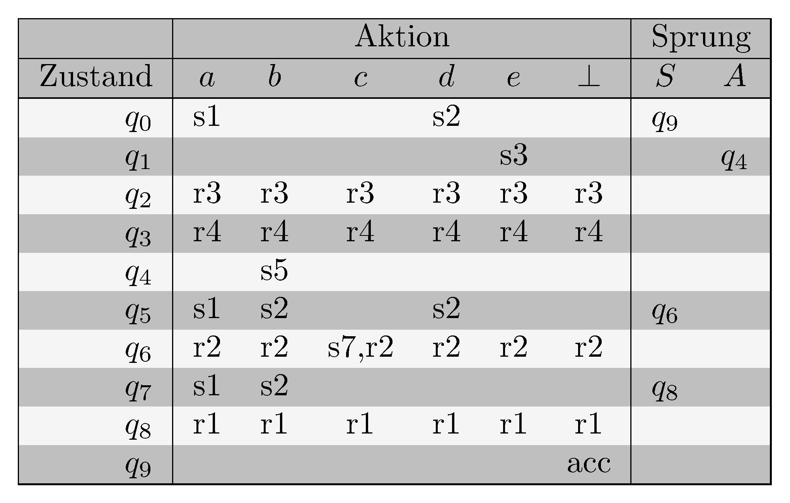
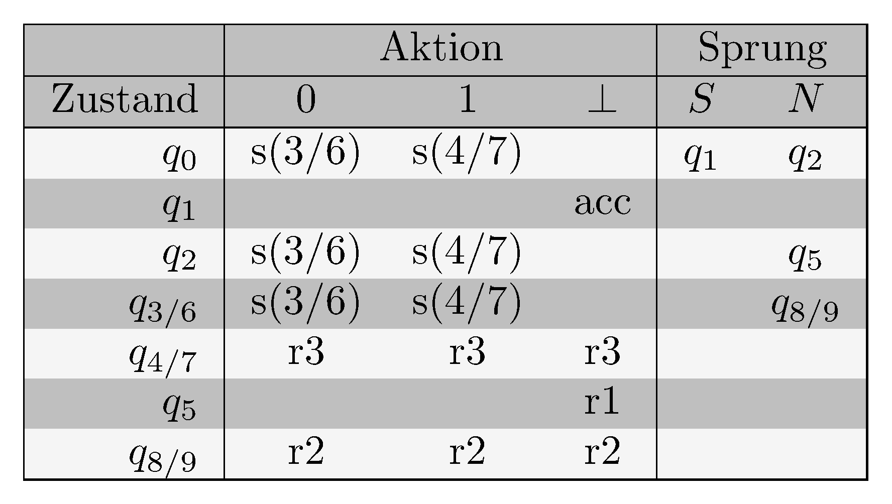
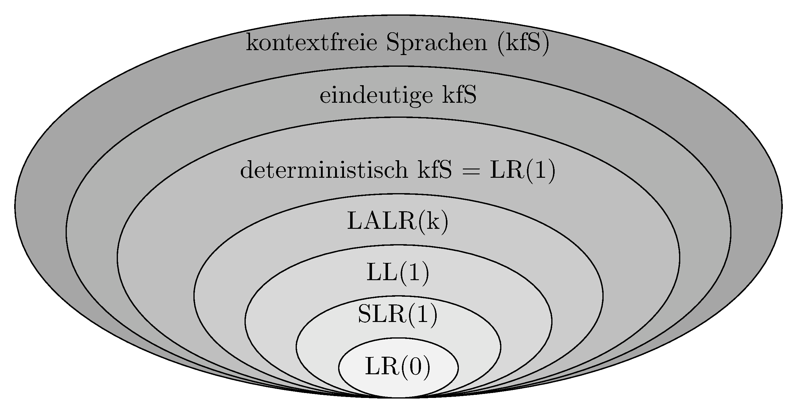

# Syntaxanalyse: LR-Parser (Teil 2)

> [!NOTE]
>
> 

>
> 
<strong>🖇 Unterlagen</strong>

>
> - [Annotierte Folien:
>   LR-Parser2](https://github.com/Compiler-CampusMinden/AnnotatedSlides/blob/master/lr-parser2.ann.ma.pdf)
>
> 

## Wiederholung

Ein PDA für
$`L=\lbrace ww^{R}\mid w\in \lbrace a,b\rbrace^{\ast}\rbrace`$:

### Top-Down-Analyse

- LL reicht nicht.
- LR: Aufbau des Ableitungsbaums von unten nach oben.
- LR(0): Parsen ohne Vorschautoken
- Ein DFA mit einem Stack wird über eine Tabelle mit Aktions- und
  Sprungbefehlen gesteuert.
- Im Stack stehen Zustände des DFAs.
- Diese Zustände werden mit sog. Dotted Items und deren Closures
  identifiziert.

## Motivation

### Auch *LR(0)* ist nicht alles

Die Menge der *LR(0)*-Sprachen ist eine echte Teilmenge der
deterministisch kontextfreien Sprachen. Wir brauchen ein Verfahren, mit
dem man alle deterministisch kontextfreien Sprachen parsen kann.

## Bottom-Up-Analyse mit Vorschautoken

### LR-Parsen mit 1 Vorschautoken

Ist eine Grammatik nicht LR(0), kann sie vielleicht mit einem
Vorschautoken geparst werden. Hier gibt es drei Verfahren:

- SLR(1)-Parsing
- (kanonisches) LR(1)-Parsing
- LALR(1)-Parsing

## SLR

### Simple LR(1) = (SLR)-Parsing

$`A \rightarrow \beta`$ wird nur reduziert, wenn das Vorschautoken in
der $`FOLLOW`$-Menge von $`A`$ ist.

$`\Rightarrow`$ Es ändert sich nur die Parse Table:

Bei allen LR(0)-Items in der Tabelle, die einen Punkt am Ende der
rechten Seite stehen haben, trage in der Aktionstabelle beim zugehörigen
Zustand die Reduktion mittels der zugehörigen Regel bei allen Terminals
ein, die in der FOLLOW-Menge des Nonterminals auf der linken Seite der
Regel enthalten sind.

### Der SLR-Automat der Grammatik G1:

SLR(1)-Automat

### Die SLR-Parsertabelle der Grammatik G1

SLR(1)-Parsertabelle

### Zum Vergleich: Die LR(0)-Tabelle von G1 (letzte Vorlesung)

LR(0)-Parsertabelle

## Kanonische LR(1)-Syntaxanalyse

### Mehr geht nicht: Kanonische LR(1)-Syntaxanalyse = LR-Analyse

Beim SLR-Verfahren wird nach $`A \rightarrow \beta`$ reduziert, wenn das
Vorschautoken in $`Follow(A)`$ liegt. Dabei kann es vorkommen, dass das
Vorschautoken ein Element davon ist, aber genau bei dieser Regel kann es
nicht dem *A* folgen. Es wird also falsch reduziert, und es entstehen zu
viele Einträge in der Tabelle (Konflikte!).

Jetzt werden nicht Follow-Mengen von Nichtterminalen, sondern
LOOKAHEAD-Mengen von Produktionen berechnet.

### Die LR(1)-Items

Zu jedem LR(0)-Item (hier auch *Kern* genannt) wird eine *LOOKAHEAD* -
Menge $`L`$ hinzugefügt, die angibt, welche Terminals dem Symbol auf der
linken Seite folgen können.

1.  B. $`[S' \rightarrow \cdot S, \lbrace \bot \rbrace ]`$

### Die Hülle $`CLOSURE_1`$

1.  füge $`I`$ zu $`CLOSURE_1 (I)`$ hinzu

2.  gibt es ein LR(1) - Item
    $`[A \rightarrow \alpha \cdot B \beta,\ L]`$ aus $`CLOSURE_1 (I)`$
    und eine Produktion $`(B \rightarrow \gamma)`$, füge
    $`[B \rightarrow \cdot \gamma, FIRST(\beta\ L)]`$ zu
    $`CLOSURE_1 (I)`$ hinzu ($`\alpha, \beta`$ dürfen $`\epsilon`$
    sein).

### $`Goto_1`$

$`GOTO_1(I, X) =`$ eine Produktion

$`CLOSURE_1(\lbrace[A \rightarrow \alpha X \cdot \beta, \ L] \mid [A \rightarrow \alpha \cdot X \beta,\ L] \in I\rbrace)`$

für eine Itemmenge $`I`$ und
$`X \in N \cup T, A \in N, \alpha, \beta \in (N \cup T)^{\ast}`$.

### Der LR(1)-Automat

Der Automat wird analog zum LR(0)-Automaten erstellt mit dem
Startzustand

$`[S' \rightarrow \cdot S, \lbrace \bot \rbrace ]`$

Die Tabelle unterscheidet sich nur bei der Reduktion von der
LR(0)-Tabelle:

Reduktionsoperationen werden in den Spalten der Terminals eingetragen,
die in der LOOKAHEAD-Menge der entsprechenden Regel enthalten sind.

### Die Beispielgrammatik G2

1.  $`S^{'} \rightarrow S`$

2.  $`S \rightarrow NN`$

3.  $`N \rightarrow 0N`$

4.  $`N \rightarrow 1`$

### Der LR(1)-Automat der Grammatik G2

LR(1)-Automat

### Die LR(1)-Parsertabelle der Grammatik G2

LR(1)-Parsertabelle

## Lookahead-LR = LALR

### LALR(1)

Zusammenfassung aller LR(1)-Zustände, die sich nur in den
LOOKAHEAD-Mengen unterscheiden

Parsergeneratoren generieren oft direkt aus einem LR(0)- einen
LALR(1)-Zustands- Übergangsgraphen durch Hinzufügen der
LOOKAHEAD-Mengen.

### Der LALR-Automat der Grammatik G2

LALR(1)-Automat

### Die LALR-Parsertabelle der Grammatik G2

LALR(1)-Parsertabelle

## $`k \geq 2`$ Vorschautoken

### Hierarachie

Zu jeder LR(k)-Sprache gibt es eine LR(1)-Grammatik.

## Mehrdeutige Grammatiken

### Es gibt auch Auswege

Mehrdeutige Grammatiken sind oft leichter zu lesen und kleiner als die
Grammatiken, die man erhält, wenn man die Mehrdeutigkeit auflöst, sofern
möglich. Also die Grammatik mehrdeutig lassen!

Folgendes kann trotzdem helfen:

- Angabe von Vorrangregeln
- Angabe von Assoziativität
- Voreinstellung des Parsergenearators: z. B. Shiften bei
  Shift-Reduce-Konflikten
- Voreinstellung des Parsergenearators: z. B. Reduzieren nach der Regel,
  die in der Grammatik zuerst kommt bei Reduce-Reduce-Konflikten

## Hierarchie der kontextfreien Sprachen

Sprachenhierarchie

## Wrap-Up

### Wrap-Up

- mit Bottom-Up-Parsing LR(1) kann man alle deterministisch
  kontextfreien Sprachen parsen

- ein Vorschautoken genügt

- LR(0)-, SLR- und LALR- Parsing sind vereinfachte Verfahren für
  Teilmengen der LR-Sprachen

## 📖 Zum Nachlesen

- Aho u. a. ([2023](#ref-Aho2023)): Kapitel 4.5 bis 4.8
- Aho u. a. ([2023](#ref-Aho2023))
- Hopcroft, Motwani, und Ullman ([2003](#ref-hopcroft2003))
- Kunert ([2018](#ref-Kunert2018))
- Wagenknecht und Hielscher ([2014](#ref-Wagenknecht2014))

------------------------------------------------------------------------

> [!TIP]
>
> 

>
> 
<strong>✅ Lernziele</strong>

>
> - k1: Prinzipien der Bottom-Up-Analyse
> - k1: Items
> - k1: Closure
> - k1: Parse Table
> - k2: LR(0)-Parsing
> - k2: SLR-Parsing
> - k2: LR(1)-Parsing
> - k2: LALR-Parsing
> - k3: Konstruktion der Parse Tables
> - k3: Durchführen des Parsens
>
> 

------------------------------------------------------------------------

> [!NOTE]
>
> 

>
> 
<strong>👀 Quellen</strong>

>
> 
 entry-spacing="0">
>
> 

>
> Aho, A. V., M. S. Lam, R. Sethi, J. D. Ullman, und S. Bansal. 2023.
> *Compilers: Principles, Techniques, and Tools, Updated 2nd Edition by
> Pearson*. Pearson India.
> <https://learning.oreilly.com/library/view/compilers-principles-techniques/9789357054881/>.
>
> 

>
> 

>
> Hopcroft, J. E., R. Motwani, und J. D. Ullman. 2003. *Einführung in
> die Automatentheorie, formale Sprachen und Komplexitätstheorie*. I
> theoretische informatik. Pearson Education Deutschland GmbH.
>
> 

>
> 

>
> Kunert, A. 2018. „LR(k)-Analyse für Pragmatiker“. 2018.
> <http://amor.cms.hu-berlin.de/~kunert/papers/lr-analyse/lr.pdf>.
>
> 

>
> 

>
> Wagenknecht, C., und M. Hielscher. 2014. *Formale Sprachen, abstrakte
> Automaten und Compiler*. Springer Fachmedien Wiesbaden.
> <https://doi.org/10.1007/978-3-658-02692-9>.
>
> 

>
> 

>
> 

------------------------------------------------------------------------

Unless otherwise noted, this work is licensed under CC BY-SA 4.0.

<blockquote>
<strong>Last modified:</strong> 1c01cef (markdown: switch to leaner yaml header (#253), 2025-08-09) 
</blockquote>
