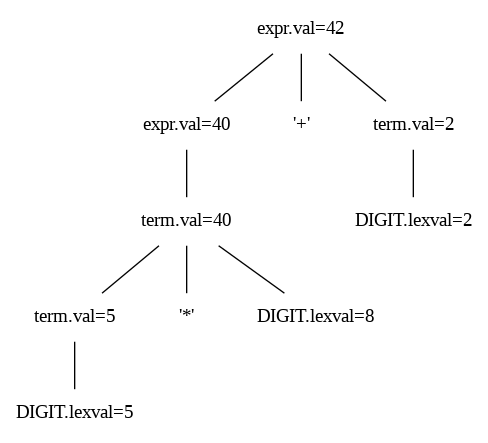
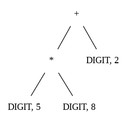
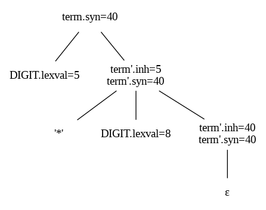

# Typen, Type Checking und Attributierte Grammatiken

> [!NOTE]
>
> <details>
>
> <summary><strong>🖇 Weitere Unterlagen</strong></summary>
>
> - [Annotierte Folien: Typen, Type Checking und attributierte
>   Grammatiken](https://github.com/Compiler-CampusMinden/AnnotatedSlides/blob/master/semantics_attribgrammars.ann.ma.pdf)
>
> </details>

## Motivation

### Ist das alles erlaubt?

Operation erlaubt?

Zuweisung erlaubt?

Welcher Ausdruck hat welchen Typ?

(Welcher Code muss dafür erzeugt werden?)

- a = b
- a = f(b)
- a = b + c
- a = b + o.nummer
- if (f(a) == f(b))

### Taschenrechner: Parsen von Ausdrücken wie `3*5+4`

    expr : expr '+' term
         | term
         ;
    term : term '*' DIGIT
         | DIGIT
         ;

    DIGIT : [0-9] ;

=\> Wie den Ausdruck **ausrechnen**?

*Anmerkung*: Heute geht es um die einfachste Form der semantischen
Analyse: Anreichern einer Grammatik um Attribute und Aktionen, die
während des Parsens oder bei der Traversierung des Parse-Trees
ausgewertet werden.

## Semantische Analyse

### Das haben wir bis jetzt

Wir haben den AST vorliegen.

Idealerweise enthält er bei jedem Bezeichner einen Verweis in sogenannte
Symboltabellen (siehe spätere Veranstaltung).

### Was kann beim Parsen schon überprüft / bestimmt werden?

Hier entsteht ein Tafelbild.

### Was fehlt jetzt noch?

Kontextsensitive Analysen

Hier entsteht ein Tafelbild.

## Analyse von Datentypen

### Typisierung

- stark oder statisch typisierte Sprachen: Alle oder fast alle
  Typüberprüfungen finden in der semantischen Analyse statt (C, C++,
  Java)

- schwach oder dynamisch typisierte Sprachen: Alle oder fast alle
  Typüberprüfungen finden zur Laufzeit statt (Python, Lisp, Perl)

- untypisierte Sprachen: keinerlei Typüberprüfungen (Maschinensprache)

### Ausdrücke

Jetzt muss für jeden Ausdruck im weitesten Sinne sein Typ bestimmt
werden.

Ausdrücke können hier sein:

- rechte Seiten von Zuweisungen

- linke Seiten von Zuweisungen

- Funktions- und Methodenaufrufe

- jeder einzelne aktuelle Parameter in Funktions- und Methodenaufrufen

- Bedingungen in Kontrollstrukturen

### Typinferenz

**Def.:** *Typinferenz* ist die Bestimmung des Datentyps jedes
Bezeichners und jedes Ausdrucks im Code.

- Die Typen von Unterausdrücken bestimmen den Typ eines Ausdrucks

- Kalkül mit sog. Inferenzregeln der Form

  *(Wenn f den Typ $`s \rightarrow t`$ hat und x den Typ s, dann hat der
  Ausdruck f(x) den Typ t.)*

``` math
\frac{f:s \rightarrow t\ \ \ \ \ x:s}{f(x) : t}
```

- 1.  B. zur Auflösung von Überladung und Polymorphie zur Laufzeit

### Statische Typprüfungen

**Bsp.:** Der + - Operator:

| Typ 1. Operand | Typ 2. Operand | Ergebnistyp |
|:--------------:|:--------------:|:-----------:|
|      int       |      int       |     int     |
|     float      |     float      |    float    |
|      int       |     float      |    float    |
|     float      |      int       |    float    |
|     string     |     string     |   string    |

### Typkonvertierungen

- Der Compiler kann implizite Typkonvertierungen vornehmen, um einen
  Ausdruck zu verifizieren (siehe Sprachdefiniton)

- Typerweiterungen, z.B. von *int* nach *float* oder

- Bestimmung des kleinsten umschließenden Typ vorliegender Typen

- *Type Casts*: explizite Typkonvertiereungen

### Nicht grundsätzlich statisch mögliche Typprüfungen

**Bsp.:** Der `^`-Operator $`(a^b)`$:

| Typ 1. Operand | Typ 2. Operand | Ergebnistyp |
|:--------------:|:--------------:|:-----------:|
|      int       | int $`\geq`$ 0 |     int     |
|      int       |    int \< 0    |    float    |
|      int       |     float      |    float    |
|   $`\ldots`$   |   $`\ldots`$   | $`\ldots`$  |

## Attributierte Grammatiken

### Was man damit macht

Die Syntaxanalyse kann keine kontextsensitiven Analysen durchführen

- Kontextsensitive Grammatiken benutzen: Laufzeitprobleme, das Parsen
  von cs-Grammatiken ist *PSPACE-complete*

- Parsergenerator *Bison*: generiert LALR(1)-Parser, aber auch sog.
  *Generalized LR (GLR) Parser*, die bei nichtlösbaren Konflikten in der
  Grammatik (Reduce/Reduce oder Shift/Reduce) parallel den Input mit
  jede der Möglichkeiten weiterparsen

- Anderer Ansatz: Berücksichtigung kontextsensitiver Abhängigkeiten mit
  Hilfe attributierter Grammatiken, zur Typanalyse, auch zur
  Codegenerierung

- Weitergabe von Informationen im Baum

## Syntax-gesteuerte Übersetzung: Attribute und Aktionen

### Berechnen der Ausdrücke

    expr : expr '+' term ;

    translate expr ;
    translate term ;
    handle + ;

### Attributierte Grammatiken (SDD)

auch “*syntax-directed definition*”

Anreichern einer CFG:

- Zuordnung einer Menge von Attributen zu den Symbolen (Terminal- und
  Nicht-Terminal-Symbole)

- Zuordnung einer Menge von *semantischen Regeln* (Evaluationsregeln) zu
  den Produktionen

### Definition: Attributierte Grammatik

Eine *attributierte Grammatik* *AG = (G,A,R)* besteht aus folgenden
Komponenten:

- Mengen A(X) der Attribute eines Nonterminals X

- *G = (N, T, P, S)* ist eine cf-Grammatik

- A = $`\bigcup\limits_{X \in (T \cup N)} A(X)`$ mit
  $`A(X) \cap A(Y) \neq \emptyset \Rightarrow X = Y`$

- R = $`\bigcup\limits_{p \in P} R(p)`$ mit
  $`R(p) = \lbrace X_i.a = f(\ldots) \vert p : X_0 \rightarrow X_1 \ldots X_n \in P, X_i.a \in A(X_i), 0 \leq i \leq n\rbrace`$

### Abgeleitete und ererbte Attribute

Die in einer Produktion p definierten Attribute sind

*AF(p)* =
$`\lbrace X_i.a \ \vert\  p : X_0 \rightarrow X_1 \ldots X_n \in P,  0 \leq i \leq n, X_i.a = f(\ldots) \in R(p)\rbrace`$

Disjunkte Teilmengen der Attribute: abgeleitete (synthesized) Attributen
*AS(X)* und ererbte (inherited) Attributen *AI(X)*:

- *AS(X)* =
  $`\lbrace X.a\ \vert \ \exists p : X \rightarrow X_1 \ldots X_n \in P, X.a \in AF(p)\rbrace`$

- *AI(X)* =
  $`\lbrace X.a\ \vert \ \exists q : Y \rightarrow uXv \in P, X.a\in AF(q)\rbrace`$

Abgeleitete Attribute geben Informationen von unten nach oben weiter,
geerbte von oben nach unten.

*Abhängigkeitsgraphen* stellen die Abhängigkeiten der Attribute dar.

### Beispiel: Attributgrammatiken

| Produktion       | Semantische Regel           |
|:-----------------|:----------------------------|
| `e : e1 '+' t ;` | `e.val = e1.val + t.val`    |
| `e : t ;`        | `e.val = t.val`             |
| `t : t1 '*' D ;` | `t.val = t1.val * D.lexval` |
| `t : D ;`        | `t.val = D.lexval`          |

| Produktion              | Semantische Regel             |
|:------------------------|:------------------------------|
| `t : D t' ;`            | `t'.inh = D.lexval`           |
|                         | `t.syn = t'.syn`              |
| `t' : '*' D t'1 ;`      | `t'1.inh = t'.inh * D.lexval` |
|                         | `t'.syn = t'1.syn`            |
| `t' :` $`\epsilon`$ `;` | `t'.syn = t'.inh`             |

Wenn ein Nichtterminal mehr als einmal in einer Produktion vorkommt,
werden die Vorkommen nummeriert. (t, t1; t’, t’1)

## S-Attributgrammatiken und L-Attributgrammatiken

### S-Attributgrammatiken

*S-Attributgrammatiken*: Grammatiken mit nur abgeleiteten Attributen,
lassen sich während des Parsens mit LR-Parsern beim Reduzieren berechnen
(Tiefensuche mit Postorder-Evaluation):

``` python
def visit(N):
    for each child C of N (from left to right):
        visit(C)
    eval(N)     # evaluate attributes of N
```

### L-Attributgrammatiken

- Grammatiken, deren geerbte Atribute nur von einem Elternknoten oder
  einem linken Geschwisterknoten abhängig sind

- können während des Parsens mit LL-Parsern berechnet werden

- alle Kanten im Abhängigkeitsgraphen gehen nur von links nach rechts

- ein Links-Nach-Rechts-Durchlauf ist ausreichend

- S-attributierte SDD sind eine Teilmenge von L-attributierten SDD

### Beispiel: S-Attributgrammatik

| Produktion       | Semantische Regel           |
|:-----------------|:----------------------------|
| `e : e1 '+' t ;` | `e.val = e1.val + t.val`    |
| `e : t ;`        | `e.val = t.val`             |
| `t : t1 '*' D ;` | `t.val = t1.val * D.lexval` |
| `t : D ;`        | `t.val = D.lexval`          |

### Beispiel: Annotierter Syntaxbaum für `5*8+2`

<p align="center"></p><p align="center">Annotierter
Parse-Tree</p>

### Erzeugung des AST aus dem Parse-Tree für `5*8+2`

| Produktion | Semantische Regel |
|:---|:---|
| `e : e1 '+' t ;` | `e.node = new Node('+', e1.node, t.node)` |
| `e : t ;` | `e.node = t.node` |
| `t : t1 '*' D ;` | `t.node = new Node('*', t1.node, new Leaf(D, D.lexval));` |
| `t : D ;` | `t.node = new Leaf(D, D.lexval);` |

<p align="center"></p><p align="center">AST</p>

### Beispiel: L-Attributgrammatik, berechnete u. geerbte Attribute, ohne Links-Rekursion

Teil der vorigen SDD zum Parsen und Berechnen von Ausdrücken wie
`5*8+2`, hier umformuliert ohne Links-Rekursion und mit berechneten und
geerbten Attributen:

<div align="center">

| Produktion              | Semantische Regel             |
|:------------------------|:------------------------------|
| `t : D t' ;`            | `t'.inh = D.lexval`           |
|                         | `t.syn = t'.syn`              |
| `t' : '*' D t'1 ;`      | `t'1.inh = t'.inh * D.lexval` |
|                         | `t'.syn = t'1.syn`            |
| `t' :` $`\epsilon`$ `;` | `t'.syn = t'.inh`             |

</div>

<div align="center">

**`5*8`** =\>

<p align="center"></p><p align="center">Annotierter
Parse-Tree mit berechneten und geerbten Attributen (nur
Multiplikation)</p>

</div>

*Vorgriff*: Dies ist ein Beispiel für eine “L-attributierte SDD”.

### Beispiel: Typinferenz für `3+7+9` oder `"hello"+"world"`

| Produktion       | Semantische Regel             |
|:-----------------|:------------------------------|
| `e : e1 '+' t ;` | `e.type = f(e1.type, t.type)` |
| `e : t ;`        | `e.type = t.type`             |
| `t : NUM ;`      | `t.type = "int"`              |
| `t : NAME ;`     | `t.type = "string"`           |

## Syntax-gesteuerte Übersetzung (SDT)

### Erweiterung attributierter Grammatiken

*Syntax-directed translation scheme*:

Zu den Attributen kommen **Semantische Aktionen**: Code-Fragmente als
zusätzliche Knoten im Parse Tree an beliebigen Stellen in einer
Produktion, die, wenn möglich, während des Parsens, ansonsten in
weiteren Baumdurchläufen ausgeführt werden.

    e : e1  {print e1.val;}
        '+' {print "+";}
        t   {e.val = e1.val + t.val; print(e.val);}
      ;

### S-attributierte SDD, LR-Grammatik: Bottom-Up-Parsierbar

Die Aktionen werden am Ende jeder Produktion eingefügt (“postfix SDT”).

| Produktion       | Semantische Regel           |
|:-----------------|:----------------------------|
| `e : e1 '+' t ;` | `e.val = e1.val + t.val`    |
| `e : t ;`        | `e.val = t.val`             |
| `t : t1 '*' D ;` | `t.val = t1.val * D.lexval` |
| `t : D ;`        | `t.val = D.lexval`          |

    e : e1 '+' t  {e.val = e1.val + t.val; print(e.val);} ;
    e : t         {e.val = t.val;} ;
    t : t1 '*' D  {t.val = t1.val * D.lexval;} ;
    t : D         {t.val = D.lexval;} ;

### L-attributierte SDD, LL-Grammatik: top-down-parsebar (1/2)

| Produktion              | Semantische Regel             |
|:------------------------|:------------------------------|
| `t : D t' ;`            | `t'.inh = D.lexval`           |
|                         | `t.syn = t'.syn`              |
| `t' : '*' D t'1 ;`      | `t'1.inh = t'.inh * D.lexval` |
|                         | `t'.syn = t'1.syn`            |
| `t' :` $`\epsilon`$ `;` | `t'.syn = t'.inh`             |

    t  : D {t'.inh = D.lexval;} t' {t.syn = t'.syn;} ;
    t' : '*' D {t'1.inh = t'.inh * D.lexval;} t'1 {t'.syn = t'1.syn;} ;
    t' : e {t'.syn = t'.inh;} ;

### L-attributierte SDD, LL-Grammatik: Top-Down-Parsierbar (2/2)

- LL-Grammatik: Jede L-attributierte SDD direkt während des
  Top-Down-Parsens implementierbar/berechenbar

- SDT dazu:

  - Aktionen, die ein berechnetes Attribut des Kopfes einer Produktion
    berechnen, an das Ende der Produktion anfügen

  - Aktionen, die geerbte Attribute für ein Nicht-Terminalsymbol $`A`$
    berechnen, direkt vor dem Auftreten von $`A`$ im Körper der
    Produktion eingefügen

## Implementierung im rekursiven Abstieg

### Implementierung im rekursiven Abstieg

- Geerbte Attribute sind Parameter für die Funktionen für die
  Nicht-Terminalsymbole

- berechnete Attribute sind Rückgabewerte dieser Funktionen.

``` c
T t'(T inh) {
    match('*');
    T t1inh = inh * match(D);
    return t'(t1inh);
}
```

## Wrap-Up

### Wrap-Up

- Die Typinferenz benötigt Informationen aus der Symboltabelle

- Einfache semantische Analyse: Attribute und semantische Regeln (SDD)

- Umsetzung mit SDT: Attribute und eingebettete Aktionen

- Reihenfolge der Auswertung u.U. schwierig

  Bestimmte SDT-Klassen können direkt beim Parsing abgearbeitet werden:

  - S-attributierte SDD, LR-Grammatik: bottom-up-parsebar

  - L-attributierte SDD, LL-Grammatik: top-down-parsebar

  Ansonsten werden die Attribute und eingebetteten Aktionen in den
  Parse-Tree, bzw. AST, integriert und bei einer (späteren)
  Traversierung abgearbeitet.

## 📖 Zum Nachlesen

- Aho u. a. ([2023](#ref-Aho2023)): Kapitel 2.3 und 5
- Levine ([2009](#ref-Levine2009))

> [!NOTE]
>
> <details>
>
> <summary><strong>✅ Lernziele</strong></summary>
>
> - k2: Ich kann das Konzept der attributierten Grammatiken erklären und
>   in einem Beispiel die Anreicherung mit Attributen und semantischen
>   Regeln demonstrieren
> - k2: Ich kann den Unterschied zwischen geerbten und berechneten
>   Attributen erklären
> - k2: Ich kann die Umsetzung von SDD mit Hilfe von SDT erklären
> - k3: Ich kann eine einfache semantische Analyse mit Hilfe von
>   attributierten Grammatiken durchführen
>
> </details>

------------------------------------------------------------------------

> [!NOTE]
>
> <details>
>
> <summary><strong>👀 Quellen</strong></summary>
>
> <div id="refs" class="references csl-bib-body hanging-indent"
> entry-spacing="0">
>
> <div id="ref-Aho2023" class="csl-entry">
>
> Aho, A. V., M. S. Lam, R. Sethi, J. D. Ullman, und S. Bansal. 2023.
> *Compilers: Principles, Techniques, and Tools, Updated 2nd Edition by
> Pearson*. Pearson India.
> <https://learning.oreilly.com/library/view/compilers-principles-techniques/9789357054881/>.
>
> </div>
>
> <div id="ref-Levine2009" class="csl-entry">
>
> Levine, J. 2009. *Flex & Bison*. O’Reilly.
>
> </div>
>
> </div>
>
> </details>

------------------------------------------------------------------------


Unless otherwise noted, this work is licensed under CC BY-SA 4.0.

<blockquote><p><sup><sub><strong>Last modified:</strong> 36445cc (lecture: rework outcomes (03/AttribGrammar), 2025-08-20)<br></sub></sup></p></blockquote>
