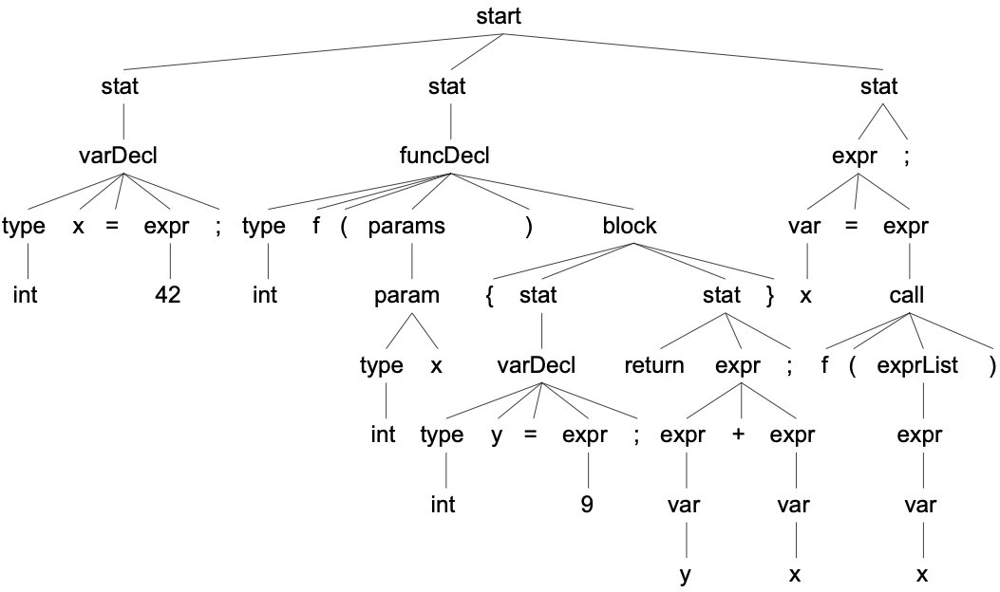
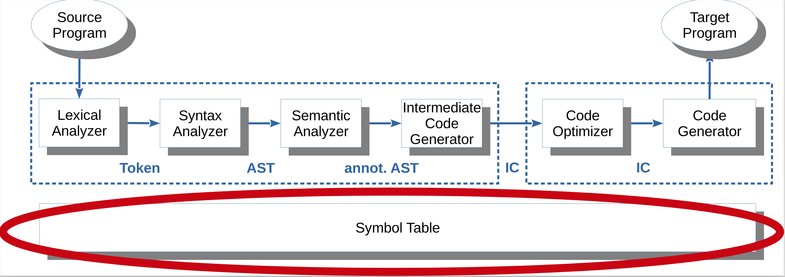
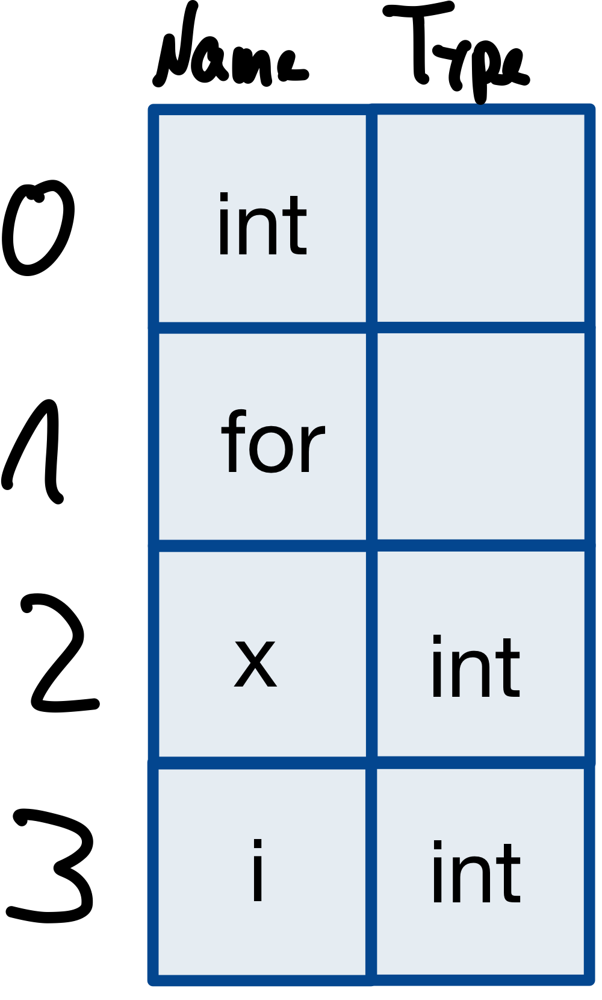

# SymbTab0: Überblick Symboltabellen

> [!IMPORTANT]
>
> <details open>
>
> <summary><strong>🎯 TL;DR</strong></summary>
>
> Auf die lexikalische Analyse und die Syntaxanalyse folgt die
> semantische Analyse. Nach dem Parsen steht fest, dass ein Programm
> syntaktisch korrekt ist. Nun muss geprüft werden, ob es auch
> semantisch korrekt ist. Dies umfasst in der Regel die Identifikation
> und Sammlung von Bezeichnern und die Zuordnung zur richtigen Ebene
> (Scopes). Außerdem muss die Nutzung von Symbolen validiert werden: Je
> nach Sprache müssen beispielsweise Variablen und Funktionen vor ihrer
> Benutzung zumindest deklariert sein; Funktionen sollten sich nicht wie
> Variablen benutzen lassen, …
>
> Als Werkzeug werden (hierarchische) Tabellen eingesetzt, um die
> verschiedenen Symbole und Informationen darüber zu verwalten. Dabei
> werden die Symboltabelleneinträge oft an verschiedenen Stellen im
> Compiler generiert und benutzt.
>
> </details>

> [!TIP]
>
> <details>
>
> <summary><strong>🎦 Videos</strong></summary>
>
> - [VL Symboltabellen (Intro)](https://youtu.be/5637iNH0wWk)
>
> </details>

## Was passiert nach der Syntaxanalyse?

``` c
int x = 42;
int f(int x) {
    int y = 9;
    return y+x;
}

x = f(x);
```



Nach der Syntaxanalyse braucht der Compiler für die darauf folgenden
Phasen **semantische Analyse**, Optimierung und Codegenerierung
**Informationen über Bezeichner**, z.B.

- Welcher Bezeichner ist gemeint?
- Welchen Typ hat ein Bezeichner?

Auf dem Weg zum Interpreter/Compiler müssen die Symbole im AST korrekt
zugeordnet werden. Dies geschieht über Symboltabellen. Im Folgenden
werden wir verschiedene Aspekte von Symboltabellen betrachten und eine
mögliche Implementierung erarbeiten, bevor wir uns (in
[Interpreter](../06-interpretation/syntaxdriven.md)) um die Auswertung
(Interpretation) des AST kümmern können.

### Logische Compilierungsphasen

- Die lexikalische Analyse generiert eine Folge von Token.
- Die Syntaxanalyse generiert einen Parse Tree.

<!-- -->

- Die semantische Analyse macht folgendes:
  - Der Parse Tree wird in einen abstrakten Syntaxbaum (AST)
    umgewandelt.
  - Dieser wird häufig mit Attributen annotiert.
  - Dabei sind oft mehrere Baumdurchläufe nötig (z.B. wegen der
    Abhängigkeiten der Attribute).

<!-- -->

- Nachfolgende Stufen:
  - Der AST wird in einen Zwischencode umgewandelt mit Registern und
    virtuellen Adressen.
  - Der Zwischencode wird optimiert.
  - Aus dem optimierten Zwischencode wird der endgültige Code, aber
    immer noch mit virtuellen Adressen, generiert.
  - Der generierte Code wird nachoptimiert.
  - Der Linker ersetzt die virtuellen Adressen durch reale Adressen.

### Abgrenzung der Phasen

Diese Phasen sind oft nicht klar unterscheidbar. Schon allein zur
Verbesserung der Laufzeit baut der Parser oft schon den abstrakten
Syntaxbaum auf, der Lexer trägt schon Bezeichner in Symboltabellen ein,
der Parser berechnet beim Baumaufbau schon Attribute, …

Oft werden gar nicht alle Phasen und alle Zwischendarstellungen
benötigt.

## Semantische Analyse und Symboltabellen



## Syntax und Semantik

- **Syntaxregeln**: Formaler Aufbau eines Programms

<!-- -->

- **Semantik**: Bedeutung eines (syntaktisch korrekten) Programms

=\> Keine Codegenerierung für syntaktisch/semantisch inkorrekte
Programme!

Zur Erinnerung: Die *Syntaxregeln* einer Programmiersprache bestimmen
den formalen Aufbau eines zu übersetzenden Programms. Die *Semantik*
gibt die Bedeutung eines syntaktisch richtigen Programms an.

Lexikalische und syntaktische Analyse können formalisiert mit regulären
Ausdrücken und endlichen Automaten, sowie mit CFG und Parsern
durchgeführt werden.

Die Durchführung der semantischen Analyse ist stark von den
Eigenschaften der zu übersetzenden Sprache, sowie der Zielsprache
abhängig und kann hier nur beispielhaft für einige Eigenschaften erklärt
werden.

Es darf kein lauffähiges Programm erstellt werden können, dass nicht
syntaktisch und semantisch korrekt ist. Ein lauffähiges Programm muss
syntaktisch und semantisch korrekt sein!

## Aufgaben der semantischen Analyse

- Identifikation und Sammlung der Bezeichner
- Zuordnung zur richtigen Ebene (Scopes)

<!-- -->

- Typ-Inferenz
- Typkonsistenz (Ausdrücke, Funktionsaufrufe, …)

<!-- -->

- Validieren der Nutzung von Symbolen
  - Vermeidung von Mehrfachdefinition
  - Zugriff auf nicht definierte Bezeichner
  - (Lesender) Zugriff auf nicht initialisierte Bezeichner
  - Funktionen werden nicht als Variablen genutzt
  - …

Die semantische Analyse überprüft die Gültigkeit eines syntaktisch
korrekten Programms bzgl. statischer semantischer Eigenschaften und
liefert die Grundlage für die (Zwischen-) Codeerzeugung und
-optimierung. Insbesondere wird hier die Typkonsistenz (in Ausdrücken,
von Parametern, …) überprüft, und implizite Typumwandlungen werden
vorgenommen. Oft müssen Typen automatisch bestimmt werden (z.B. bei
Polymorphie, Typinferenz). Damit Typen bestimmt oder angepasst werden
können, müssen Bezeichner zunächst identifiziert werden, d.h. bei
namensgleichen Bezeichnern der richtige Bezug bestimmt werden.

Zu Annotationen/Attributen, Typen und Type-Checks siehe VL
[Typprüfungen, Attributgrammatiken](attribgrammars.md)

=\> Ein wichtiges Hilfsmittel dazu sind **Symboltabellen**

### Identifizierung von Objekten

Beim Compiliervorgang müssen Namen immer wieder den dazugehörigen
Definitionen zugeordnet, ihre Eigenschaften gesammelt und geprüft und
darauf zugegriffen werden. Symboltabellen werden im Compiler fast
überall gebraucht (siehe Abbildung unter “Einordnung”).

Welche Informationen zu einem Bezeichner gespeichert und ermittelt
werden, ist dann abhängig von der Klasse des Bezeichners.

### Validieren der Nutzung von Symbolen

Hier sind unendlich viele Möglichkeiten denkbar. Dies reicht von den
unten aufgeführten Basisprüfungen bis hin zum Prüfen der
Typkompatibilität bei arithmetischen Operationen. Dabei müssen für alle
Ausdrücke die Ergebnistypen berechnet werden und ggf. automatische
Konvertierungen vorgenommen werden, etwa bei `3+4.1` …

- Zugriff auf Variablen: Müssen sichtbar sein
- Zugriff auf Funktionen: Vorwärtsreferenzen sind OK
- Variablen werden nicht als Funktionen genutzt
- Funktionen werden nicht als Variablen genutzt

=\> Verweis auf VL [Typprüfungen,
Attributgrammatiken](attribgrammars.md)

Da Funktionen bereits vor dem Bekanntmachen der Definition aufgerufen
werden dürfen, bietet sich ein **zweimaliger Durchlauf** (*pass*) an:
Beim ersten Traversieren des AST werden alle Definitionen in der
Symboltabelle gesammelt. Beim zweiten Durchlauf werden dann die
Referenzen aufgelöst.

### Das Mittel der Wahl: Tabellen für die Symbole (= Bezeichner)

**Def.:** *Symboltabellen* sind die zentrale Datenstruktur zur
Identifizierung und Verwaltung von bezeichneten Elementen.

Die Organisation der Symboltabellen ist stark anwendungsabhängig. Je
nach Sprachkonzept gibt es eine oder mehrere Symboltabellen, deren
Einträge vom Lexer oder Parser angelegt werden. Die jeweiligen Inhalte
jedes einzelnen Eintrags kommen aus den verschiedenen Phasen der
Compilierung. Symboltabellen werden oft als Hashtables oder auch als
Bäume implementiert, manchmal als verkettete Listen. In seltenen Fällen
kommt man auch mit einem Stack aus.

Eine Symboltabelle enthält benutzerdefinierte Bezeichner (oder Verweise
in eine Hashtable mit allen vorkommenden Namen), manchmal auch die
Schlüsselwörter der Programmiersprache. Die einzelnen Felder eines
Eintrags variieren stark, abhängig vom Typ des Bezeichners (=
Bezeichnerklasse).

Manchmal gibt es für Datentypen eine Extra-Tabelle, ebenso eine für die
Werte von Konstanten.

Manchmal werden die Namen selbst in eine (Hash-) Tabelle geschrieben.
Die Symboltabelle enthält dann statt der Namen Verweise in diese (Hash-)
Tabelle.

## Einfache Verwaltung von Variablen primitiven Typs

``` c
int x = 0;
int i = 0;

for (i=0; i<10; i++) {
    x++;
}
```



**Bsp.:** Die zu übersetzende Sprache hat nur einen (den globalen) Scope
und kennt nur Bezeichner für Variablen.

- **Eine** Symboltabelle für **alle** Bezeichner
- Jeder Bezeichner ist der Name einer Variablen
- Symboltabelle wird evtl. mit Einträgen aller Schlüsselwörter
  initialisiert – warum?
- Scanner erkennt Bezeichner und sucht ihn in der Symboltabelle
- Ist der Bezeichner nicht vorhanden, wird ein (bis auf den Namen
  leerer) Eintrag angelegt
- Scanner übergibt dem Parser das erkannte Token und einen Verweis auf
  den Symboltabelleneintrag

Die Symboltabelle könnte hier eine (Hash-) Tabelle oder eine einfache
verkettete Liste sein.

## Was kann jetzt weiter passieren?

``` c
int x = 0;
int i = 0;

for (i=0; i<10; i++) {
    x++;
}

a = 42;
```

In vielen Sprachen muss überprüft werden, ob es ein definierendes
Vorkommen des Bezeichners oder ein angewandtes Vorkommen ist.

### Definitionen und Deklarationen von Bezeichnern

**Def.:** Die *Definition* eines (bisher nicht existenten) Bezeichners
in einem Programm generiert einen neuen Bezeichner und legt für ihn
seinem Typ entsprechend Speicherplatz an.

**Def.:** Unter der *Deklaration* eines (bereits existierenden)
Bezeichners verstehen wir seine Bekanntmachung, damit er benutzt werden
kann. Er ist oft in einem anderen Scope definiert und bekommt dort
Speicherplatz zugeteilt.

Insbesondere werden auch Typen deklariert. Hier gibt es in der Regel gar
keine Speicherplatzzuweisung.

Ein Bezeichner kann beliebig oft deklariert werden, während er in einem
Programm nur einmal definiert werden kann. Oft wird bei der
Deklarationen eines Elements sein Namensraum mit angegeben.

**Vorsicht**: Die Begriffe werden auch anders verwendet. Z.B. findet
sich in der Java-Literatur der Begriff *Deklaration* anstelle von
*Definition*.

**Anmerkung**: Deklarationen beziehen sich auf Definitionen, die
woanders in einer Symboltabelle stehen, evtl. in einer anderen Datei,
also in diesem Compilerlauf nicht zugänglich sind und erst von Linker
aufgelöst werden können. Beim Auftreten einer Deklaration muss die
dazugehörige Definition gesucht werden,und wenn vorhanden, im
Symboltabelleneintrag für den deklarierten Bezeichner festgehalten
werden. Hier ist evtl. ein zweiter Baumdurchlauf nötig, um alle offenen
Deklarationen, die sich auf Definitionen in derselben Datei beziehen,
aufzulösen.

Wird bei objektorientierten Sprachen ein Objekt definiert, dessen
Klassendefinition in einer anderen Datei liegt, kann man die Definition
des Objekts gleichzeitig als Deklaration der Klasse auffassen (Java).

## Wo werden Verweise in Symboltabellen gebraucht?

=\> Parse Tree und AST enthalten Verweise auf Symboltabelleneinträge

- Im Parse Tree enthält der Knoten für einen Bezeichner einen Verweis
  auf den Symboltabelleneintrag.
- Parser und semantische Analyse (AST) vervollständigen die Einträge.
- Attribute des AST können Feldern der Symboltabelle entsprechen, bzw.
  sich aus ihnen berechnen.
- Für Debugging-Zwecke können die Symboltabellen die ganze Compilierung
  und das Linken überleben.

## Grenzen der semantischen Analyse

**Welche semantischen Eigenschaften einer Sprache kann die semantische
Analyse nicht überprüfen?**

- Wer ist dann dafür verantwortlich?
- Wie äußert sich das im Fehlerfall?

Dinge, die erst durch eine Ausführung/Interpretation eines Programms
berechnet werden können.

Beispielsweise können Werte von Ausdrücken oft erst zur Laufzeit
bestimmt werden. Insbesondere kann die semantische Analyse in der Regel
nicht feststellen, ob ein Null-Pointer übergeben wird und anschließend
dereferenziert wird.

## Wrap-Up

- Semantische Analyse:
  - Identifikation und Sammlung der Bezeichner
  - Zuordnung zur richtigen Ebene (Scopes)
  - Validieren der Nutzung von Symbolen
  - Typ-Inferenz
  - Typkonsistenz (Ausdrücke, Funktionsaufrufe, …)

<!-- -->

- Symboltabellen: Verwaltung von Symbolen und Typen (Informationen über
  Bezeichner)
- Symboltabelleneinträge werden an verschiedenen Stellen des Compilers
  generiert und benutzt

## 📖 Zum Nachlesen

- Mogensen ([2017](#ref-Mogensen2017)): Kapitel 3
- Parr ([2014](#ref-Parr2014)): Kapitel 6.4 und 8.4
- Parr ([2010](#ref-Parr2010)): Kapitel 6, 7 und 8

> [!NOTE]
>
> <details>
>
> <summary><strong>✅ Lernziele</strong></summary>
>
> - k2: Ich kann die Aufgaben der semantischen Analyse an einem Beispiel
>   erklären
> - k2: Ich kann die Bedeutung von Symboltabellen erklären und die
>   Aufgaben und Verbindung zu den Compiler-Phasen verdeutlichen
>
> </details>

------------------------------------------------------------------------

> [!NOTE]
>
> <details>
>
> <summary><strong>👀 Quellen</strong></summary>
>
> <div id="refs" class="references csl-bib-body hanging-indent"
> entry-spacing="0">
>
> <div id="ref-Mogensen2017" class="csl-entry">
>
> Mogensen, T. 2017. *Introduction to Compiler Design*. Springer.
> <https://doi.org/10.1007/978-3-319-66966-3>.
>
> </div>
>
> <div id="ref-Parr2010" class="csl-entry">
>
> Parr, T. 2010. *Language Implementation Patterns*. Pragmatic
> Bookshelf.
> <https://learning.oreilly.com/library/view/language-implementation-patterns/9781680500097/>.
>
> </div>
>
> <div id="ref-Parr2014" class="csl-entry">
>
> ———. 2014. *The Definitive ANTLR 4 Reference*. Pragmatic Bookshelf.
> <https://learning.oreilly.com/library/view/the-definitive-antlr/9781941222621/>.
>
> </div>
>
> </div>
>
> </details>

------------------------------------------------------------------------


Unless otherwise noted, this work is licensed under CC BY-SA 4.0.

<blockquote><p><sup><sub><strong>Last modified:</strong> 59d9b3d (lecture: rework outcomes (03/SymbTab0), 2025-08-21)<br></sub></sup></p></blockquote>
