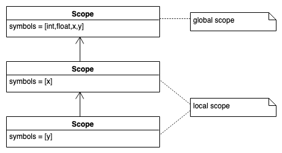
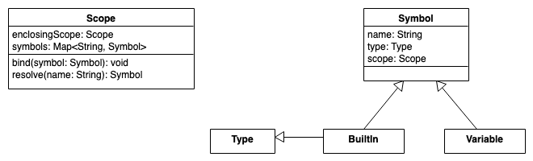

# SymbTab1: Nested Scopes

> [!IMPORTANT]
>
> <details open>
>
> <summary><strong>🎯 TL;DR</strong></summary>
>
> In Symboltabellen werden Informationen über Bezeichner verwaltet. Wenn
> es in der zu übersetzenden Sprache *Nested Scopes* gibt, spiegelt sich
> dies in den Symboltabellen wider: Auch hier wird eine entsprechende
> hierarchische Organisation notwendig. In der Regel nutzt man Tabellen,
> die untereinander verlinkt sind.
>
> Eine wichtige Aufgabe ist das Binden von Bezeichner gleichen Namens an
> ihren jeweiligen Scope =\> `bind()`. Zusätzlich müssen Symboltabellen
> auch das Abrufen von Bezeichnern aus dem aktuellen Scope oder den
> Elternscopes unterstützen =\> `resolve()`.
>
> </details>

> [!TIP]
>
> <details>
>
> <summary><strong>🎦 Videos</strong></summary>
>
> - [VL Nested Scopes](https://youtu.be/CdM1gvsi6P0)
>
> </details>

## Scopes und Name Spaces

**Def.:** Unter dem *Gültigkeitsbereich* (Sichtbarkeitsbereich, Scope)
eines Bezeichners versteht man den Programmabschnitt, in dem der
Bezeichner sichtbar und nutzbar ist. Das ist oft der kleinste umgebende
Block, außer darin enthaltene Scopes, die ein eigenes Element dieses
Namens benutzen.

Scopes sind fast immer hierarchisch angeordnet.

**Def.:** Unter einem *Namensraum* (name space) versteht man die Menge
der zu einem Zeitpunkt sichtbaren Bezeichner.

Es gibt Sprachen, in denen man eigene Namensräume explizit definieren
kann (z.B. C++).

Vorsicht: Diese Begriffe werden nicht immer gleich definiert und auch
gerne verwechselt.

## Symbole und (nested) Scopes

``` c
int x = 42;
float y;
{
    int x;
    x = 1;
    y = 2;
    { int y = x; }
}
```



**Aufgaben**:

- `bind()`: Symbole im Scope definieren
- `resolve()`: Symbole aus Scope oder Eltern-Scope abrufen

### Hinzunahme von Scopes

**Bsp.:** Die zu übersetzende Sprache ist scope-basiert und kennt nur
Bezeichner für Variablen

Scopes können ineinander verschachtelt sein. Die Spezifikation der zu
übersetzenden Sprache legt fest, in welcher Reihenfolge Scopes zu
durchsuchen sind, wenn auf einen Bezeichner Bezug genommen wird, der
nicht im aktuellen Scope definiert ist.

Insgesamt bilden die Scopes oft eine Baumstruktur, wobei jeder Knoten
einen Scope repräsentiert und seine Kinder die direkt in ihm enthaltenen
Scopes sind. Dabei ist es in der Regel so, dass Scopes sich entweder
vollständig überlappen oder gar nicht. Wenn ein Bezeichner nicht im
aktuellen Scope vorhanden ist, muss er in der Regel in umschließenden
Scopes gesucht werden. Hier kann ein Stack aller “offenen” Scopes
benutzt werden.

### Grundlegendes Vorgehen

Das Element, das einen neuen Scope definiert, steht selbst in dem
aktuell behandelten Scope. Wenn dieses Element selbst ein Bezeichner
ist, gehört dieser in den aktuellen Scope. Nur das, was nur innerhalb
des oben genannten Elements oder Bezeichners definiert wird, gehört in
den Scope des Elements oder Bezeichners.

## Nested Scopes: Symbole und Scopes

### Implementierung mit hierarchischen (verketteten) Tabellen

Pro Scope wird eine Symboltabelle angelegt, dabei enthält jede
Symboltabelle zusätzlich einen Verweis auf ihre Vorgängersymboltabelle
für den umgebenden Scope. Die globale Symboltabelle wird typischerweise
mit allen Schlüsselwörtern initialisiert.

- Wenn ein neuer Scope betreten wird, wird eine neue Symboltabelle
  erzeugt.
- Scanner: Erkennt Bezeichner und sucht ihn in der Symboltabelle des
  aktuellen Scopes bzw. trägt ihn dort ein und übergibt dem Parser das
  erkannte Token und einen Verweis auf den Symboltabelleneintrag
  (**Erinnerung**: Der Scanner wird i.d.R. vom Parser aus aufgerufen,
  d.h. der Parser setzt den aktuellen Scope!)
- Parser:
  - Wird ein neues Element (ein Bezeichner) definiert, muss bestimmt
    werden, ob es einen eigenen Scope hat. Wenn ja, wird eine neue
    Symboltabelle für den Scope angelegt. Sie enthält alle Definitionen
    von Elementen, die in diesem Scope liegen. Der Bezeichner selbst
    wird in die aktuelle Symboltabelle eingetragen mit einem Verweis auf
    die neue Tabelle, die all die Bezeichner beinhaltet, die außerhalb
    dieses Scopes nicht sichtbar sein sollen. Die Tabellen werden
    untereinander verzeigert.
  - Wird ein Element deklariert oder benutzt, muss sein Eintrag in allen
    sichtbaren Scopes in der richtigen Reihenfolge entlang der
    Verzeigerung gesucht (und je nach Sprachdefinition auch gefunden)
    werden.
- Der Parse-Tree enthält im Knoten für den Bezeichner den Verweis in die
  Symboltabelle

### Klassenhierarchie für Scopes

Für die Scopes wird eine Klasse `Scope` definiert mit den Methoden
`bind()` (zum Definieren von Symbolen im Scope) und `resolve()` (zum
Abrufen von Symbolen aus dem Scope oder dem umgebenden Scope).

Für lokale Scopes wird eine Instanz dieser Klasse angelegt, die eine
Referenz auf den einschließenden Scope im Attribut `enclosingScope`
hält. Für den globalen Scope ist diese Referenz einfach leer (`None`).

### Klassen und Interfaces für Symbole

Für die Symbole gibt es die Klasse `Symbol`, wo für jedes Symbol Name
und Typ gespeichert wird. Variablensymbole leiten direkt von dieser
Klasse ab. Für die eingebauten Typen wird ein “Marker-Interface” `Type`
erstellt, um Variablen- und Typ-Symbole unterscheiden zu können.



Quelle: Nested Scopes: Eigene Modellierung nach einer Idee in ([Parr
2010](#ref-Parr2010), p. 142)

### Alternative Implementierung über einen Stack

- Der Parse Tree bzw. der AST enthalten an den Knoten, die jeweils einen
  ganzen Scope repräsentieren, einen Verweis auf die Symboltabelle
  dieses Scopes.
- Die Scopes werden in einem Stack verwaltet.
- Wird ein Scope betreten beim Baumdurchlauf, wird ein Verweis auf seine
  Symboltabelle auf den Stack gepackt.
- Die Suche von Bezeichnern in umliegenden Scopes erfordert ein
  Durchsuchen des Stacks von oben nach unten.
- Beim Verlassen eines Scopes beim Baumdurchlauf wird der Scope vom
  Stack entfernt.

## Nested Scopes: Definieren und Auflösen von Namen

``` python
class Scope:
    Scope enclosingScope    # None if global (outermost) scope
    Symbol<String, Symbol> symbols

    def resolve(name):
        # do we know "name" here?
        if symbols[name]: return symbols[name]
        # if not here, check any enclosing scope
        if enclosingScope: return enclosingScope.resolve(name)
        else: return None     # not found

    def bind(symbol):
        symbols[symbol.name] = symbol
        symbol.scope = self     # track the scope in each symbol
```

Quelle: Nested Scopes: Eigene Implementierung nach einer Idee in ([Parr
2010](#ref-Parr2010), p. 169)

**Anmerkung**: In der Klasse `Symbol` kann man ein Feld `scope` vom Typ
`Scope` implementieren. Damit “weiss” jedes Symbol, in welchem Scope es
definiert ist und man muss sich auf der Suche nach dem Scope eines
Symbols ggf. nicht erst durch die Baumstruktur hangeln. Aus technischer
Sicht verhindert das Attribut das Aufräumen eines lokalen Scopes durch
den Garbage Collector, wenn man den lokalen Scope wieder verlässt: Jeder
Scope hat eine Referenz auf den umgebenden (Eltern-) Scope (Feld
`enclosingScope`). Wenn man den aktuellen Scope “nach oben” verlässt,
würde der eben verlassene lokale Scope bei nächster Gelegenheit
aufgeräumt, wenn es keine weiteren Referenzen auf diesen gäbe. Da nun
aber die Symbole, die in diesem Scope definiert wurden, auf diesen
verweisen, passiert das nicht :)

## Nested Scopes: Listener

Mit einem passenden Listener kann man damit die nötigen Scopes aufbauen:

- `enterStart`:
  - erzeuge neuen globalen Scope
  - definiere und pushe die eingebauten Typen
- `exitVarDecl`:
  - löse den Typ der Variablen im aktuellen Scope auf
  - definiere ein neues Variablensymbol im aktuellen Scope
- `exitVar`:
  - löse die Variable im aktuellen Scope auf
- `enterBlock`:
  - erzeuge neuen lokalen Scope, wobei der aktuelle Scope der
    Elternscope ist
  - ersetze den aktuellen Scope durch den lokalen Scope
- `exitBlock`:
  - ersetze den aktuellen Scope durch dessen Elternscope

``` yacc
start   :   stat+ ;

stat    : block | varDecl | expr ';' ;
block   : '{' stat* '}' ;

varDecl : type ID ('=' expr)? ';' ;
expr    : var '=' INT ;

var     : ID ;
type    : 'float' | 'int' ;
```

Relevanter Ausschnitt aus der Grammatik

``` c
int x = 42;

{ int y = 9; x = 7; }
```

``` python
class MyListener(BaseListener):
    Scope scope

    def enterStart(Parser.FileContext ctx):
        globals = Scope()
        globals.bind(BuiltIn("int"))
        globals.bind(BuiltIn("float"))
        scope = globals

    def enterBlock(Parser.BlockContext ctx):
        scope = Scope(scope)
    def exitBlock(Parser.BlockContext ctx):
        scope = scope.enclosingScope

    def exitVarDecl(Parser.VarDeclContext ctx):
        t = scope.resolve(ctx.type().getText())
        var = Variable(ctx.ID().getText(), t)
        scope.bind(var)
    def exitVar(Parser.VarContext ctx):
        name = ctx.ID().getText()
        var = scope.resolve(name)
        if var == None: error("no such var: " + name)
```

*Anmerkung*: Um den Code auf die Folie zu bekommen, ist dies ein Mix aus
Java und Python geworden. Sry ;)

In der Methode `exitVar()` wird das Variablensymbol beim Ablaufen des
AST lediglich aufgelöst und ein Fehler geworfen, wenn das
Variablensymbol (noch) nicht bekannt ist. Hier könnte man weiteres
Type-Checking und/oder -Propagation ansetzen.

Später im Interpreter muss an dieser Stelle dann aber auch der **Wert**
der Variablen abgerufen werden …

## Löschen von Symboltabellen

Möglicherweise sind die Symboltabellen nach der Identifizierungsphase
der Elemente überflüssig, weil die zusammengetragenen Informationen als
Attribute im AST stehen. Die Knoten enthalten dann Verweise auf
definierende Knoten von Elementen, nicht mehr auf Einträge in den
Symboltabellen. In diesem Fall können die Symboltabellen nach der
Identifizierung gelöscht werden, wenn sie nicht z.B. für einen
symbolischen Debugger noch gebraucht werden.

## Wrap-Up

- Symboltabellen: Verwaltung von Symbolen und Typen (Informationen über
  Bezeichner)

<!-- -->

- Blöcke: Nested Scopes =\> hierarchische Organisation
- Binden von Bezeichner gleichen Namens an ihren jeweiligen Scope =\>
  `bind()`
- Abrufen von Bezeichnern aus dem aktuellen Scope oder den Elternscopes
  =\> `resolve()`

## 📖 Zum Nachlesen

- Mogensen ([2017](#ref-Mogensen2017)): Kapitel 3
- Parr ([2014](#ref-Parr2014)): Kapitel 6.4 und 8.4
- Parr ([2010](#ref-Parr2010)): Kapitel 6, 7 und 8

> [!NOTE]
>
> <details>
>
> <summary><strong>✅ Lernziele</strong></summary>
>
> - k3: Ich kann Symboltabellen für Nested Scopes implementieren unter
>   Nutzung von passenden Strukturen/Klassen und einem Listener
> - k3: Ich kann Symbole über die Scopes auflösen
> - k3: Ich kann einfache statische Prüfungen anhand der Symboltabellen
>   durchführen
>
> </details>

------------------------------------------------------------------------

> [!NOTE]
>
> <details>
>
> <summary><strong>👀 Quellen</strong></summary>
>
> <div id="refs" class="references csl-bib-body hanging-indent"
> entry-spacing="0">
>
> <div id="ref-Mogensen2017" class="csl-entry">
>
> Mogensen, T. 2017. *Introduction to Compiler Design*. Springer.
> <https://doi.org/10.1007/978-3-319-66966-3>.
>
> </div>
>
> <div id="ref-Parr2010" class="csl-entry">
>
> Parr, T. 2010. *Language Implementation Patterns*. Pragmatic
> Bookshelf.
> <https://learning.oreilly.com/library/view/language-implementation-patterns/9781680500097/>.
>
> </div>
>
> <div id="ref-Parr2014" class="csl-entry">
>
> ———. 2014. *The Definitive ANTLR 4 Reference*. Pragmatic Bookshelf.
> <https://learning.oreilly.com/library/view/the-definitive-antlr/9781941222621/>.
>
> </div>
>
> </div>
>
> </details>

------------------------------------------------------------------------


Unless otherwise noted, this work is licensed under CC BY-SA 4.0.

<blockquote><p><sup><sub><strong>Last modified:</strong> 0db2fe0 (tooling: rename 'origin' to 'credits', 2025-08-22)<br></sub></sup></p></blockquote>
