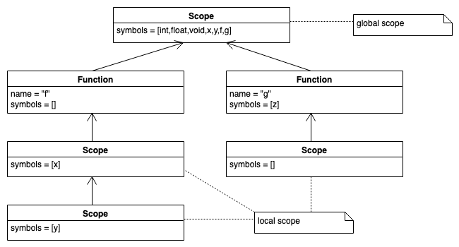
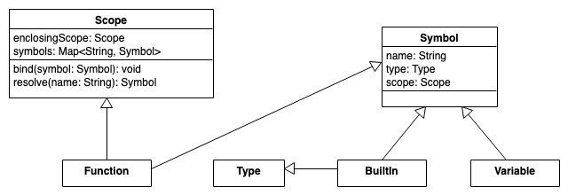

# SymbTab2: Funktionen

> [!IMPORTANT]
>
> <details open>
>
> <summary><strong>🎯 TL;DR</strong></summary>
>
> Eine Funktion sind selbst ein Symbol, welches in einem Scope gilt und
> entsprechend in der Symboltabelle eingetragen wird. Darüber hinaus
> bildet sie einen neuen verschachtelten Scope, in dem die
> Funktionsparameter und der Funktionskörper definiert werden müssen.
>
> Entsprechend müssen die Strukturen für die Symboltabellen sowie das
> Eintragen und das Auflösen von Symbolen erweitert werden.
>
> </details>

> [!TIP]
>
> <details>
>
> <summary><strong>🎦 Videos</strong></summary>
>
> - [VL Funktionen](https://youtu.be/yk2x6WGhgVg)
>
> </details>

## Funktionen und Scopes

``` c
int x = 42;
int y;
void f() {
    int x;
    x = 1;
    y = 2;
    { int y = x; }
}
void g(int z){}
```



### Behandlung von Funktionsdefinitionen

- Jeder Symboltabelleneintrag braucht ein Feld, das angibt, ob es sich
  um eine Variable, eine Funktion, … handelt. Alternativ eine eigene
  Klasse ableiten …
- Der Name der Funktion steht als Bezeichner in der Symboltabelle des
  Scopes, in dem die Funktion definiert wird.
- Der Symboltabelleneintrag für den Funktionsnamen enthält Verweise auf
  die Parameter.
- Der Symboltabelleneintrag für den Funktionsnamen enthält Angaben über
  den Rückgabetypen.
- Jede Funktion wird grundsätzlich wie ein neuer Scope behandelt.
- Die formalen Parameter werden als Einträge in der Symboltabelle für
  den Scope der Funktion angelegt and entsprechend als Parameter
  gekennzeichnet.

### Behandlung von Funktionsaufrufen

- Der Name der Funktion steht als Bezeichner in der Symboltabelle des
  Scopes, in dem die Funktion aufgerufen wird und wird als Aufruf
  gekennzeichnet.
- Der Symboltabelleneintrag für den Funktionsnamen enthält Verweise auf
  die aktuellen Parameter.
- Die Definition der Funktion wird in den zugänglichen Scopes gesucht
  (wie oben) und ein Verweis darauf in der Symboltabelle gespeichert.

## Erweiterung des Klassendiagramms für Funktions-Scopes



Quelle: Funktions-Scopes: Eigene Modellierung nach einer Idee in ([Parr
2010](#ref-Parr2010), p. 147)

## Funktionen sind Symbole *und* Scopes

``` python
class Function(Scope, Symbol):
    def __init__(name, retType, enclScope):
        Symbol.__init__(name, retType)      # we are "Symbol" ...
        enclosingScope = enclScope          # ... and "Scope"
```

## Funktionen: Listener

Den Listener zum Aufbau der Scopes könnte man entsprechend erweitern:

- `enterFuncDecl`:
  - löse den Typ der Funktion im aktuellen Scope auf
  - lege neues Funktionssymbol an, wobei der aktuelle Scope der
    Elternscope ist
  - definiere das Funktionssymbol im aktuellen Scope
  - ersetze den aktuellen Scope durch das Funktionssymbol
- `exitFuncDecl`:
  - ersetze den aktuellen Scope durch dessen Elternscope
- `exitParam`: analog zu `exitVarDecl`
  - löse den Typ der Variablen im aktuellen Scope auf
  - definiere ein neues Variablensymbol im aktuellen Scope
- `exitCall`: analog zu `exitVar`
  - löse das Funktionssymbol (und die Argumente) im aktuellen Scope auf

``` yacc
funcDecl : type ID '(' params? ')' block ;
params   : param (',' param)* ;
param    : type ID ;

call     : ID '(' exprList? ')' ;
exprList : expr (',' expr)* ;
```

Relevanter Ausschnitt aus der Grammatik

``` c
int f(int x) {
    int y = 9;
}

int x = f(x);
```

``` python
def enterFuncDecl(Parser.FuncDeclContext ctx):
    name = ctx.ID().getText()
    type = scope.resolve(ctx.type().getText())
    func = Function(name, type, scope)
    scope.bind(func)
    # change current scope to function scope
    scope = func

def exitFuncDecl(Parser.FuncDeclContext ctx):
    scope = scope.enclosingScope
def exitParam(Parser.ParamContext ctx):
    t = scope.resolve(ctx.type().getText())
    var = Variable(ctx.ID().getText(), t)
    scope.bind(var)

def exitCall(Parser.CallContext ctx):
    name = ctx.ID().getText()
    func = scope.resolve(name)
    if func == None:
        error("no such function: " + name)
    if func.type == Variable:
        error(name + " is not a function")
```

*Anmerkung*: Um den Code auf die Folie zu bekommen, ist dies wieder ein
Mix aus Java und Python geworden. Sry ;)

Im Vergleich zu den einfachen *nested scopes* kommt hier nur ein
weiterer Scope für den Funktionskopf dazu. Dieser spielt eine
Doppelrolle: Er ist sowohl ein Symbol (welches im Elternscope bekannt
ist) als auch ein eigener (lokaler) Scope für die Funktionsparameter.

Um später im Interpreter eine Funktion tatsächlich auswerten zu können,
muss im Scope der Funktion zusätzlich der AST-Knoten der
Funktionsdefinition gespeichert werden (weiteres Feld/Attribut in
`Function`)!

## Wrap-Up

- Symboltabellen: Verwaltung von Symbolen und Typen (Informationen über
  Bezeichner)

<!-- -->

- Funktionen: Nested Scopes =\> hierarchische Organisation
- Umgang mit dem Funktionsnamen, den Parametern und dem Funktionskörper

## 📖 Zum Nachlesen

- Mogensen ([2017](#ref-Mogensen2017)): Kapitel 3
- Parr ([2014](#ref-Parr2014)): Kapitel 6.4 und 8.4
- Parr ([2010](#ref-Parr2010)): Kapitel 6, 7 und 8

> [!NOTE]
>
> <details>
>
> <summary><strong>✅ Lernziele</strong></summary>
>
> - k3: Ich kann Symboltabellen für Nested Scopes implementieren unter
>   Nutzung von passenden Strukturen/Klassen und einem Listener
> - k3: Ich kann Parameter und lokale Variablen von Funktionen auflösen
>
> </details>

> [!TIP]
>
> <details>
>
> <summary><strong>🏅 Challenges</strong></summary>
>
> Diskutieren Sie folgende Fragen:
>
> - Warum werden überhaupt Symboltabellen eingesetzt?
> - Warum muss man zwischen Deklaration und Definition unterscheiden?
> - Erklären Sie die Verbindung einer Symboltabelle zu den einzelnen
>   Phasen einer Compiler-Pipeline.
> - Wo liegen die Grenzen der semantischen Analyse?
> - Warum kann man im Allgemeinen nicht die Symboltabellen nutzen, um
>   die Werte von Symbolen mit zu speichern?
> - Wieso sind Funktionen Scope und Symbol gleichzeitig?
> - Skizzieren Sie für eine Funktionsdeklaration mit Parametern die
>   resultierende Symboltabelle.
> - Erklären Sie, wie man beim Funktionsaufruf vorgehen würde. Werden
>   dabei Einträge in der Symboltabelle erzeugt?
>
> </details>

------------------------------------------------------------------------

> [!NOTE]
>
> <details>
>
> <summary><strong>👀 Quellen</strong></summary>
>
> <div id="refs" class="references csl-bib-body hanging-indent"
> entry-spacing="0">
>
> <div id="ref-Mogensen2017" class="csl-entry">
>
> Mogensen, T. 2017. *Introduction to Compiler Design*. Springer.
> <https://doi.org/10.1007/978-3-319-66966-3>.
>
> </div>
>
> <div id="ref-Parr2010" class="csl-entry">
>
> Parr, T. 2010. *Language Implementation Patterns*. Pragmatic
> Bookshelf.
> <https://learning.oreilly.com/library/view/language-implementation-patterns/9781680500097/>.
>
> </div>
>
> <div id="ref-Parr2014" class="csl-entry">
>
> ———. 2014. *The Definitive ANTLR 4 Reference*. Pragmatic Bookshelf.
> <https://learning.oreilly.com/library/view/the-definitive-antlr/9781941222621/>.
>
> </div>
>
> </div>
>
> </details>

------------------------------------------------------------------------


Unless otherwise noted, this work is licensed under CC BY-SA 4.0.

<blockquote><p><sup><sub><strong>Last modified:</strong> 0db2fe0 (tooling: rename 'origin' to 'credits', 2025-08-22)<br></sub></sup></p></blockquote>
