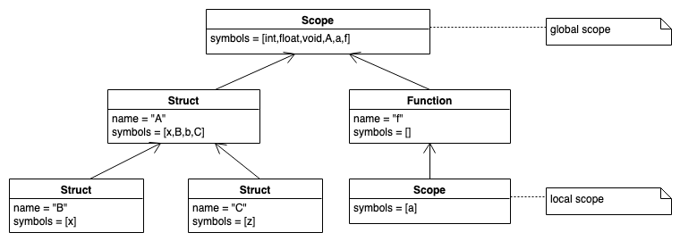
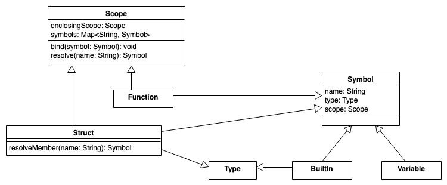
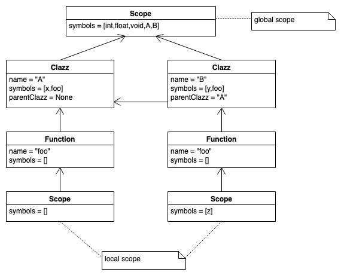
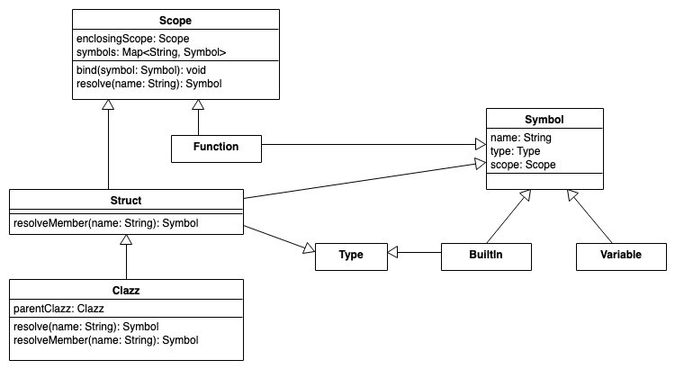

::: tldr
Strukturen und Klassen bilden jeweils einen eigenen verschachtelten Scope, worin die
Attribute und Methoden definiert werden.

Bei der Namensauflösung muss man dies beachten und darf beim Zugriff auf Attribute
und Methoden nicht einfach in den übergeordneten Scope schauen. Zusätzlich müssen
hier Vererbungshierarchien in der Struktur der Symboltabelle berücksichtigt werden.
:::

::: youtube
-   [VL Strukturen und Klassen](https://youtu.be/-w9ljeFGq3k)
:::

# Strukturen

::::: columns
::: {.column width="32%"}
``` c
struct A {
    int x;
    struct B {int x;};
    B b;
    struct C {int z;};
};
A a;
void f() {
    A a;
    a.b.x = 42;
}
```
:::

::: {.column width="68%"}
\pause
\vspace{8mm}


:::
:::::

# Strukturen: Erweiterung der Symbole und Scopes

{width="80%"}

[Structs: Eigene Modellierung nach einer Idee in [@Parr2010, p. 162]]{.origin nolist=true}

::: notes
Strukturen stellen wie Funktionen sowohl einen Scope als auch ein Symbol dar.

Zusätzlich stellt eine Struktur (-definition) aber auch einen neuen Typ dar, weshalb
`Struct` auch noch das Interface `Type` "implementiert".
:::

# Strukturen: Auflösen von Namen

``` python
class Struct(Scope, Symbol, Type):
    def resolveMember(name):
        return symbols[name]
```

\smallskip

=\> Auflösen von "`a.b`"[(im Listener in `exitMember()`)]{.notes}:

-   `a` im "normalen" Modus mit `resolve()` über den aktuellen Scope
-   Typ von `a` ist `Struct` mit Verweis auf den eigenen Scope
-   `b` nur innerhalb des `Struct`-Scopes mit `resolveMember()`

::: notes
In der Grammatik würde es eine Regel `member` geben, die auf eine Struktur der Art
`ID.ID` anspricht (d.h. eigentlich den Teil `.ID`), und entsprechend zu Methoden
`enterMember()` und `exitMember()` im Listener führt.

Das Symbol für `a` hat als `type`-Attribut eine Referenz auf die `Struct`, die ja
einen eigenen Scope hat (`symbols`-Map). Darin muss dann `b` aufgelöst werden.
:::

\bigskip

::::::: slides
:::::: columns
::: {.column width="13%"}
\vspace{-1mm}

``` {.c size="tiny"}
struct A {
    int b;
};
void f() {
    A a;
    a.b = 42;
}
```
:::

::: {.column width="33%"}

:::

::: {.column width="54%"}
{width="90%"}

[Structs: Eigene Modellierung nach einer Idee in [@Parr2010, p. 162]]{.origin nolist=true}
:::
::::::
:::::::

# Klassen

::::: columns
::: {.column width="32%"}
``` cpp
class A {
public:
    int x;
    void foo() { ; }
};
class B : public A {
public
    int y;
    void foo() {
        int z = x+y;
    }
};
```
:::

::: {.column width="58%"}
\pause


:::
:::::

# Klassen: Erweiterung der Symbole und Scopes

{width="80%"}

[Klassen: Eigene Modellierung nach einer Idee in [@Parr2010, p. 167]]{.origin nolist=true}

::: notes
Bei Klassen kommt in den Tabellen ein weiterer Pointer `parentClazz` auf die
Elternklasse hinzu (in der Superklasse ist der Wert `None`).
:::

# Klassen: Auflösen von Namen

``` {.python size="footnotesize"}
class Clazz(Struct):
    Clazz parentClazz   # None if base class

    def resolve(name):
        # do we know "name" here?
        if symbols[name]: return symbols[name]
        # NEW: if not here, check any parent class ...
        if parentClazz and parentClazz.resolve(name): return parentClazz.resolve(name)
        else:
            # ... or enclosing scope if base class
            if enclosingScope: return enclosingScope.resolve(name)
            else: return None     # not found

    def resolveMember(name):
        if symbols[name]: return symbols[name]
        # NEW: check parent class
        if parentClazz: return parentClazz.resolveMember(name)
        else: return None
```

[Klassen: Eigene Implementierung nach einer Idee in [@Parr2010, p. 172]]{.origin nolist=true}

::: notes
**Hinweis**: Die obige Implementierungsskizze soll vor allem das Prinzip
demonstrieren - sie ist aus Gründen der Lesbarkeit nicht besonders effizient:
beispielsweise wird `parentClazz.resolve(name)` mehrfach evaluiert ...

Beim Auflösen von Attributen oder Methoden muss zunächst in der Klasse selbst
gesucht werden, anschließend in der Elternklasse.

Beispiel (mit den obigen Klassen `A` und `B`):

``` cpp
B foo;
foo.x = 42;
```

Hier wird analog zu den Structs zuerst `foo` mit `resolve()` im lokalen Scope
aufgelöst. Der Typ des Symbols `foo` ist ein `Clazz`, was zugleich ein Scope ist. In
diesem Scope wird nun mit `resolveMember()` nach dem Symbol `x` gesucht. Falls es
hier nicht gefunden werden kann, wird in der Elternklasse (sofern vorhanden) weiter
mit`resolveMember()` gesucht.

Die normale Namensauflösung wird ebenfalls erweitert um die Auflösung in der
Elternklasse.

Beispiel:

``` cpp
int wuppie;
class A {
public:
    int x;
    void foo() { ; }
};
class B : public A {
public
    int y;
    void foo() {
        int z = x+y+wuppie;
    }
};
```

Hier würde `wuppie` als Symbol im globalen Scope definiert werden. Beim Verarbeiten
von `int z = x+y+wuppie;` würde mit `resolve()` nach `wuppie` gesucht: Zuerst im
lokalen Scope unterhalb der Funktion, dann im Funktions-Scope, dann im Klassen-Scope
von `B`. Hier sucht `resolve()` auch zunächst lokal, geht dann aber die
Vererbungshierarchie entlang (sofern wie hier vorhanden). Erst in der Superklasse
(wenn der `parentClazz`-Zeiger `None` ist), löst `resolve()` wieder normal auf und
sucht um umgebenden Scope. Auf diese Weise kann man wie gezeigt in Klassen
(Methoden) auf globale Variablen verweisen ...

*Anmerkung*: Durch dieses Vorgehen wird im Prinzip in Methoden aus dem Zugriff auf
ein Feld `x` implizit ein `this.x` aufgelöst, wobei `this` die Klasse auflöst und
`x` als Attribut darin.
:::

# Wrap-Up

-   Symboltabellen: Verwaltung von Symbolen und Typen (Informationen über
    Bezeichner)

\smallskip

-   Strukturen und Klassen bilden eigenen Scope
-   Strukturen/Klassen lösen etwas anders auf: Zugriff auf Attribute und Methoden

::: readings
-   @Mogensen2017: Kapitel 3
-   @Parr2014: Kapitel 6.4 und 8.4
-   @Parr2010: Kapitel 6, 7 und 8
:::

::: outcomes
-   k3: Ich kann Symboltabellen für Nested Scopes implementieren unter Nutzung von
    passenden Strukturen/Klassen und einem Listener
-   k3: Ich kann Attribute von Klassen und Strukturen auflösen
:::

::: challenges
**Symboltabellen praktisch**

Betrachten Sie folgenden Java-Code:

1.  Umkreisen Sie alle Symbole.
2.  Zeichen Sie Pfeile von Symbol-Referenzen zur jeweiligen Definition (falls
    vorhanden).
3.  Identifizieren Sie alle benannten Scopes.
4.  Identifizieren Sie alle anonymen Scopes.
5.  Geben Sie die resultierende Symboltabelle an (Strukturen wie in VL besprochen).

``` java
package a.b;

import u.Y;

class X extends Y {
    int f(int x) {
        int x,y;
        { int x; x - y + 1; }
        x = y + 1;
    }
}

class Z {
    class W extends X {
        int x;
        void foo() { f(34); }
    }
    int x,z;
    int f(int x) {
        int y;
        y = x;
        z = x;
    }
}
```
:::
