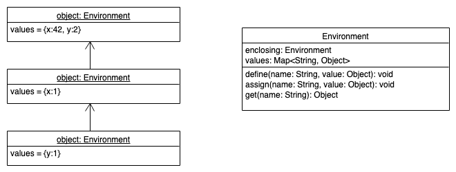

# AST-basierte Interpreter: Basics

> [!IMPORTANT]
>
> <details open>
>
> <summary><strong>🎯 TL;DR</strong></summary>
>
> Ein AST-basierter Interpreter besteht oft aus einem
> “Visitor-Dispatcher”: Man traversiert mit einer `eval()`-Funktion den
> AST und ruft je nach Knotentyp die passende Funktion auf. Dabei werden
> bei Ausdrücken (*Expressions*) Werte berechnet und zurückgegeben, d.h.
> hier hat man einen Rückgabewert und ein entsprechendes `return` im
> `switch`/`case`, während man bei Anweisungen (*Statements*) keinen
> Rückgabewert hat.
>
> Der Wert von Literalen ergibt sich direkt durch die Übersetzung des
> jeweiligen Werts in den passenden Typ der Implementierungssprache. Bei
> einfachen Ausdrücken kann man auf das in [Syntaxgesteuerte
> Interpreter](https://github.com/Compiler-CampusMinden/CPL-Vorlesung-Master/blob/master/lecture/06-interpretation/syntaxdriven.md)
> demonstrierte Vorgehen zurückgreifen: Man interpretiert zunächst die
> Teilausdrücke durch den Aufruf von `eval()` für die jeweiligen
> AST-Kindknoten und berechnet daraus das gewünschte Ergebnis.
>
> Für Blöcke und Variablen muss man analog zum Aufbau von Symboltabellen
> wieder Scopes berücksichtigen, d.h. man benötigt Strukturen ähnlich zu
> den Symboltabellen (hier “Umgebung” (*Environment*) genannt). Es gibt
> eine globale Umgebung, und mit dem Betreten eines neuen Blocks wird
> eine neue Umgebung aufgemacht, deren Eltern-Umgebung die bisherige
> Umgebung ist.
>
> Zu jedem Namen kann man in einer Umgebung einen Wert definieren bzw.
> abrufen. Dabei muss man je nach Semantik der zu interpretierenden
> Sprache unterscheiden zwischen der “Definition” und der “Zuweisung”
> einer Variablen: Die Definition erfolgt i.d.R. in der aktuellen
> Umgebung, bei der Zuweisung sucht man ausgehend von der aktuellen
> Umgebung bis hoch zur globalen Umgebung nach dem ersten Vorkommen der
> Variablen und setzt den Wert in der gefundenen Umgebung. Bei Sprachen,
> die Variablen beim ersten Zugriff definieren, muss man dieses
> Verhalten entsprechend anpassen.
>
> </details>

> [!TIP]
>
> <details>
>
> <summary><strong>🎦 Videos</strong></summary>
>
> - [VL AST-basierte Interpreter (Basics)](https://youtu.be/lupQ0f3Tp7A)
>
> </details>

## Aufgaben im Interpreter

Im Allgemeinen reichen einfache syntaxgesteuerte Interpreter nicht aus.
Normalerweise simuliert ein Interpreter die Ausführung eines Programms
durch den Computer. D.h. der Interpreter muss über die entsprechenden
Eigenschaften verfügen: Prozessor, Code-Speicher, Datenspeicher, Stack …

``` c
int x = 42;
int f(int x) {
    int y = 9;
    return y+x;
}

x = f(x);
```

- Aufbauen des AST … =\> Lexer+Parser
- Auflösen von Symbolen/Namen … =\> Symboltabellen, Resolving
- Type-Checking und -Inference … =\> Semantische Analyse (auf
  Symboltabellen)

<!-- -->

- Speichern von Daten: Name+Wert vs. Adresse+Wert (Erinnerung:
  Data-Segment und Stack im virtuellen Speicher)
- Ausführen von Anweisungen Text-Segment im virtuellen Speicher; hier
  über den AST
- Aufruf von Funktionen und Methoden Kontextwechsel nötig: Was ist von
  wo aus sichtbar?

## AST-basierte Interpreter: Visitor-Dispatcher

``` python
def eval(self, AST t):
    if   t.type == Parser.BLOCK  : block(t)
    elif t.type == Parser.ASSIGN : assign(t)
    elif t.type == Parser.RETURN : ret(t)
    elif t.type == Parser.IF     : ifstat(t)
    elif t.type == Parser.CALL   : return call(t)
    elif t.type == Parser.ADD    : return add(t)
    elif t.type == Parser.MUL    : return mul(t)
    elif t.type == Parser.INT    : return Integer.parseInt(t.getText())
    elif t.type == Parser.ID     : return load(t)
    else : ...  # catch unhandled node types
    return None;
```

Nach dem Aufbau des AST durch Scanner und Parser und der semantischen
Analyse anhand der Symboltabellen müssen die Ausdrücke (*expressions*)
und Anweisungen (*statements*) durch den Interpreter ausgewertet werden.
Eine Möglichkeit dazu ist das Traversieren des AST mit dem
Visitor-Pattern. Basierend auf dem Typ des aktuell betrachteten
AST-Knotens wird entschieden, wie damit umgegangen werden soll. Dies
erinnert an den Aufbau der Symboltabellen …

Die `eval()`-Methode bildet das Kernstück des (AST-traversierenden)
Interpreters. Hier wird passend zum aktuellen AST-Knoten die passende
Methode des Interpreters aufgerufen.

**Hinweis**: Im obigen Beispiel wird nicht zwischen der Auswertung von
Ausdrücken und Anweisungen unterschieden, es wird die selbe Methode
`eval()` genutzt. Allerdings liefern Ausdrücke einen Wert zurück
(erkennbar am `return` im jeweiligen `switch/case`-Zweig), während
Anweisungen keinen Wert liefern.

In den folgenden Beispielen wird davon ausgegangen, dass ein komplettes
Programm eingelesen, geparst, vorverarbeitet und dann interpretiert
wird.

Für einen interaktiven Interpreter würde man in einer Schleife die
Eingaben lesen, parsen und vorverarbeiten und dann interpretieren. Dabei
würde jeweils der AST und die Symboltabelle *ergänzt*, damit die neuen
Eingaben auf frühere verarbeitete Eingaben zurückgreifen können. Durch
die Form der Schleife “Einlesen – Verarbeiten – Auswerten” hat sich auch
der Name “*Read-Eval-Loop*” bzw. “*Read-Eval-Print-Loop*” (**REPL**)
eingebürgert.

## Auswertung von Literalen und Ausdrücken

- Typen mappen: Zielsprache =\> Implementierungssprache

  Die in der Zielsprache verwendeten (primitiven) Typen müssen auf
  passende Typen der Sprache, in der der Interpreter selbst
  implementiert ist, abgebildet werden.

  Beispielsweise könnte man den Typ `nil` der Zielsprache auf den Typ
  `null` des in Java implementierten Interpreters abbilden, oder den Typ
  `number` der Zielsprache auf den Typ `Double` in Java mappen.

<!-- -->

- Literale auswerten:

  ``` antlr
  INT: [0-9]+ ;
  ```

  ``` python
  elif t.type == Parser.INT : return Integer.parseInt(t.getText())
  ```

  Das ist der einfachste Teil … Die primitiven Typen der Zielsprache,
  für die es meist ein eigenes Token gibt, müssen als Datentyp der
  Interpreter-Programmiersprache ausgewertet werden.

<!-- -->

- Ausdrücke auswerten:

  ``` antlr
  add: e1=expr "+" e2=expr ;
  ```

  ``` python
  def add(self, AST t):
      lhs = eval(t.e1())
      rhs = eval(t.e2())
      return (double)lhs + (double)rhs  # Semantik!
  ```

  Die meisten möglichen Fehlerzustände sind bereits durch den Parser und
  bei der semantischen Analyse abgefangen worden. Falls zur Laufzeit die
  Auswertung der beiden Summanden keine Zahl ergibt, würde eine
  Java-Exception geworfen, die man an geeigneter Stelle fangen und
  behandeln muss. Der Interpreter soll sich ja nicht mit einem
  Stack-Trace verabschieden, sondern soll eine Fehlermeldung
  präsentieren und danach normal weiter machen …

## Kontrollstrukturen

``` antlr
ifstat: 'if' expr 'then' s1=stat ('else' s2=stat)? ;
```

``` python
def ifstat(self, AST t):
    if eval(t.expr()): eval(t.s1())
    else:
        if t.s2(): eval(t.s2())
```

Analog können die anderen bekannten Kontrollstrukturen umgesetzt werden,
etwa `switch/case`, `while` oder `for`.

Dabei können erste Optimierungen vorgenommen werden: Beispielsweise
könnten `for`-Schleifen im Interpreter in `while`-Schleifen
transformiert werden, wodurch im Interpreter nur ein Schleifenkonstrukt
implementiert werden müsste.

## Zustände: Auswerten von Anweisungen

``` c
int x = 42;
float y;
{
    int x;
    x = 1;
    y = 2;
    { int y = x; }
}
```



Das erinnert nicht nur zufällig an den Aufbau der Symboltabellen :-)

Und so lange es nur um Variablen ginge, könnte man die Symboltabellen
für das Speichern der Werte nutzen. Allerdings müssen wir noch
Funktionen und Strukturen bzw. Klassen realisieren, und spätestens dann
kann man die Symboltabelle nicht mehr zum Speichern von Werten
einsetzen. Also lohnt es sich, direkt neue Strukturen für das Halten von
Variablen und Werten aufzubauen.

## Detail: Felder im Interpreter

Eine mögliche Implementierung für einen Interpreter basierend auf einem
ANTLR-Visitor ist nachfolgend gezeigt.

**Hinweis**: Bei der Ableitung des `BaseVisitor<T>` muss der Typ `T`
festgelegt werden. Dieser fungiert als Rückgabetyp für die
Visitor-Methoden. Entsprechend können alle Methoden nur einen
gemeinsamen (Ober-) Typ zurückliefern, weshalb man sich an der Stelle
oft mit `Object` behilft und dann manuell den konkreten Typ abfragen und
korrekt casten muss.

``` python
class Interpreter(BaseVisitor<Object>):
    __init__(self, AST t):
        BaseVisitor<Object>.__init__(self)
        self.root = t
        self.env = Environment()
```

Quelle: AST-Interpreter: Eigener Code basierend auf einer Idee nach
[Interpreter.java](https://github.com/munificent/craftinginterpreters/blob/master/java/com/craftinginterpreters/lox/Interpreter.java#L21)
by [Bob Nystrom](https://github.com/munificent) on Github.com
([MIT](https://github.com/munificent/craftinginterpreters/blob/master/LICENSE))

## Ausführen einer Variablendeklaration

``` antlr
varDecl: "var" ID ("=" expr)? ";" ;
```

``` python
def varDecl(self, AST t):
    # deklarierte Variable (String)
    name = t.ID().getText()

    value = None;  # TODO: Typ der Variablen beachten (Defaultwert)
    if t.expr(): value = eval(t.expr())

    self.env.define(name, value)

    return None
```

Wenn wir bei der Traversierung des AST mit `eval()` bei einer
Variablendeklaration vorbeikommen, also etwa `int x;` oder
`int x = wuppie + fluppie;`, dann wird im **aktuellen** Environment der
String “x” sowie der Wert (im zweiten Fall) eingetragen.

## Ausführen einer Zuweisung

``` antlr
assign: ID "=" expr;
```

``` python
def assign(self, AST t):
    lhs = t.ID().getText()
    value = eval(t.expr())

    self.env.assign(lhs, value)  # Semantik!
}

class Environment:
    def assign(self, String n, Object v):
        if self.values[n]: self.values[n] = v
        elif self.enclosing: self.enclosing.assign(n, v)
        else: raise RuntimeError(n, "undefined variable")
```

Quelle: Evaluieren einer Zuweisung: Eigener Code basierend auf einer
Idee nach
[Environment.java](https://github.com/munificent/craftinginterpreters/blob/master/java/com/craftinginterpreters/lox/Environment.java#L38)
by [Bob Nystrom](https://github.com/munificent) on Github.com
([MIT](https://github.com/munificent/craftinginterpreters/blob/master/LICENSE))

Wenn wir bei der Traversierung des AST mit `eval()` bei einer Zuweisung
vorbeikommen, also etwa `x = 7;` oder `x = wuppie + fluppie;`, dann wird
zunächst im aktuellen Environment die rechte Seite der Zuweisung
ausgewertet (Aufruf von `eval()`). Anschließend wird der Wert für die
Variable im Environment eingetragen: Entweder sie wurde im aktuellen
Environment früher bereits definiert, dann wird der neue Wert hier
eingetragen. Ansonsten wird entlang der Verschachtelungshierarchie
gesucht und entsprechend eingetragen. Falls die Variable nicht gefunden
werden kann, wird eine Exception ausgelöst.

An dieser Stelle kann man über die Methode `assign` in der Klasse
`Environment` dafür sorgen, dass nur bereits deklarierte Variablen
zugewiesen werden dürfen. Wenn man stattdessen wie etwa in Python das
implizite Erzeugen neuer Variablen erlaubten möchte, würde man statt
`Environment#assign` einfach `Environment#define` nutzen …

*Anmerkung*: Der gezeigte Code funktioniert nur für normale Variablen,
nicht für Zugriffe auf Attribute einer Struct oder Klasse!

## Blöcke: Umgang mit verschachtelten Environments

``` antlr
block:  '{' stat* '}' ;
```

``` python
def block(self, AST t):
    prev = self.env

    try:
        self.env = Environment(self.env)
        for s in t.stat(): eval(s)
    finally: self.env = prev

    return None;
```

Quelle: Nested Environments: Eigener Code basierend auf einer Idee nach
[Interpreter.java](https://github.com/munificent/craftinginterpreters/blob/master/java/com/craftinginterpreters/lox/Interpreter.java#L92)
by [Bob Nystrom](https://github.com/munificent) on Github.com
([MIT](https://github.com/munificent/craftinginterpreters/blob/master/LICENSE))

Beim Interpretieren von Blöcken muss man einfach nur eine weitere
Verschachtelungsebene für die Environments anlegen und darin dann die
Anweisungen eines Blockes auswerten …

**Wichtig**: Egal, was beim Auswerten der Anweisungen in einem Block
passiert: Es muss am Ende die ursprüngliche Umgebung wieder hergestellt
werden (`finally`-Block).

## Wrap-Up

- Interpreter simulieren die Programmausführung
  - Namen und Symbole auflösen
  - Speicherbereiche simulieren
  - Code ausführen: Read-Eval-Loop

<!-- -->

- Traversierung des AST: `eval(AST t)` als Visitor-Dispatcher
- Scopes mit `Environment` (analog zu Symboltabellen)
- Interpretation von Blöcken und Variablen (Deklaration, Zuweisung)

## 📖 Zum Nachlesen

- Nystrom ([2021](#ref-Nystrom2021)): Kapitel: A Tree-Walk Interpreter,
  insb. 8. Statements and State
- Grune u. a. ([2012](#ref-Grune2012)): Kapitel 6
- Mogensen ([2017](#ref-Mogensen2017)): Kapitel 4

> [!NOTE]
>
> <details>
>
> <summary><strong>✅ Lernziele</strong></summary>
>
> - k3: Ich kann die Traversierung von Parse-Trees implementieren und
>   dabei mit Hilfe des Visitor-Patterns Aktionen ausführen
> - k3: Ich kann Environment-Strukturen analog zu den Symboltabellen
>   aufbauen, um Namen und Werte dynamisch zu speichern
> - k3: Ich kann eine Read-Eval-Schleife implementieren und dabei durch
>   Traversierung des AST die dort abgelegten Anweisungen und Ausdrücke
>   und Kontrollstrukturen ausführen
>
> </details>

------------------------------------------------------------------------

> [!NOTE]
>
> <details>
>
> <summary><strong>👀 Quellen</strong></summary>
>
> <div id="refs" class="references csl-bib-body hanging-indent"
> entry-spacing="0">
>
> <div id="ref-Grune2012" class="csl-entry">
>
> Grune, D., K. van Reeuwijk, H. E. Bal, C. J. H. Jacobs, und K.
> Langendoen. 2012. *Modern Compiler Design*. Springer.
>
> </div>
>
> <div id="ref-Mogensen2017" class="csl-entry">
>
> Mogensen, T. 2017. *Introduction to Compiler Design*. Springer.
> <https://doi.org/10.1007/978-3-319-66966-3>.
>
> </div>
>
> <div id="ref-Nystrom2021" class="csl-entry">
>
> Nystrom, R. 2021. *Crafting Interpreters*. Genever Benning.
> <https://github.com/munificent/craftinginterpreters>.
>
> </div>
>
> </div>
>
> </details>

------------------------------------------------------------------------


Unless otherwise noted, this work is licensed under CC BY-SA 4.0.

<blockquote><p><sup><sub><strong>Last modified:</strong> 0db2fe0 (tooling: rename 'origin' to 'credits', 2025-08-22)<br></sub></sup></p></blockquote>
