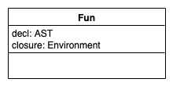
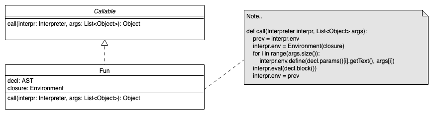

# AST-basierte Interpreter: Funktionen und Klassen

> [!IMPORTANT]
>
> <details open>
>
> <summary><strong>🎯 TL;DR</strong></summary>
>
> Üblicherweise können Funktionen auf die Umgebung zurückgreifen, in der
> die Definition der Funktion erfolgt ist
> ([“**Closure**”](https://en.wikipedia.org/wiki/Closure_(computer_programming))).
> Deshalb wird beim Interpretieren einer Funktionsdefinition der
> jeweilige AST-Knoten (mit dem Block des Funktionskörpers) und die
> aktuelle Umgebung in einer Struktur zusammengefasst. Zusätzlich muss
> in der aktuellen Umgebung der Name der Funktion zusammen mit der eben
> erzeugten Struktur (“Funktionsobjekt”) als Wert definiert werden.
>
> Beim Funktionsaufruf löst man den Funktionsnamen in der aktuellen
> Umgebung auf und erhält das Funktionsobjekt mit dem AST der Funktion
> und der Closure. Die Funktionsparameter werden ebenfalls in der
> aktuellen Umgebung aufgelöst (Aufruf von `eval()` für die
> AST-Kindknoten des Funktionsaufrufs). Zur Interpretation der Funktion
> legt man sich eine neue Umgebung an, deren Eltern-Umgebung die Closure
> der Funktion ist, definiert die Funktionsparameter (Name und eben
> ermittelter Wert) in dieser neuen Umgebung und interpretiert dann den
> AST-Kindknoten des Funktionsblocks in dieser neuen Umgebung. Für den
> Rückgabewert muss man ein wenig tricksen: Ein Block hat normalerweise
> keinen Wert. Eine Möglichkeit wäre, bei der Interpretation eines
> `return`-Statements eine Exception mit dem Wert des Ausdruck hinter
> dem “`return`” zu werfen und im `eval()` des Funktionsblock zu fangen.
>
> Für Klassen kann man analog verfahren. Methoden sind zunächst einfach
> Funktionen, die in einem Klassenobjekt gesammelt werden. Das Erzeugen
> einer Instanz einer Klasse ist die Interpretation eines “Aufrufs” der
> Klasse (analog zum Aufruf einer Funktion): Dabei wird ein spezielles
> Instanzobjekt erzeugt, welches auf die Klasse verweist und welches die
> Werte der Attribute hält. Beim Aufruf von Methoden auf einem
> Instanzobjekt wird der Name der Funktion über das Klassenobjekt
> aufgelöst, eine neue Umgebung erzeugt mit der Closure der Funktion als
> Eltern-Umgebung und das Instanzobjekt wird in dieser Umgebung
> definiert als “`this`” oder “`self`”. Anschließend wird ein neues
> Funktionsobjekt mit der eben erzeugten Umgebung und dem Funktions-AST
> erzeugt und zurückgeliefert. Dieses neue Funktionsobjekt wird dann wie
> eine normale Funktion aufgerufen (interpretiert, s.o.). Der Zugriff in
> der Methode auf die Attribute der Klasse erfolgt dann über `this` bzw.
> `self`, welche in der Closure der Funktion nun definiert sind und auf
> das Instanzobjekt mit den Attributen verweisen.
>
> </details>

> [!TIP]
>
> <details>
>
> <summary><strong>🎦 Videos</strong></summary>
>
> - [VL AST-basierte Interpreter (Funktionen,
>   Klassen)](https://youtu.be/LTqk7ifB-V0)
>
> </details>

## Funktionen

``` java
int foo(int a, int b, int c) {
    print a + b + c;
}

foo(1, 2, 3);
```

``` python
def makeCounter():
    var i = 0
    def count():
        i = i + 1
        print i
    return count;

counter = makeCounter()
counter()   # "1"
counter()   # "2"
```

Die Funktionsdeklaration muss im aktuellen Kontext abgelegt werden, dazu
wird der AST-Teilbaum der Deklaration benötigt.

Beim Aufruf muss man das Funktionssymbol im aktuellen Kontext suchen,
die Argumente auswerten, einen neuen lokalen Kontext anlegen und darin
die Parameter definieren (mit den eben ausgewerteten Werten) und
anschließend den AST-Teilbaum des Funktionskörpers im Interpreter mit
`eval()` auswerten …

## Ausführen einer Funktionsdeklaration

``` antlr
funcDecl : type ID '(' params? ')' block ;
funcCall : ID '(' exprList? ')' ;
```

``` python
def funcDecl(self, AST t):
    fn = Fun(t, self.env)
    self.env.define(t.ID().getText(), fn)
```



Quelle: Funktionsdeklaration: Eigener Code basierend auf einer Idee nach
[LoxFunction.java](https://github.com/munificent/craftinginterpreters/blob/master/java/com/craftinginterpreters/lox/LoxFunction.java#L6)
by [Bob Nystrom](https://github.com/munificent) on Github.com
([MIT](https://github.com/munificent/craftinginterpreters/blob/master/LICENSE))

Man definiert im aktuellen Environment den Funktionsnamen und hält dazu
den aktuellen Kontext (aktuelles Environment) sowie den AST-Knoten mit
der eigentlichen Funktionsdefinition fest.

Für *Closures* ist der aktuelle Kontext wichtig, sobald man die Funktion
ausführen muss. In ([Parr 2010, 236](#ref-Parr2010)) wird beispielsweise
einfach nur ein neuer Memory-Space (entspricht ungefähr hier einem neuen
lokalen Environment) angelegt, in dem die im Funktionskörper definierten
Symbole angelegt werden. Die Suche nach Symbolen erfolgt dort nur im
Memory-Space (Environment) der Funktion bzw. im globalen Scope
(Environment).

## Ausführen eines Funktionsaufrufs

``` antlr
funcDecl : type ID '(' params? ')' block ;
funcCall : ID '(' exprList? ')' ;
```

``` python
def funcCall(self, AST t):
    fn = (Fun)eval(t.ID())
    args = [eval(a)  for a in t.exprList()]

    prev = self.env;  self.env = Environment(fn.closure)
    for i in range(args.size()):
        self.env.define(fn.decl.params()[i].getText(), args[i])

    eval(fn.decl.block())
    self.env = prev
```

Quelle: Funktionsaufruf: Eigener Code basierend auf einer Idee nach
[LoxFunction.java](https://github.com/munificent/craftinginterpreters/blob/master/java/com/craftinginterpreters/lox/LoxFunction.java#L57)
by [Bob Nystrom](https://github.com/munificent) on Github.com
([MIT](https://github.com/munificent/craftinginterpreters/blob/master/LICENSE))

Zunächst wird die `ID` im aktuellen Kontext ausgewertet. In der obigen
Grammatik ist dies tatsächlich nur ein Funktionsname, aber man könnte
über diesen Mechanismus auch Ausdrücke erlauben und damit
Funktionspointer bzw. Funktionsreferenzen realisieren … Im Ergebnis hat
man das Funktionsobjekt mit dem zugehörigen AST-Knoten und dem Kontext
zur Deklarationszeit.

Die Argumente der Funktion werden nacheinander ebenfalls im aktuellen
Kontext ausgewertet.

Um den Funktionsblock auszuwerten, legt man einen neuen temporären
Kontext über dem Closure-Kontext der Funktion an und definiert darin die
Parameter der Funktion samt den aktuellen Werten. Dann lässt man den
Interpreter über den Visitor-Dispatch den Funktionskörper evaluieren und
schaltet wieder auf den Kontext vor der Funktionsauswertung zurück.

## Funktionsaufruf: Rückgabewerte

``` python
def funcCall(self, AST t):
    ...

    eval(fn.decl.block())

    ...
    return None  # (Wirkung)
```

``` python
class ReturnEx(RuntimeException):
    __init__(self, v): self.value = v

def return(self, AST t):
    raise ReturnEx(eval(t.expr()))

def funcCall(self, AST t):
    ...
    erg = None
    try: eval(fn.decl.block())
    except ReturnEx as r: erg = r.value
    ...
    return erg;
```

Quelle: Rückgabewerte: Eigener Code basierend auf einer Idee nach
[Return.java](https://github.com/munificent/craftinginterpreters/blob/master/java/com/craftinginterpreters/lox/Return.java#L4)
und
[LoxFunction.java](https://github.com/munificent/craftinginterpreters/blob/master/java/com/craftinginterpreters/lox/LoxFunction.java#L74)
by [Bob Nystrom](https://github.com/munificent) on Github.com
([MIT](https://github.com/munificent/craftinginterpreters/blob/master/LICENSE))

Rückgabewerte für den Funktionsaufruf werden innerhalb von `block`
berechnet, wo eine Reihe von Anweisungen interpretiert werden, weshalb
`block` ursprünglich keinen Rückgabewert hat. Im Prinzip könnte man
`block` etwas zurück geben lassen, was durch die möglicherweise tiefe
Rekursion relativ umständlich werden kann.

An dieser Stelle kann man den Exceptions-Mechanismus **missbrauchen**
und bei der Auswertung eines `return` mit dem Ergebniswert direkt zum
Funktionsaufruf zurück springen. In Methoden, wo man einen neuen lokalen
Kontext anlegt und die globale `env`-Variable temporär damit ersetzt,
muss man dann ebenfalls mit `try/catch` arbeiten und im `finally`-Block
die Umgebung zurücksetzen und die Exception erneut werfen.

## Native Funktionen

``` python
class Callable:
    def call(self, Interpreter i, List<Object> a): pass
class Fun(Callable): ...
class NativePrint(Fun):
    def call(self, Interpreter i, List<Object> a):
        for o in a: print a  # nur zur Demo, hier sinnvoller Code :-)

# Im Interpreter (Initialisierung):
self.env.define("print", NativePrint())

def funcCall(self, AST t):
    ...
#    prev = self.env;  self.env = Environment(fn.closure)
#    for i in range(args.size()): ...
#    eval(fn.decl.block()); self.env = prev
    fn.call(self, args)
    ...
```

Quelle: Native Funktionen: Eigener Code basierend auf einer Idee nach
[LoxCallable.java](https://github.com/munificent/craftinginterpreters/blob/master/java/com/craftinginterpreters/lox/LoxCallable.java#L6)
und
[LoxFunction.java](https://github.com/munificent/craftinginterpreters/blob/master/java/com/craftinginterpreters/lox/LoxFunction.java#L6)
by [Bob Nystrom](https://github.com/munificent) on Github.com
([MIT](https://github.com/munificent/craftinginterpreters/blob/master/LICENSE))

Normalerweise wird beim Interpretieren eines Funktionsaufrufs der
Funktionskörper (repräsentiert durch den entsprechenden AST-Teilbaum)
durch einen rekursiven Aufruf von `eval` ausgewertet.

Für native Funktionen, die im Interpreter eingebettet sind, klappt das
nicht mehr, da hier kein AST vorliegt.

Man erstellt ein neues Interface `Callable` mit der Hauptmethode
`call()` und leitet die frühere Klasse `Fun` davon ab:
`class Fun(Callable)`. Die Methode `funcCall()` des Interpreters ruft
nun statt der `eval()`-Methode die `call()`-Methode des Funktionsobjekts
auf und übergibt den Interpreter (== Zustand) und die Argumente. Die
`call()`-Methode der Klasse `Fun` muss nun ihrerseits im Normalfall den
im Funktionsobjekt referenzierten AST-Teilbaum des Funktionskörpers mit
dem Aufruf von `eval()` interpretieren …



Für die nativen Funktionen leitet man einfach eine (anonyme) Klasse ab
und speichert sie unter dem gewünschten Namen im globalen Kontext des
Interpreters. Die `call()`-Methode wird dann entsprechend der
gewünschten Funktion implementiert, d.h. hier erfolgt kein weiteres
Auswerten des AST.

## Klassen und Instanzen I

``` antlr
classDef : "class" ID "{" funcDecl* "}" ;
```

``` python
def classDef(self, AST t):
    methods = HashMap<String, Fun>()
    for m in t.funcDecl():
        fn = Fun(m, self.env)
        methods[m.ID().getText()] = fn

    clazz = Clazz(methods)
    self.env.define(t.ID().getText(), clazz)
```

Quelle: Klassen: Eigener Code basierend auf einer Idee nach
[Interpreter.java](https://github.com/munificent/craftinginterpreters/blob/master/java/com/craftinginterpreters/lox/Interpreter.java#L115)
by [Bob Nystrom](https://github.com/munificent) on Github.com
([MIT](https://github.com/munificent/craftinginterpreters/blob/master/LICENSE))

**Anmerkung**: In dieser Darstellung wird der Einfachheit halber nur auf
Methoden eingegangen. Für Attribute müssten ähnliche Konstrukte
implementiert werden.

## Klassen und Instanzen II

``` python
class Clazz(Callable):
    __init__(self, Map<String, Fun> methods):
        self.methods = methods

    def call(self, Interpreter i, List<Object> a):
        return Instance(self)

    def findMethod(self, String name):
        return self.methods[name]

class Instance:
    __init__(self, Clazz clazz):
        self.clazz = clazz

    def get(self, String name):
        method = self.clazz.findMethod(name)
        if method != None: return method.bind(self)
        raise RuntimeError(name, "undefined method")
```

Quelle: Instanzen: Eigener Code basierend auf einer Idee nach
[LoxClass.java](https://github.com/munificent/craftinginterpreters/blob/master/java/com/craftinginterpreters/lox/LoxClass.java#L11)
und
[LoxInstance.java](https://github.com/munificent/craftinginterpreters/blob/master/java/com/craftinginterpreters/lox/LoxInstance.java#L7)
by [Bob Nystrom](https://github.com/munificent) on Github.com
([MIT](https://github.com/munificent/craftinginterpreters/blob/master/LICENSE))

Instanzen einer Klasse werden durch den funktionsartigen “Aufruf” der
Klassen angelegt (parameterloser Konstruktor). Eine Instanz hält die
Attribute (hier nicht gezeigt) und eine Referenz auf die Klasse, um
später an die Methoden heranzukommen.

## Zugriff auf Methoden (und Attribute)

``` antlr
getExpr : obj "." ID ;
```

``` python
def getExpr(self, AST t):
    obj = eval(t.obj())

    if isinstance(obj, Instance):
        return ((Instance)obj).get(t.ID().getText())

    raise RuntimeError(t.obj().getText(), "no object")
```

Beim Zugriff auf Attribute muss das Objekt im aktuellen Kontext
evaluiert werden. Falls es eine Instanz von `Instance` ist, wird auf das
Feld per interner Hash-Map zugriffen; sonst Exception.

## Methoden und *this* oder *self*

``` python
class Fun(Callable):
    def bind(self, Instance i):
        e = Environment(self.closure)
        e.define("this", i)
        e.define("self", i)
        return Fun(self.decl, e)
```

Quelle: Methodenaufruf: Eigener Code basierend auf einer Idee nach
[LoxFunction.java](https://github.com/munificent/craftinginterpreters/blob/master/java/com/craftinginterpreters/lox/LoxFunction.java#L31)
by [Bob Nystrom](https://github.com/munificent) on Github.com
([MIT](https://github.com/munificent/craftinginterpreters/blob/master/LICENSE))

Nach dem Interpretieren von Klassendefinitionen sind die Methoden in der
Klasse selbst gespeichert, wobei der jeweilige `closure` auf den
Klassenkontext zeigt.

Beim Auflösen eines Methodenaufrufs wird die gefundene Methode an die
Instanz gebunden, d.h. es wird eine neue Funktion angelegt, deren
`closure` auf den Kontext der Instanz zeigt. Zusätzlich wird in diesem
Kontext noch die Variable “`this`” definiert, damit man damit auf die
Instanz zugreifen kann.

In Python wird das in der Methodensignatur sichtbar: Der erste Parameter
ist eine Referenz auf die Instanz, auf der diese Methode ausgeführt
werden soll …

## Wrap-Up

- Interpreter simulieren die Programmausführung
  - Namen und Symbole auflösen
  - Speicherbereiche simulieren
  - Code ausführen: Read-Eval-Loop

<!-- -->

- Traversierung des AST: `eval(AST t)` als Visitor-Dispatcher
- Scopes mit `Environment` (analog zu Symboltabellen)
- Interpretation von Funktionen (Deklaration/Aufruf, native Funktionen)
- Interpretation von Klassen und Instanzen

## 📖 Zum Nachlesen

- Nystrom ([2021](#ref-Nystrom2021)): Kapitel: A Tree-Walk Interpreter,
  insb. 10. Functions u. 12. Classes
- Grune u. a. ([2012](#ref-Grune2012)): Kapitel 6
- Mogensen ([2017](#ref-Mogensen2017)): Kapitel 4

> [!NOTE]
>
> <details>
>
> <summary><strong>✅ Lernziele</strong></summary>
>
> - k3: Ich kann die Traversierung von Parse-Trees implementieren und
>   dabei mit Hilfe des Visitor-Patterns Aktionen ausführen
> - k3: Ich kann Environment-Strukturen analog zu den Symboltabellen
>   aufbauen, um Namen und Werte dynamisch zu speichern
> - k3: Ich kann eine Read-Eval-Schleife implementieren und dabei durch
>   Traversierung des AST die dort abgelegten Klassendefinitionen und
>   Methodenaufrufe ausführen
>
> </details>

> [!TIP]
>
> <details>
>
> <summary><strong>🏅 Challenges</strong></summary>
>
> - Wie interpretiert man Code?
> - Warum kann man die Werte nicht einfach in Symboltabellen ablegen?
> - Wie geht man mit Funktionen um? Warum? Kann man diese mehrfach
>   aufrufen?
> - Wieso erzeugt man eine neue Environment mit der Closure in der
>   Funktion?
> - Wie gehen native Funktionen?
>
> Betrachten Sie folgenden Code-Ausschnitt:
>
> ``` c
> int x = 42;
> int f(int x) {
>     int y = 9;
>     return y+x;
> }
>
> x = f(x);
> ```
>
> 1.  Geben Sie den AST an.
> 2.  Stellen Sie die Strukturen der Symboltabelle dar.
> 3.  Stellen Sie die Strukturen im Interpreter dar.
>
> </details>

------------------------------------------------------------------------

> [!NOTE]
>
> <details>
>
> <summary><strong>👀 Quellen</strong></summary>
>
> <div id="refs" class="references csl-bib-body hanging-indent"
> entry-spacing="0">
>
> <div id="ref-Grune2012" class="csl-entry">
>
> Grune, D., K. van Reeuwijk, H. E. Bal, C. J. H. Jacobs, und K.
> Langendoen. 2012. *Modern Compiler Design*. Springer.
>
> </div>
>
> <div id="ref-Mogensen2017" class="csl-entry">
>
> Mogensen, T. 2017. *Introduction to Compiler Design*. Springer.
> <https://doi.org/10.1007/978-3-319-66966-3>.
>
> </div>
>
> <div id="ref-Nystrom2021" class="csl-entry">
>
> Nystrom, R. 2021. *Crafting Interpreters*. Genever Benning.
> <https://github.com/munificent/craftinginterpreters>.
>
> </div>
>
> <div id="ref-Parr2010" class="csl-entry">
>
> Parr, T. 2010. *Language Implementation Patterns*. Pragmatic
> Bookshelf.
> <https://learning.oreilly.com/library/view/language-implementation-patterns/9781680500097/>.
>
> </div>
>
> </div>
>
> </details>

------------------------------------------------------------------------


Unless otherwise noted, this work is licensed under CC BY-SA 4.0.

<blockquote><p><sup><sub><strong>Last modified:</strong> 0db2fe0 (tooling: rename 'origin' to 'credits', 2025-08-22)<br></sub></sup></p></blockquote>
