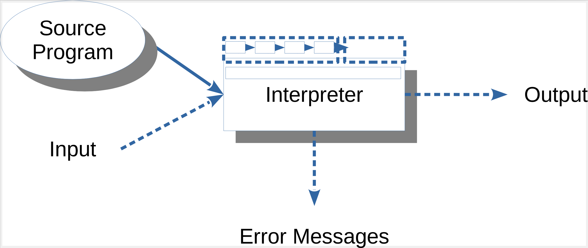
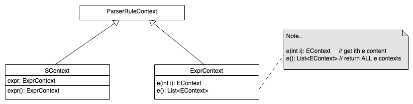
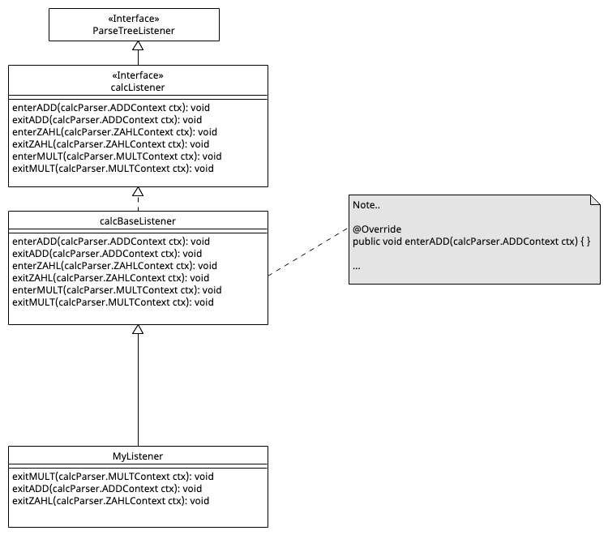
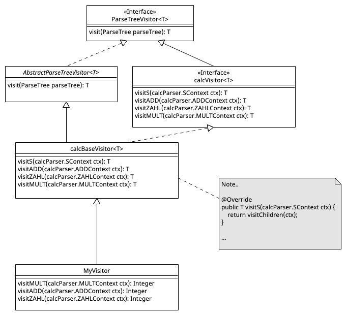

# Syntaxgesteuerte Interpreter

> [!IMPORTANT]
>
> <details open>
>
> <summary><strong>🎯 TL;DR</strong></summary>
>
> Zur Einordnung noch einmal die bisher betrachteten Phasen und die
> jeweiligen Ergebnisse:
>
> 
>
> |  | Phase | Ergebnis |
> |:---|:---|:---|
> | 0 | Lexer/Parser | AST |
> | 1 | Semantische Analyse, Def-Phase | Symboltabelle (Definitionen), Verknüpfung Scopes mit AST-Knoten |
> | 2 | Semantische Analyse, Ref-Phase | Prüfung auf nicht definierte Referenzen |
> | 3 | Interpreter | Abarbeitung, Nutzung von AST und Symboltabelle |
>
> Das Erzeugen der Symboltabelle wird häufig in zwei Phasen aufgeteilt:
> Zunächst werden die Definitionen abgearbeitet und in der zweiten Phase
> wird noch einmal über den AST iteriert und die Referenzen werden
> geprüft. Dies hat den Vorteil, dass man mit Vorwärtsreferenzen
> arbeiten kann …
>
> Für die semantische Analyse kann man gut mit Listenern arbeiten, für
> den Interpreter werden oft Visitors eingesetzt.
>
> Die einfachste Form von Interpretern sind die “syntaxgesteuerten
> Interpreter”. Durch den Einsatz von attributierten Grammatiken und
> eingebetteten Aktionen kann in einfachen Fällen der Programmcode
> bereits beim Parsen interpretiert werden, d.h. nach dem Parsen steht
> das Ergebnis fest.
>
> Normalerweise traversiert man in Interpretern aber den AST, etwa mit
> dem Listener- oder Visitor-Pattern. Die in dieser Sitzung gezeigten
> einfachen Beispiele der syntaxgesteuerten Interpreter werden erweitert
> auf die jeweilige Traversierung mit dem Listener- bzw.
> Visitor-Pattern. Für nicht so einfache Fälle braucht man aber
> zusätzlich noch Speicherstrukturen, die wir in [AST-basierte
> Interpreter:
> Basics](https://github.com/Compiler-CampusMinden/CPL-Vorlesung-Master/blob/master/lecture/06-interpretation/astdriven-part1.md)
> und [AST-basierte Interpreter: Funktionen und
> Klassen](https://github.com/Compiler-CampusMinden/CPL-Vorlesung-Master/blob/master/lecture/06-interpretation/astdriven-part2.md)
> betrachten.
>
> </details>

> [!TIP]
>
> <details>
>
> <summary><strong>🎦 Videos</strong></summary>
>
> - [VL Syntaxgesteuerte Interpreter](https://youtu.be/s5wvvoYsxe4)
>
> </details>

## Überblick Interpreter



Beim Interpreter durchläuft der Sourcecode nur das Frontend, also die
Analyse. Es wird kein Code erzeugt, stattdessen führt der Interpreter
die Anweisungen im AST bzw. IC aus. Dazu muss der Interpreter mit den
Eingabedaten beschickt werden.

Es gibt verschiedene Varianten, beispielsweise:

- Syntaxgesteuerte Interpreter

  - Einfachste Variante, wird direkt im Parser mit abgearbeitet
  - Keine Symboltabellen, d.h. auch keine Typprüfung oder
    Vorwärtsdeklarationen o.ä. (d.h. erlaubt nur vergleichsweise
    einfache Sprachen)
  - Beispiel: siehe nächste Folie

- AST-basierte Interpreter

  - Nutzt den AST und Symboltabellen
  - Beispiel: siehe weiter unten

- Stack-basierte Interpreter

  - Simuliert eine *Stack Machine*, d.h. hält alle (temporären) Werte
    auf einem Stack
  - Arbeitet typischerweise auf bereits stark vereinfachtem Zwischencode
    (IR), etwa Bytecode

- Register-basierte Interpreter

  - Simuliert eine *Register Machine*, d.h. hält alle (temporären) Werte
    in virtuellen Prozessor-Registern
  - Arbeitet typischerweise auf bereits stark vereinfachtem Zwischencode
    (IR), etwa Bytecode

Weiterhin kann man Interpreter danach unterscheiden, ob sie interaktiv
sind oder nicht. Python kann beispielsweise direkt komplette Dateien
verarbeiten oder interaktiv Eingaben abarbeiten. Letztlich kommen dabei
aber die oben dargestellten Varianten zum Einsatz.

## Syntaxgesteuerte Interpreter: Attributierte Grammatiken

``` antlr
s     : expr                    {System.err.println($expr.v);} ;

expr returns [int v]
      : e1=expr '*' e2=expr     {$v = $e1.v * $e2.v;}
      | e1=expr '+' e2=expr     {$v = $e1.v + $e2.v;}
      | DIGIT                   {$v = $DIGIT.int;}
      ;

DIGIT : [0-9] ;
```

Die einfachste Form des Interpreters wird direkt beim Parsen ausgeführt
und kommt ohne AST aus. Der Nachteil ist, dass der AST dabei nicht
vorverarbeitet werden kann, insbesondere entfallen semantische Prüfungen
weitgehend.

Über `returns [int v]` fügt man der Regel `expr` ein Attribut `v`
(Integer) hinzu, welches man im jeweiligen Kontext abfragen bzw. setzen
kann (agiert als Rückgabewert der generierten Methode). Auf diesen Wert
kann in den Aktionen mit `$v` zugegriffen werden.

Da in den Alternativen der Regel `expr` jeweils zwei “Aufrufe” dieser
Regel auftauchen, muss man per “`e1=expr`” bzw. “`e2=expr`” eindeutige
Namen für die “Aufrufe” vergeben, hier `e1` und `e2`.

## Eingebettete Aktionen in ANTLR I

Erinnerung: ANTLR generiert einen LL-Parser, d.h. es wird zu jeder Regel
eine entsprechende Methode generiert.

Analog zum Rückgabewert der Regel (Methode) `expr()` kann auf die
Eigenschaften der Token und Sub-Regeln zugegriffen werden:
`$name.eigenschaft`. Dabei gibt es bei Token Eigenschaften wie `text`
(gematchter Text bei Token), `type` (Typ eines Tokens), `int`
(Integerwert eines Tokens, entspricht `Integer.valueOf($Token.text)`).
Parser-Regeln haben u.a. ein `text`-Attribut und ein spezielles
Kontext-Objekt (`ctx`).

Die allgemeine Form lautet:

    rulename[args] returns [retvals] locals [localvars] : ... ;

Dabei werden die in “`[...]`” genannten Parameter mit Komma getrennt
(Achtung: Abhängig von Zielsprache!).

Beispiel:

``` antlr
add[int x] returns [int r] : '+=' INT {$r = $x + $INT.int;} ;
```

## Eingebettete Aktionen in ANTLR II

``` antlr
@members {
    int count = 0;
}

expr returns [int v]
      @after {System.out.println(count);}
      : e1=expr '*' e2=expr     {$v = $e1.v * $e2.v; count++;}
      | e1=expr '+' e2=expr     {$v = $e1.v + $e2.v; count++;}
      | DIGIT                   {$v = $DIGIT.int;}
      ;

DIGIT : [0-9] ;
```

Mit `@members { ... }` können im generierten Parser weitere Attribute
angelegt werden, die in den Regeln normal genutzt werden können.

Die mit `@after` markierte Aktion wird am Ende der Regel `list`
ausgeführt. Analog existiert `@init`.

## ANTLR: Traversierung des AST und Auslesen von Kontext-Objekten

Mit dem obigen Beispiel, welches dem Einsatz einer L-attributierten SDD
in ANTLR entspricht, können einfache Aufgaben bereits beim Parsen
erledigt werden.

Für den etwas komplexeren Einsatz von attributierten Grammatiken kann
man die von ANTLR erzeugten Kontext-Objekte für die einzelnen AST-Knoten
nutzen und über den AST mit dem Visitor- oder dem Listener-Pattern
iterieren.

Die Techniken sollen im Folgenden kurz vorgestellt werden.

### ANTLR: Kontext-Objekte für Parser-Regeln

``` antlr
s    : expr         {List<EContext> x = $expr.ctx.e();} ;
expr : e '*' e ;
```



Jede Regel liefert ein passend zu dieser Regel generiertes
Kontext-Objekt zurück. Darüber kann man das/die Kontextobjekt(e) der
Sub-Regeln abfragen.

Die Regel `s()` liefert entsprechend ein `SContext`-Objekt und die Regel
`expr()` liefert ein `ExprContext`-Objekt zurück.

In der Aktion fragt man das Kontextobjekt über `ctx` ab.

Für einfache Regel-Aufrufe liefert die parameterlose Methode nur ein
einziges Kontextobjekt (statt einer Liste) zurück.

**Anmerkung**: ANTLR generiert nur dann Felder für die Regel-Elemente im
Kontextobjekt, wenn diese in irgendeiner Form referenziert werden. Dies
kann beispielsweise durch Benennung (Definition eines Labels, siehe
nächste Folie) oder durch Nutzung in einer Aktion (siehe obiges
Beispiel) geschehen.

### ANTLR: Benannte Regel-Elemente oder Alternativen

``` antlr
stat  : 'return' value=e ';'    # Return
      | 'break' ';'             # Break
      ;
```

``` java
public static class StatContext extends ParserRuleContext { ... }
public static class ReturnContext extends StatContext {
    public EContext value;
    public EContext e() { ... }
}
public static class BreakContext extends StatContext { ... }
```

Mit `value=e` wird der Aufruf der Regel `e` mit dem Label `value`
belegt, d.h. man kann mit `$e.text` oder `$value.text` auf das
`text`-Attribut von `e` zugreifen. Falls es in einer Produktion mehrere
Aufrufe einer anderen Regel gibt, **muss** man für den Zugriff auf die
Attribute eindeutige Label vergeben.

Analog wird für die beiden Alternativen je ein eigener Kontext erzeugt.

### ANTLR: Arbeiten mit dem Listener-Pattern

ANTLR (generiert auf Wunsch) zur Grammatik passende Listener (Interface
und leere Basisimplementierung). Beim Traversieren mit dem
Default-`ParseTreeWalker` wird der Parse-Tree mit Tiefensuche abgelaufen
und jeweils beim Eintritt in bzw. beim Austritt aus einen/m Knoten der
passende Listener mit dem passenden Kontext-Objekt aufgerufen.

Damit kann man die Grammatik “für sich” halten, d.h. unabhängig von
einer konkreten Zielsprache und die Aktionen über die Listener (oder
Visitors, s.u.) ausführen.

``` antlr
expr : e1=expr '*' e2=expr      # MULT
     | e1=expr '+' e2=expr      # ADD
     | DIGIT                    # ZAHL
     ;
```

ANTLR kann zu dieser Grammatik einen passenden Listener (Interface
`calcListener`) generieren. Weiterhin generiert ANTLR eine leere
Basisimplementierung (Klasse `calcBaseListener`):



Von dieser Basisklasse leitet man einen eigenen Listener ab und
implementiert die Methoden, die man benötigt.

``` java
public static class MyListener extends calcBaseListener {
    Stack<Integer> stack = new Stack<Integer>();

    public void exitMULT(calcParser.MULTContext ctx) {
        int right = stack.pop();
        int left = stack.pop();
        stack.push(left * right);   // {$v = $e1.v * $e2.v;}
    }
    public void exitADD(calcParser.ADDContext ctx) {
        int right = stack.pop();
        int left = stack.pop();
        stack.push(left + right);   // {$v = $e1.v + $e2.v;}
    }
    public void exitZAHL(calcParser.ZAHLContext ctx) {
        stack.push(Integer.valueOf(ctx.DIGIT().getText()));
    }
}
```

Anschließend baut man das alles in eine Traversierung des Parse-Trees
ein:

``` java
public class TestMyListener {
    public static class MyListener extends calcBaseListener {
        ...
    }

    public static void main(String[] args) throws Exception {
        calcLexer lexer = new calcLexer(CharStreams.fromStream(System.in));
        CommonTokenStream tokens = new CommonTokenStream(lexer);
        calcParser parser = new calcParser(tokens);

        ParseTree tree = parser.s();    // Start-Regel
        System.out.println(tree.toStringTree(parser));

        ParseTreeWalker walker = new ParseTreeWalker();
        MyListener eval = new MyListener();
        walker.walk(eval, tree);
        System.out.println(eval.stack.pop());
    }
}
```

<p align="right"><a href="https://github.com/Compiler-CampusMinden/CPL-Vorlesung-Master/blob/master/lecture/06-interpretation/src/TestMyListener.java">Beispiel: TestMyListener.java und calc.g4</a></p>

### ANTLR: Arbeiten mit dem Visitor-Pattern

ANTLR (generiert ebenfalls auf Wunsch) zur Grammatik passende Visitoren
(Interface und leere Basisimplementierung). Hier muss man allerdings
selbst für eine geeignete Traversierung des Parse-Trees sorgen. Dafür
hat man mehr Freiheiten im Vergleich zum Listener-Pattern, insbesondere
im Hinblick auf Rückgabewerte.

``` antlr
expr : e1=expr '*' e2=expr      # MULT
     | e1=expr '+' e2=expr      # ADD
     | DIGIT                    # ZAHL
     ;
```

ANTLR kann zu dieser Grammatik einen passenden Visitor (Interface
`calcVisitor<T>`) generieren. Weiterhin generiert ANTLR eine leere
Basisimplementierung (Klasse `calcBaseVisitor<T>`):



Von dieser Basisklasse leitet man einen eigenen Visitor ab und
überschreibt die Methoden, die man benötigt. Wichtig ist, dass man
selbst für das “Besuchen” der Kindknoten sorgen muss (rekursiver Aufruf
der geerbten Methode `visit()`).

``` java
public static class MyVisitor extends calcBaseVisitor<Integer> {
    public Integer visitMULT(calcParser.MULTContext ctx) {
        return visit(ctx.e1) * visit(ctx.e2);   // {$v = $e1.v * $e2.v;}
    }
    public Integer visitADD(calcParser.ADDContext ctx) {
        return visit(ctx.e1) + visit(ctx.e2);   // {$v = $e1.v + $e2.v;}
    }
    public Integer visitZAHL(calcParser.ZAHLContext ctx) {
        return Integer.valueOf(ctx.DIGIT().getText());
    }
}
```

Anschließend baut man das alles in eine manuelle Traversierung des
Parse-Trees ein:

``` java
public class TestMyVisitor {
    public static class MyVisitor extends calcBaseVisitor<Integer> {
        ...
    }

    public static void main(String[] args) throws Exception {
        calcLexer lexer = new calcLexer(CharStreams.fromStream(System.in));
        CommonTokenStream tokens = new CommonTokenStream(lexer);
        calcParser parser = new calcParser(tokens);

        ParseTree tree = parser.s();    // Start-Regel
        System.out.println(tree.toStringTree(parser));

        MyVisitor eval = new MyVisitor();
        System.out.println(eval.visit(tree));
    }
}
```

<p align="right"><a href="https://github.com/Compiler-CampusMinden/CPL-Vorlesung-Master/blob/master/lecture/06-interpretation/src/TestMyVisitor.java">Beispiel: TestMyVisitor.java und calc.g4</a></p>

## Wrap-Up

- Interpreter simulieren die Programmausführung

<!-- -->

- Syntaxgesteuerter Interpreter (attributierte Grammatiken)
- Beispiel ANTLR: Eingebettete Aktionen, Kontextobjekte,
  Visitors/Listeners (AST-Traversierung)

## 📖 Zum Nachlesen

- Nystrom ([2021](#ref-Nystrom2021)): Kapitel: A Tree-Walk Interpreter
- Levine ([2009](#ref-Levine2009)): Bison, Kapitel 6
- Parr ([2014](#ref-Parr2014)): Kapitel 6.4 und 8.4
- Parr ([2010](#ref-Parr2010)): Kapitel 8 und 9

> [!NOTE]
>
> <details>
>
> <summary><strong>✅ Lernziele</strong></summary>
>
> - k3: Ich kann Attribute und eingebettete Aktionen in ANTLR einsetzen
> - k3: Ich kann Parse-Trees traversieren und Aktionen implementieren
>   mit Hilfe des Listener-Patterns
> - k3: Ich kann Parse-Trees traversieren und Aktionen implementieren
>   mit Hilfe des Visitor-Patterns
>
> </details>

------------------------------------------------------------------------

> [!NOTE]
>
> <details>
>
> <summary><strong>👀 Quellen</strong></summary>
>
> <div id="refs" class="references csl-bib-body hanging-indent"
> entry-spacing="0">
>
> <div id="ref-Levine2009" class="csl-entry">
>
> Levine, J. 2009. *Flex & Bison*. O’Reilly.
>
> </div>
>
> <div id="ref-Nystrom2021" class="csl-entry">
>
> Nystrom, R. 2021. *Crafting Interpreters*. Genever Benning.
> <https://github.com/munificent/craftinginterpreters>.
>
> </div>
>
> <div id="ref-Parr2010" class="csl-entry">
>
> Parr, T. 2010. *Language Implementation Patterns*. Pragmatic
> Bookshelf.
> <https://learning.oreilly.com/library/view/language-implementation-patterns/9781680500097/>.
>
> </div>
>
> <div id="ref-Parr2014" class="csl-entry">
>
> ———. 2014. *The Definitive ANTLR 4 Reference*. Pragmatic Bookshelf.
> <https://learning.oreilly.com/library/view/the-definitive-antlr/9781941222621/>.
>
> </div>
>
> </div>
>
> </details>

------------------------------------------------------------------------


Unless otherwise noted, this work is licensed under CC BY-SA 4.0.

<blockquote><p><sup><sub><strong>Last modified:</strong> 4fd8c3d (lecture: rework outcomes (06/Syntaxdriven), 2025-08-21)<br></sub></sup></p></blockquote>
