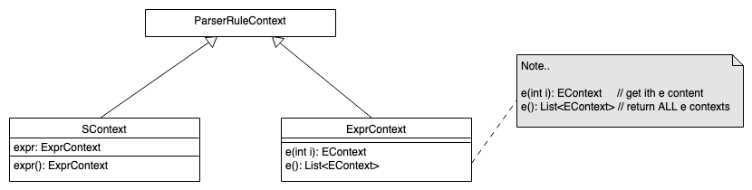
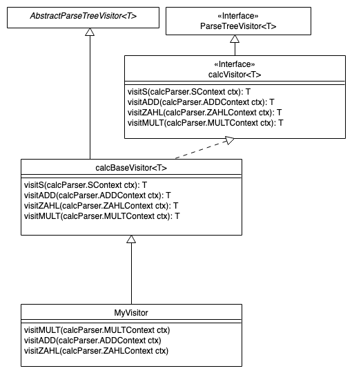

## Überblick Interpreter

::: center
{width="60%"}
:::

::: notes
Beim Interpreter durchläuft der Sourcecode nur das Frontend, also die Analyse.
Es wird kein Code erzeugt, stattdessen führt der Interpreter die Anweisungen
im AST bzw. IC aus. Dazu muss der Interpreter mit den Eingabedaten beschickt
werden.

Es gibt verschiedene Varianten, beispielsweise:
:::

\bigskip
\bigskip

*   Syntaxgesteuerte Interpreter

    ::: notes
    *   Einfachste Variante, wird direkt im Parser mit abgearbeitet
    *   Keine Symboltabellen, d.h. auch keine Typprüfung oder Vorwärtsdeklarationen o.ä.
        (d.h. erlaubt nur vergleichsweise einfache Sprachen)
    *   Beispiel: siehe nächste Folie
	:::

*   AST-basierte Interpreter

    ::: notes
    *   Nutzt den AST und Symboltabellen
    *   Beispiel: siehe weiter unten
	:::

*   Stack-basierte Interpreter

    ::: notes
    *   Simuliert eine *Stack Machine*, d.h. hält alle (temporären) Werte auf einem Stack
    *   Arbeitet typischerweise auf bereits stark vereinfachtem Zwischencode (IR),
        etwa Bytecode
	:::

*   Register-basierte Interpreter

    ::: notes
    *   Simuliert eine *Register Machine*, d.h. hält alle (temporären) Werte in virtuellen
        Prozessor-Registern
    *   Arbeitet typischerweise auf bereits stark vereinfachtem Zwischencode (IR),
        etwa Bytecode
	:::

::: notes
Weiterhin kann man Interpreter danach unterscheiden, ob sie interaktiv sind oder nicht.
Python kann beispielsweise direkt komplette Dateien verarbeiten oder interaktiv Eingaben
abarbeiten. Letztlich kommen dabei aber die oben dargestellten Varianten zum Einsatz.
:::


## Syntaxgesteuerte Interpreter: Attributierte Grammatiken

```yacc
s     : expr                    {System.err.println($expr.v);} ;

expr returns [int v]
      : e1=expr '*' e2=expr     {$v = $e1.v * $e2.v;}
      | e1=expr '+' e2=expr     {$v = $e1.v + $e2.v;}
      | DIGIT                   {$v = $DIGIT.int;}
      ;

DIGIT : [0-9] ;
```

::: notes
Die einfachste Form des Interpreters wird direkt beim Parsen ausgeführt und kommt ohne AST aus.
Der Nachteil ist, dass der AST dabei nicht vorverarbeitet werden kann, insbesondere entfallen
semantische Prüfungen weitgehend.

Über `returns [int v]` fügt man der Regel `expr` ein Attribut `v` (Integer) hinzu, welches
man im jeweiligen Kontext abfragen bzw. setzen kann (agiert als Rückgabewert der generierten
Methode). Auf diesen Wert kann in den Aktionen mit `$v` zugegriffen werden.

Da in den Alternativen der Regel `expr` jeweils zwei "Aufrufe" dieser Regel auftauchen, muss
man per "`e1=expr`" bzw. "`e2=expr`" eindeutige Namen für die "Aufrufe" vergeben, hier `e1`
und `e2`.
:::


## Eingebettete Aktionen in ANTLR I

::: notes
Erinnerung: ANTLR generiert einen LL-Parser, d.h. es wird zu jeder Regel eine entsprechende
Methode generiert.

Analog zum Rückgabewert der Regel (Methode) `expr()` kann auf die Eigenschaften der Token und
Sub-Regeln zugegriffen werden: `$name.eigenschaft`. Dabei gibt es bei Token Eigenschaften wie
`text` (gematchter Text bei Token), `type` (Typ eines Tokens), `int` (Integerwert eines Tokens,
entspricht `Integer.valueOf($Token.text)`). Parser-Regeln haben u.a. ein `text`-Attribut und
ein spezielles Kontext-Objekt (`ctx`).

Die allgemeine Form lautet:
:::

```
rulename[args] returns [retvals] locals [localvars] : ... ;
```

::: notes
Dabei werden die in "`[...]`" genannten Parameter mit Komma getrennt (Achtung: Abhängig von
Zielsprache!).

Beispiel:
:::

\bigskip
\bigskip

```yacc
add[int x] returns [int r] : '+=' INT {$r = $x + $INT.int;} ;
```


## Eingebettete Aktionen in ANTLR II

```yacc
@members {
    int count = 0;
}

expr returns [int v]
      @after {System.out.println(count);}
      : e1=expr '*' e2=expr     {$v = $e1.v * $e2.v; count++;}
      | e1=expr '+' e2=expr     {$v = $e1.v + $e2.v; count++;}
      | DIGIT                   {$v = $DIGIT.int;}
      ;

DIGIT : [0-9] ;
```

::: notes
Mit `@members { ... }` können im generierten Parser weitere Attribute angelegt
werden, die in den Regeln normal genutzt werden können.

Die mit `@after` markierte Aktion wird am Ende der Regel `list` ausgeführt. Analog
existiert `@init`.
:::


::: notes
## ANTLR: Traversierung des AST und Auslesen von Kontext-Objekten

Mit dem obigen Beispiel, welches dem Einsatz einer L-attributierten SDD in ANTLR
entspricht, können einfache Aufgaben bereits beim Parsen erledigt werden.

Für den etwas komplexeren Einsatz von attributierten Grammatiken kann man die von
ANTLR erzeugten Kontext-Objekte für die einzelnen AST-Knoten nutzen und über den
AST mit dem Visitor- oder dem Listener-Pattern iterieren.

Die Techniken sollen im Folgenden kurz vorgestellt werden.
:::


::: notes
### ANTLR: Kontext-Objekte für Parser-Regeln
:::

::: slides
## ANTLR: Kontext-Objekte für Parser-Regeln
:::

```yacc
s    : expr         {List<EContext> x = $expr.ctx.e();} ;
expr : e '*' e ;
```

\bigskip
\bigskip



::: notes
Jede Regel liefert ein passend zu dieser Regel generiertes Kontext-Objekt
zurück. Darüber kann man das/die Kontextobjekt(e) der Sub-Regeln abfragen.

Die Regel `s()` liefert entsprechend ein `SContext`-Objekt und die Regel
`expr()` liefert ein `ExprContext`-Objekt zurück.

In der Aktion fragt man das Kontextobjekt über `ctx` ab.

Für einfache Regel-Aufrufe liefert die parameterlose Methode nur ein
einziges Kontextobjekt (statt einer Liste) zurück.

**Anmerkung**: ANTLR generiert nur dann Felder für die Regel-Elemente im
Kontextobjekt, wenn diese in irgendeiner Form referenziert werden. Dies
kann beispielsweise durch Benennung (Definition eines Labels, siehe nächste
Folie) oder durch Nutzung in einer Aktion (siehe obiges Beispiel) geschehen.
:::


::: notes
### ANTLR: Benannte Regel-Elemente oder Alternativen

```yacc
stat  : 'return' value=e ';'    # Return
      | 'break' ';'             # Break
      ;
```

\bigskip

```java
public static class StatContext extends ParserRuleContext { ... }
public static class ReturnContext extends StatContext {
    public EContext value;
    public EContext e() { ... }
}
public static class BreakContext extends StatContext { ... }
```

Mit `value=e` wird der Aufruf der Regel `e` mit dem Label `value` belegt,
d.h. man kann mit `$e.text` oder `$value.text` auf das `text`-Attribut von
`e` zugreifen. Falls es in einer Produktion mehrere Aufrufe einer anderen
Regel gibt, **muss** man für den Zugriff auf die Attribute eindeutige Label
vergeben.

Analog wird für die beiden Alternativen je ein eigener Kontext erzeugt.
:::


::: notes
### ANTLR: Arbeiten mit dem Listener-Pattern
:::

::: slides
## ANTLR: Arbeiten mit dem Listener-Pattern
:::

::: notes
ANTLR (generiert auf Wunsch) zur Grammatik passende Listener (Interface und
leere Basisimplementierung). Beim Traversieren mit dem Default-`ParseTreeWalker`
wird der Parse-Tree mit Tiefensuche abgelaufen und jeweils beim Eintritt in
bzw. beim Austritt aus einen/m Knoten der passende Listener mit dem passenden
Kontext-Objekt aufgerufen.

Damit kann man die Grammatik "für sich" halten, d.h. unabhängig von einer
konkreten Zielsprache und die Aktionen über die Listener (oder Visitors, s.u.)
ausführen.
:::

```{.yacc size="footnotesize"}
expr : e1=expr '*' e2=expr      # MULT
     | e1=expr '+' e2=expr      # ADD
     | DIGIT                    # ZAHL
     ;
```

\smallskip

::: notes
ANTLR kann zu dieser Grammatik einen passenden Listener (Interface `calcListener`)
generieren. Weiterhin generiert ANTLR eine leere Basisimplementierung (Klasse
`calcBaseListener`):


Von dieser Basisklasse leitet man einen eigenen Listener ab und implementiert
die Methoden, die man benötigt.
:::

```{.java size="footnotesize"}
public static class MyListener extends calcBaseListener {
    Stack<Integer> stack = new Stack<Integer>();

    public void exitMULT(calcParser.MULTContext ctx) {
        int right = stack.pop();
        int left = stack.pop();
        stack.push(left * right);   // {$v = $e1.v * $e2.v;}
    }
    public void exitADD(calcParser.ADDContext ctx) {
        int right = stack.pop();
        int left = stack.pop();
        stack.push(left + right);   // {$v = $e1.v + $e2.v;}
    }
    public void exitZAHL(calcParser.ZAHLContext ctx) {
        stack.push(Integer.valueOf(ctx.DIGIT().getText()));
    }
}
```

::: notes
Anschließend baut man das alles in eine Traversierung des Parse-Trees ein:

```java
public class TestMyListener {
    public static class MyListener extends calcBaseListener {
        ...
    }

    public static void main(String[] args) throws Exception {
        calcLexer lexer = new calcLexer(CharStreams.fromStream(System.in));
        CommonTokenStream tokens = new CommonTokenStream(lexer);
        calcParser parser = new calcParser(tokens);

        ParseTree tree = parser.s();    // Start-Regel
        System.out.println(tree.toStringTree(parser));

        ParseTreeWalker walker = new ParseTreeWalker();
        MyListener eval = new MyListener();
        walker.walk(eval, tree);
        System.out.println(eval.stack.pop());
    }
}
```

[Beispiel: TestMyListener.java und calc.g4]{.bsp}
:::


::: notes
### ANTLR: Arbeiten mit dem Visitor-Pattern
:::

::: slides
## ANTLR: Arbeiten mit dem Visitor-Pattern
:::

::: notes
ANTLR (generiert ebenfalls auf Wunsch) zur Grammatik passende Visitoren
(Interface und leere Basisimplementierung). Hier muss man allerdings selbst
für eine geeignete Traversierung des Parse-Trees sorgen. Dafür hat man mehr
Freiheiten im Vergleich zum Listener-Pattern, insbesondere im Hinblick auf
Rückgabewerte.
:::

```{.yacc size="footnotesize"}
expr : e1=expr '*' e2=expr      # MULT
     | e1=expr '+' e2=expr      # ADD
     | DIGIT                    # ZAHL
     ;
```

\bigskip

::: notes
ANTLR kann zu dieser Grammatik einen passenden Visitor (Interface `calcVisitor<T>`)
generieren. Weiterhin generiert ANTLR eine leere Basisimplementierung (Klasse
`calcBaseVisitor<T>`):



Von dieser Basisklasse leitet man einen eigenen Visitor ab und überschreibt
die Methoden, die man benötigt. Wichtig ist, dass man selbst für das "Besuchen"
der Kindknoten sorgen muss (rekursiver Aufruf der geerbten Methode `visit()`).
:::

```{.java size="footnotesize"}
public static class MyVisitor extends calcBaseVisitor<Integer> {
    public Integer visitMULT(calcParser.MULTContext ctx) {
        return visit(ctx.e1) * visit(ctx.e2);   // {$v = $e1.v * $e2.v;}
    }
    public Integer visitADD(calcParser.ADDContext ctx) {
        return visit(ctx.e1) + visit(ctx.e2);   // {$v = $e1.v + $e2.v;}
    }
    public Integer visitZAHL(calcParser.ZAHLContext ctx) {
        return Integer.valueOf(ctx.DIGIT().getText());
    }
}
```

::: notes
Anschließend baut man das alles in eine manuelle Traversierung des Parse-Trees ein:

```java
public class TestMyVisitor {
    public static class MyVisitor extends calcBaseVisitor<Integer> {
        ...
    }

    public static void main(String[] args) throws Exception {
        calcLexer lexer = new calcLexer(CharStreams.fromStream(System.in));
        CommonTokenStream tokens = new CommonTokenStream(lexer);
        calcParser parser = new calcParser(tokens);

        ParseTree tree = parser.s();    // Start-Regel
        System.out.println(tree.toStringTree(parser));

        MyVisitor eval = new MyVisitor();
        System.out.println(eval.visit(tree));
    }
}
```

[Beispiel: TestMyVisitor.java und calc.g4]{.bsp}
:::


## Wrap-Up

*   Interpreter simulieren die Programmausführung

\smallskip

*   Syntaxgesteuerter Interpreter (attributierte Grammatiken)
*   Beispiel ANTLR: Eingebettete Aktionen, Kontextobjekte, Visitors/Listeners (AST-Traversierung)


<!-- DO NOT REMOVE - THIS IS A LAST SLIDE TO INDICATE THE LICENSE AND POSSIBLE EXCEPTIONS (IMAGES, ...). -->
::: slides
## LICENSE


Unless otherwise noted, this work is licensed under CC BY-SA 4.0.
:::
