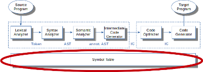

# Symboltabellen

Zur semantischen Analyse gehört die Identifikation und Sammlung von Bezeichnern und die
Zuordnung zur richtigen Ebene (Scopes). Das Werkzeug hierfür sind die Symboltabellen.

``{=markdown}
